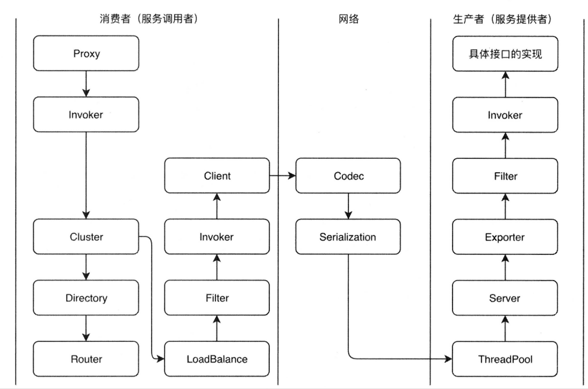

1. dubbo总览

   1. 调用流程

   2. 调用细节

      > 1. 调用过程是从一个Proxy开始，proxy持有一个Invoker对象。然后触发invoke调用，在invoke调用过程中需要使用cluster，cluster负责容错，比如重试。cluster在调用之前会通过Directory获取所有可以调用的远程服务Invoker列表，如果用户配置了路由规则，还会根据路由规则对Invoker列表进行一次过滤
      > 2. 此时存活的Invoker还有很多，所以需要通过LoadBalance方法进行负载均衡，选出一个Invoker。invoker在调用之前还会经过一个filter链，这个filter链通常是处理上下文、限流、计数等。
      > 3. 接着使用client做数据传输，比如NettyClient。传输之前要做一些私有协议的构造（调用Codec接口），构造完成后，对数据包进行序列化，然后发起请求。provider收到请求后，也会使用Codec处理协议头以及一些半包、粘包等，然后对数据报文进行反序列化。
      > 4. 随后这个request会被分配到线程池中处理。Server会处理这些Request，根据request查找对应的Exporter（exporter内部持有了Invoker）。invoker是被装饰器模式套了很多filter，因此在调用最终实现类之前，也会经过一个provider的filter链。
      > 5. 进行具体接口的调用，再把结果返回
      >
      > 

2. 复习
   1. 负载均衡
   2. spi机制
   3. 分布式锁