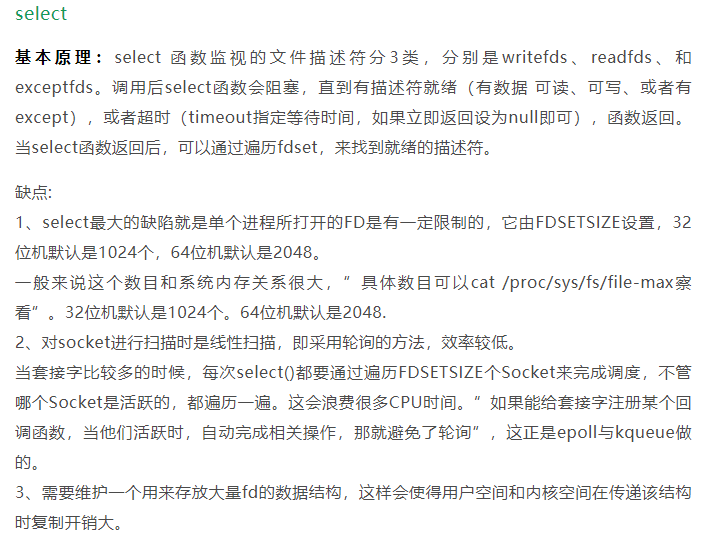
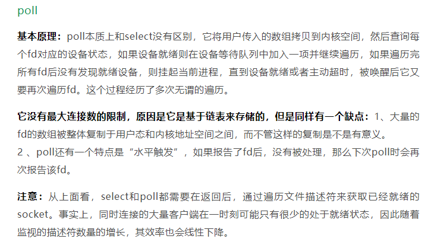
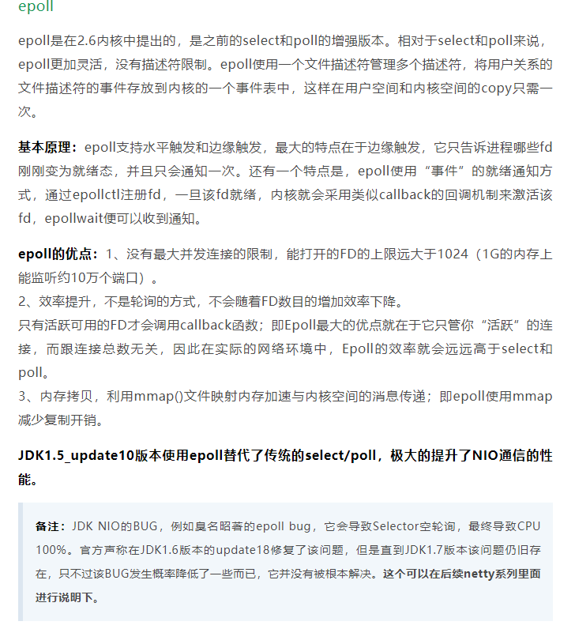
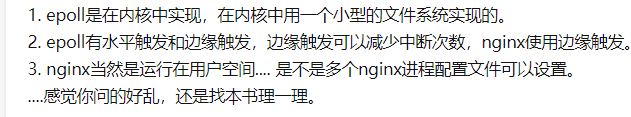
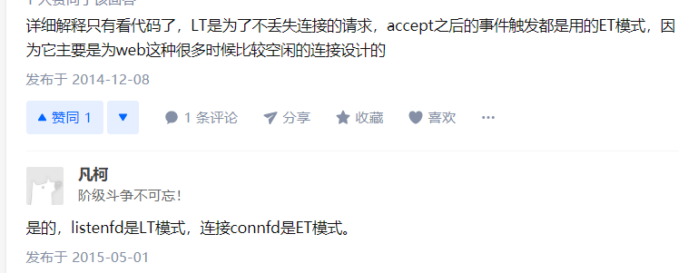
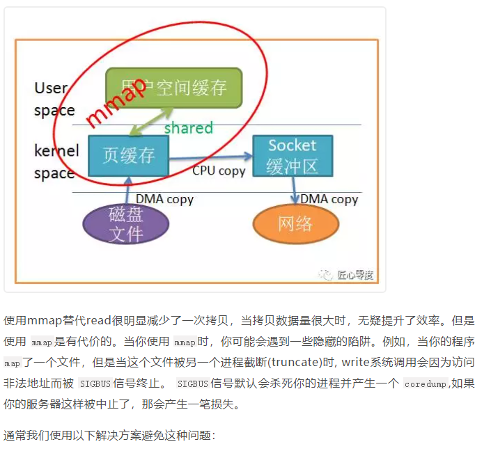
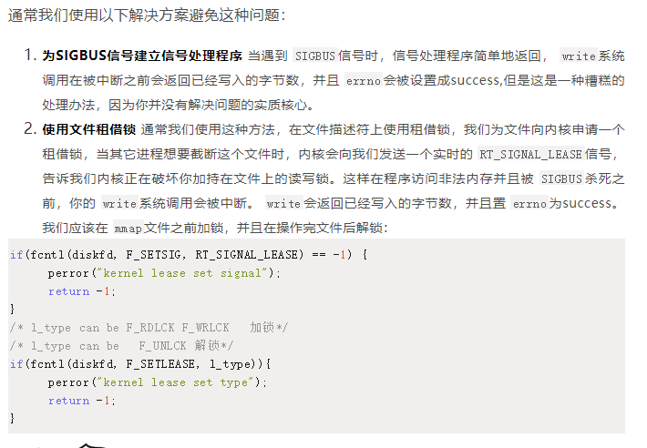

1. nio

   1. java nio的java.nio.channels.spi，提供了新的服务提供接口，允许接入新的channel和selector

   2. 为什么不直接让磁盘控制器把数据从磁盘复制到用户空间
   
      > 1. 硬件设备一般不能访问虚存，即无法访问用户空间
      > 2. 磁盘传输是的固定大小的数据块，而程序可能只需要任意大小的数据
   
   3. buyeBuffer核心api
   
      1. compact
      2. reset
   3. Mark
   
4. select、poll、epoll的区别
   
   1. select    
      2. poll 
   3. epoll 
   
3. 

   6. 

   7. 零拷贝

      1. mmap 

         

      2. sendfile 内存中只有一份文件的拷贝（存放在内核空间），整个过程过对用户空间不可见

   8. buffer

   9. channel

   10. selector

   11. netty

   12. 线程池怎么自定义拒绝策略（）

       > 继承RejectExecutionHandler类，重写rejectedExecution 方法
       >
       > 自定义策略：把任务序列化，持久到磁盘（或者数据库）。单点问题可以通过备份来解决
       
   13. JDK各个版本的变化

       1. jdk8新特性
          1. @Contented注解：独占缓存行
          2. stream：流
       2. jdk9
          1. 模块化
       
   14. 复习

       1. new 一个对象的过程

          > 类加载器->双亲委派->类加载过程->内存分配（栈上分配、tlab）

