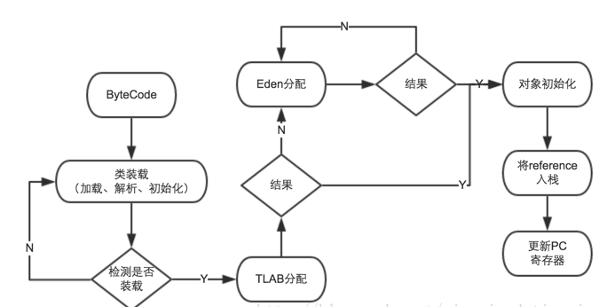
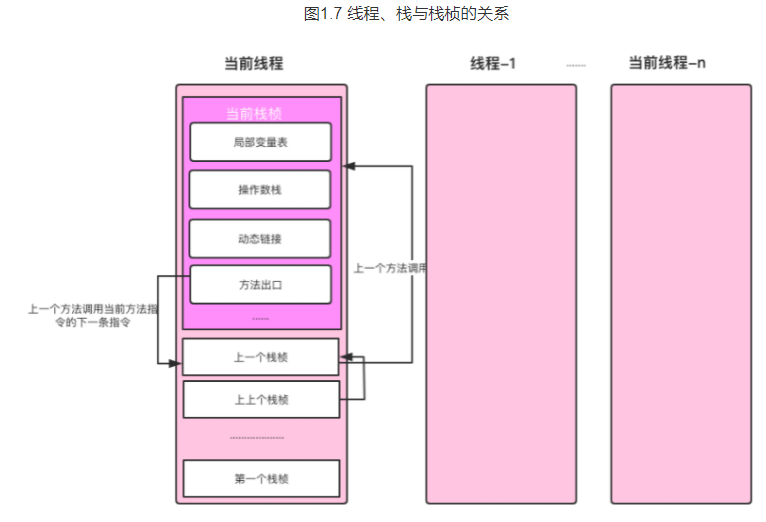

1. 对象分配过程

   

2. java调用Thread.start（）方法源码

   > ```c++
   > // 第一步：jvm.cpp文件中，JVM_StartThread方法  
   > native_thread = new JavaThread(&thread_entry, sz);  
   > // 第二步： thread.cpp文件中，JavaThread的构建方法  
   > os::create_thread(this, thr_type, stack_sz);  
   > // 第三步：os_linux.cpp文化中，os::create_thread方法  
   > OSThread* osthread = new OSThread(NULL, NULL);  
   > thread->set_osthread(osthread);
   > ```

3. 线程、栈、栈帧的关系

   

4. 