# kafka

1. 为什么kafka不支持读写分离

   1. 读写分离试用于读多写少的场景、而且会带来不一致的问题

   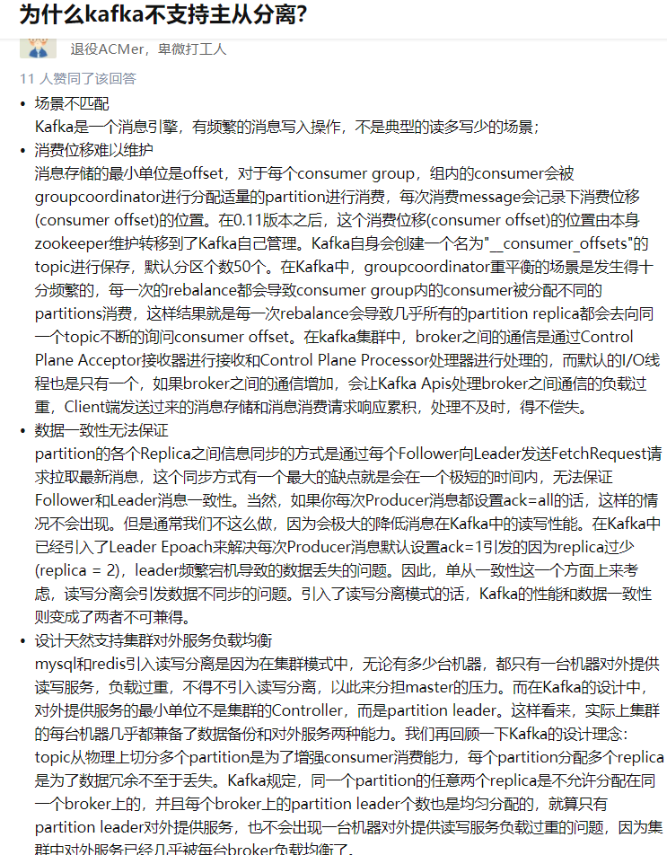

2. 流和生产者、消费者的区别

3. kafka的topic和分区

   1. isr、osr

      > topic的分区leader负责维护和跟踪ISR集合中所有follower副本的滞后状态，当follower落后太多时，分区leader会把它从ISR中移除。如果OSR有follower追上来了，分区leader会把它从OSR转移到ISR.
      >
      > AR在分配的时候就会被指定，只要不发生重分配，内部的顺序不变。而分区的ISR集合中的副本顺序可能会变

   2. HW、LEO、ISR的联系

      > ISR：和分区leader保持同步的folloer集合
      >
      > LEO: log end offset,是一个分区下一个即将写入消息的offset
      >
      > HW：ISR中最小的LEO就是整个分区的HW
      
      

   

   > 流是一组从生产者到消费者的数据

4. kafka的消费者把每个分区最后读取的偏移量储存在哪里？

   > 之前把偏移量存储在kafka或者zookeeper中，现在把偏移量存储在_consumer_offset的topic中，这个topic有50个分区

5. broker和集群

   > 1. broker是集群的组成部分，每个集群有一个broker叫做controller，负责这个集群的管理工作，包括将分区分配给broker和监控broker
   > 2. 集群中的每个partition都有一个leader，当leader宕机后，其他ISR可以成为leader，之后生产者和消费者都要重新连接到新的leader
   > 3. 集群的好处：数据类型分离，安全需求隔离，多数据中心

6. 保留消息

   > kafka的默认保留策略：要么保留一段时间，要么保留到消息达到一定大小（10GB）

7. producer

   1. kafka的消息变量

      > String topic
      >
      > Intger partition
      >
      > Headers headers
      >
      > K key （相同key会被发送到相同分区， 有key的消息可以支持日志压缩）
      >
      > V value (value一般不为空，，为空就是墓碑消息)
      >
      > Long timestamp

   2. kafka producer整体架构，kafkaProducer是线程安全的

      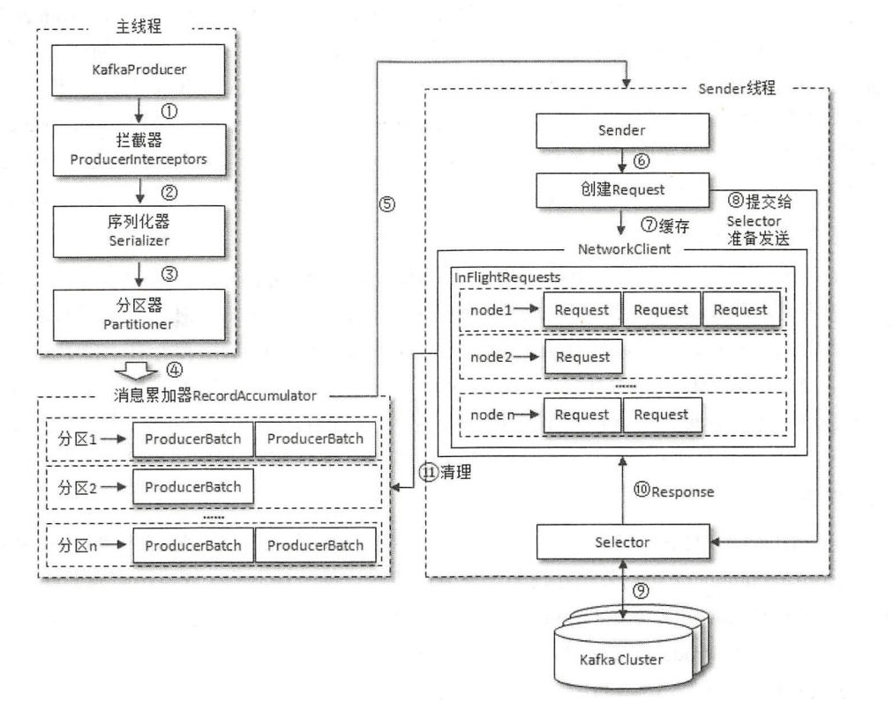

   3. 

   4. 参数

      > 1. ack all（所有的isr）
      > 2. buffer.memory：recordAccumulator的大小，默认为32MB
      > 3. 压缩 lz4 zstrand
      > 4. retries，重试可能造成重复发送，需要consumer去重处理。只针对于可重试异常，如果重试次数用完之后，还没有写入kafka broker，那么抛出异常
      > 5. retry.backoff.ms: 两次重试的停顿时间，防止频繁重试，默认100ms
      > 6. batch.size： producer会将发往同一个partition的多条消息封装到一个batch，当batch满了，producer的io线程会发送batch中的所有消息。默认为16k，这个值设置的太小，会影响吞吐量，太大会给内存带来压力
      > 7. linger.ms: 当batch.size没有被填满时，当过了linger.ms时间过后，batch还没有填满，那么io线程会把batch里的消息发送出去。默认值是0，不关心batch是否填满，这样会拉低吞吐量
      > 8. max.request.size: producer能够发送的最大消息大小,默认1mb。和broker的message.max.bytes相关联。
      > 9. request.timeout.ms: producer发送消息给broker后，broker需要在规定的时间给出响应。如果超过了这个时间没有收到broker的响应，会在回调函数中抛出异常
      > 10. connections.max.idle.ms: 多久关闭连接，默认9分钟
      > 11. max.in.flight.request.per.connection = 1,producer可以确保某一时刻只能发送一个请求，可以保证顺序发送
      > 12. send.buffer.bytes： socker的发送缓冲区的大小
      > 13. max.block.ms: 如果生产者的生产速度超过了sender线程的发送速度，会导致recordAccumulator空间不足。这是producer调用send方法要么阻塞要么抛出异常，阻塞的最大时间就是此配置

   5. 注意：

      1. 主线程发过来的消息都会被追加到RecordAccumulator的某个Deque中，RecordAccumulator会为每个分区维护一个Deque，队列的内容就是ProducerBatch,即Deque<ProducerBatch>

      2. 消息在网络上都是以Byte的形式传输的，在发送之前需要创建一块内存区域来保存消息，kafkaProducer使用ByuteBuffer实现消息内存的创建和释放。但是频繁的创建和释放是比较消耗资源的，在RecordAccumulator的内部有一个Buffer Pool来实现对ByteBuffer的复用。不过BUffer Pool只针对特定大小的ByetBuffer进行管理，其他大小的ByteBuffer不会缓存进ByteBuffer，这个特定的大小由batch.size指定，默认16k

      3. 当一条消息（ProducerRecord）流入RecordAccumulator时，先寻找消息分区对应的Deuqe（如果没有就新建），再从Deque的尾部获取一个ProducerBatch，查看ProducerBatch中是否还有空间写入这个ProdcuerRecord，如果可以就写入。如果不行就新建一个ProducerBatch，如果当前消息小于batch.size，就以batch.size创建ProducerBatch，这个batch可以通过BufferPool来管理，这个batch是可以被复用的。如果超过了，就创建消息的大小的创建ProducerBatch，这个batch无法复用。

      4. sender线程从RecordAccumulator中获取缓存的消息之后，会把消息转换由<Partition,Deque<ProducerBatch>>转换成<Node,List<ProducerBatch>>,Nodo表示kafka的Broker节点（Node都是分区leader）。 kakfaProducer不管理消息属于哪个分区，直接向建立连接的broker发送消息。

      5. sender线程还会把<Node,List<ProducerBatch>>，转换成<Node,Request>的形式

      6. 请求在sender线程发往kafka broker之前还会保存到inFlightRequests中，具体形式为Map<NodeId,Deque<Request>>,主要作用是缓存已经发出去但是还没有收到响应的请求。除此之外，InFlightRequests还可以通过配置参数来限制每个连接（kafkaProducer和Node的连接）最多缓存的请求数，默认值为5（每个连接最多只能缓存5个未响应的请求），超过该值，无法向该node发送消息。通过比较Deque的size和配置的参数来判断消息是否堆积了很多未响应的消息。除此之外，InFlightRequests可以获得leastLoadedNode（node中负载最小的一个），Deque还未 确认消息数最小的就是leastLoadedNode

      7. 元数据

         > 1. kafka集群有哪些主题，主题有多少分区，分区有多少follower，follower在哪些节点，哪些follower是ISR、ar，有多少broker
         > 2. 如果消息没有指定主题信息或者超过metadata.max.age.ms（默认5分区），会引起元数据的更新（由sender线程负责更新）

         

   6. producer无消息丢失配置。

      > * block.on.buffer.full = true 想当于 max.block.ms.当内存缓冲区满了后，没超过此配置的时间producer会停止接受新消息，等待的时间超过此配置会抛出异常
      > * acks=all or -1 isr全部写入成功
      > * retries = Integer.MAX_VALUE
      > * max.in.flight.request.per.connection = 1
      > * 使用带回调的send发送消息
      > * CallBack中显式的立即关闭producer，即使用close(0) 为了处理消息乱序问题
      > * unclean.leader.election.enable = false 不允许非isr的broker成为leader
      > * replication.factor = 3  3个备份
      > * min.insync.replicas =2 控制某消息至少写入到多少个isr才算成功，只有ack=all这个参数才有效
      > * replication.factor > min.insync.replicas
      > * enable.auto.commit = false 取消自动提交

   7. 发消息的三种模式

      1. 发送即忘（fire-and-forget）: 发完就不管 有可能没有发送成功
      2. 同步：直接调用send方法 一条一条发送， 速度太慢
      3. 异步：在send方法添加callback函数

   8. 异常： 可重试异常（网络，leader不可用），不可重试异常（消息太大）

   9. 分区器：如果record没有指定partition字段， 就会根据key分区。 

      1. 如果key为null：计算的分区为可用分区中的任意一个
      2. 如果key不为null： 计算的分区号是所有分区的任意一个
      3. 在不改变topic分区数量的情况下， key和分区之间的映射可以保持不变。 一旦增加了分区，就不能保证这种映射关系了

   10. 拦截器：在消息序列化和计算分区之前会调用生产者拦截器。

   11. KafkaProducer 会在消息被应答（ cknowledgement ）之前或消息发送失败时调用生产者拦

       截器的 onAcknowledgement（） 方法，优先于用户设定的 Callback 之前执行。这个方法运行在

       Producer I/ O线程中，所以这个方法中实现的代码逻辑越简单越好 则会影响消息的发送

       速度。可以配置多个拦截器，拦截器会按照配置的顺序一一执行。 在拦截链中，如果某个拦截器执行失败，那么下 个拦截器会接着从上一个执行成功截器继续执行

   12. kafkaProducer是线程安全的

8. kafka 的consumer

   1. kafka的consumer不是线程安全的，consumer会把每个partition的offset提交到__consumer_offset的topic中

   2. consumer的订阅方式，只能使用一种订阅方式

      1. subscribe(Collection): auto_topics
      2. subscribe(auto_pattern): auto_pattern
      3. assign(collection): 指定topic和分区， USER_ASSIGNED
      4. subscribe()方法订阅具有消费者自动rebalance功能， 当消费组内的消费者增加或减少时， 消费者的分区分配关系会自动调整

   3. consumerGroup的分区策略

   4. kafkaConsumer.assign(List<TopicPartition> partition):可以订阅topic中的某个分区

   5. rebalance

      > 1. rebalance规定了一个consumer group下的consumer如何达成一致来分配订阅某个topic的所有分区
      > 2. 

   6. consumer.subscribe(list<String> ) 方法不是增量，而是覆盖

   7. kafka默认的位移提交是自动提交， 参数为auto.commit.interval.ms 表示自动提交间隔， 默认为5s。 每隔5s会将每个分区的最大消息位移进行提交， 自动提交位移的操作是在poll方法里完成的， consumer每次向服务端拉取请求之前会先检查是否可以进行位移提交

   8. 手动提交offset

      1. 同步提交
         1. 无参数的手动提交会根据poll方法拉取的最新位移进行提交
         2. 有参数的offset参数是消息的offset+1
      2. 异步提交: 不阻塞， 可以提高性能

   9. seek（）： 指定消费的offset， 也可以指定时间参数

   10. consumer的参数

      > * session.timeout.ms: consumer group检测组内成员发送崩溃的时间
      > * max.poll.interval.ms: consumer处理逻辑的最大时间。如果consusmer的逻辑处理时间超过了此值，coordinator会把该consumer踢出改组，然后对该组进行Rebalance
      > * auto.offset.reset: 如果group没有提交offset到broker的topic（__consumer_topic），那么就会从头消费
      > * enable.auto.commit: 是否自动提交offset
      > * fetch.max.bytes: consumer一次最大获取的字节数，如果业务数据大于此值，那么consumer无法消费这个消息
      > * max.poll.records: 单次poll返回的最大消息数
      > * heartbeat.interval.ms: 该值必须小于session.timeout.ms。每个consumer都会根据此值周期性的向group coordinator发送heartbeat，然后groupcoordinator给各个consumer响应。如果group coordinator给sonsumer的响应包好了 REBALANCE_IN_PROGRESS标识，各个consumer就知道已经发送了rebalance
      > * connection.max.idle.ms: kakfa会周期性的关闭空闲连接

   11. kafka的consumer是有两个线程，一个是用户主线程，用来poll、rebalance，位移提交，异步任务结果的处理，，还有一个是心跳线程

   12. consumer的位移

       1. 常见的交付语义

          > 1. at most once: 消息可能丢失，但不会重复处理
          > 2. at least once：消息不会丢失，但是会重复消费
          > 3. exactly once：消息不会丢失并且只会被消费一次
          >
          > 如果consumer在消费之前（poll消息之后）提交offset，consumer崩溃会导致消息丢失
          >
          > 如果consumer在消费之后提交offset，consumer崩溃来不及提交offset，会导致消息重复消费
          
       2. 使用commitAsync提交offset时，如果设置了retry也有可能造成重复消费。我们可以维护一个递增的序号来维护异步提交的顺序

   13. consum控制或关闭消费

       1. kafka使用pause和resume来暂停和恢复

   14. rebalance触发条件

          1. 组成员发送变化：加入新的consumer，consumer下线、崩溃
          2. 组订阅的topic数发生变化：比如使用正则订阅topic
          3. topic的分区数发生变化： topic增加的分区

   15. 分区策略

          1. round-robin
          2. range
          3. sticky

9. topic和partition

   1. partition的分区管理

      1. 优先副本的管理(preferred replicas)

         >1. 当有broker下线时，把会该broker的leader分区转移到其他broker上（即进行leader选举其他follower成为新的leader）。极端情况下，会导致一个broker管理多个分区，导致负载不均衡。
         >2. kafka中有一个优先副本的概念(preferred replicas)，会进行分区leader的负载均衡。这一行为也成为分区平衡。
         >3. 实现：kafka的控制器会启动一个定时任务，轮训所有broker的节点，计算每个broker节点的分区不平衡率（broker中 非优先副本的leader个数/分区总数）是否超过leader.embalance.per.broker.percentage的，默认为10%。定时任务的执行周期为5分钟
         >4. 配置：auto.leader.rebalance.enable:true 默认为true

      2. 分区重分配

         1. 当某个节点的分区副本都处于不可用的状态，kafka不会将这些失效的分区副本迁移到集群中剩余可用的broker节点上，所以需要重分配

10. 日志存储

    1. 文件结构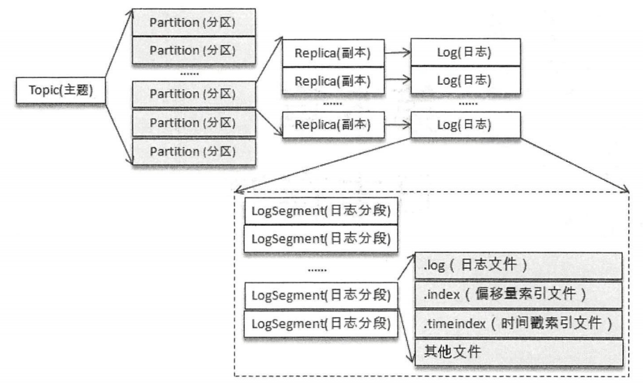
    2. 一个分区对应一个log（log实际上是一个文件夹）。例如创建一个"topic-log"的topic，分配4个分区，那么实际物理存储上表现为"topic-log-0","topic-log-1"等4个文件夹
    3. 向log中追加消息时是顺序写的，只有最后一个logSegment才能执行写操作，一般把最后一个logSegment称为activeSegment。
    4. 为了方便消息的检索，每个logSegment中的日志文件（*.log文件）都有对应的两个索引文件偏移量索引文件和时间戳索引文件（.index文件和.timeIndex文件），每个logSegment都有一个baseOffset，表示当前logSegment中的第一条消息的offset。偏移量是有一个long类型，日志文件和两个索引文件都是基于baseOffset命名的，名称的固定长度为20。实例图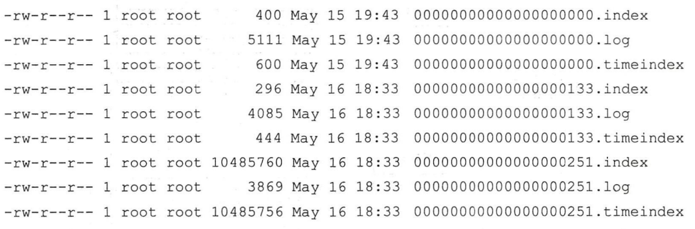
       5. 日志格式
             1. v0：kafka 0.10.0之前使用的日志格式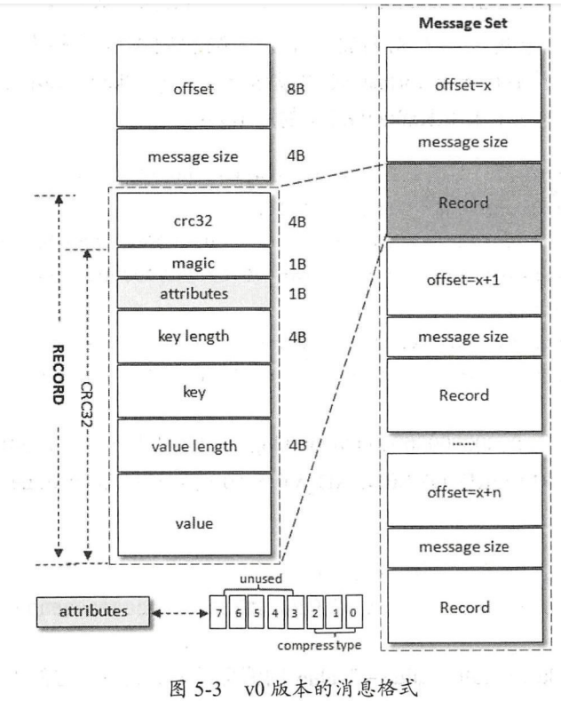
             2. v1：0.10.0-0.11.0使用的日志格式   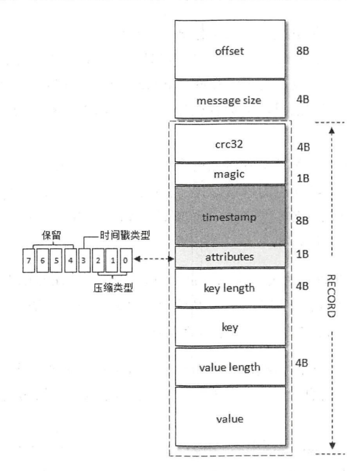
             3. v2：0.11.0之后的日志格式 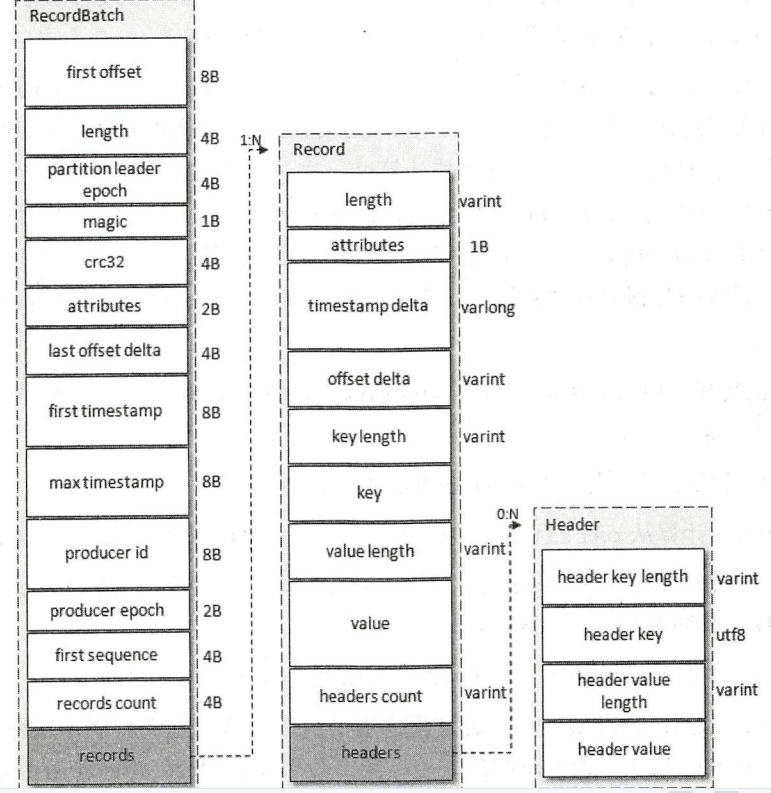
             4. v2版本的日志格式提供了事务、幂等等特性
    6. 日志索引
       1. 偏移量索引：relativeOffset（logSegment内的偏移量）  postitoin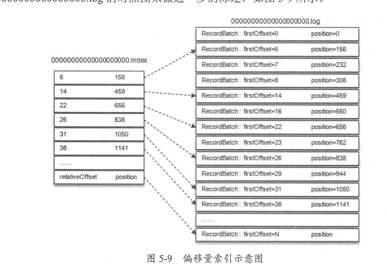
       2.  最外层会有ConcurrentSkipListMap的跳表保存各个logSegment的baseOffest
       3. 时间戳索引：timestamp（最大时间戳） relativeOffset（根据这个字段回表）
          1. 找到的索引要去偏移量索引重新找一次，，然后才能确定具体的位置， 类似于innodb的回表
          2. 时间戳分为两种：创建时间和logAppendTime，logAppendTime是递增的，但是createTime不是， 生产者自己指定时间戳也无法保证递增
          3. 查找流程：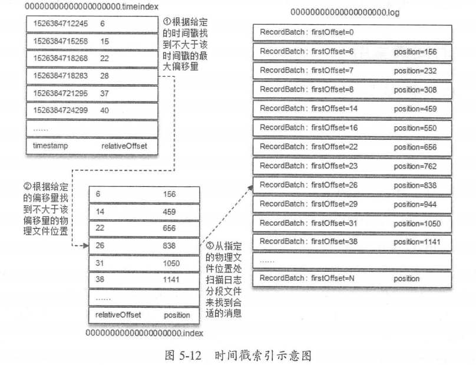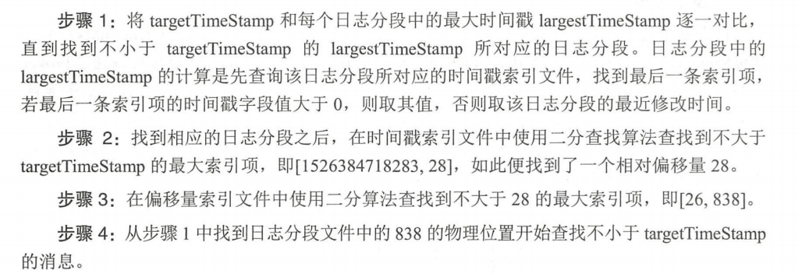
          4. 以上
       4. 日志清理策略
          1. 日志删除
             1. 基于时间的保留策略：
                1. log retention ms优先级最高，时间戳选择是的logsegment的最大时间戳：largestTimeStamp（要获取日志分段中的最大时间 largestTimeStamp 的值 首先要查询该日志分段所对应的时间戳索引文件，查找时间戳索引文 中最后一条索引项，若最后 条索引项的时间戳字段值大于 ，则取其值才设置为最近修改时间 lastModifiedTime）
                2. 如果所有的logsegment都要被删除，由于分区必须要有一个activeSegment，所以会新建一个空的logsegment作为activeSegment
             2. 基于日志大小的保留策略： 计算partition的大小， 删除多于的logSegment
             3. 基于日志起始偏移量的保留策略
          2. 日志压缩：针对每个消息的key进行整合， 只保留相同key的最后一个版本
       5. 磁盘存储
          1. 顺序IO
          2. 页缓存、
          3. 零拷贝（mmap和sendfile（sendfile的数据对应用不可见））

11. Broker端

    1. kafka包含了4个核心的api：kakfaProducer，kafkaConsumer，KafkaConnector，kafkaProcessor
    2. 协议设计
       1. 请求头： 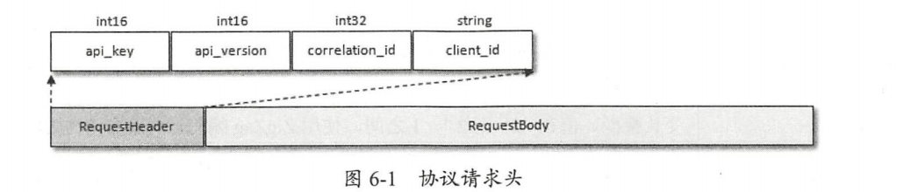
          1. api_key: api标识，类似http的method。PRODUCE表示发送消息，fetch表示拉取消息
          2. api_version：api的版本号
          3. correlation_id： 客户端指定的一个数字来唯一标识这次请求，服务端在处理完请求之后会把同样的correlation_id回写到response中，这样客户端就能把某个请求和响应对应起来
          4. client_id：客户端的id
       2. 响应头：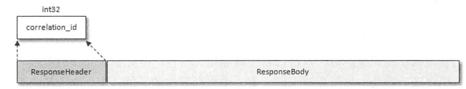
       3. 
    3. 时间轮
       1. kafka存在大量的延时操作，比如延时生产，延时拉取，延时删除等。JDK中的Timer和DelayQueue的插入和删除的时间复杂度为O(nlogn)不能满足kafka的高性能要求，所以kafka基于时间轮的概念自定义实现了一个用于延时功能的定时器（SystemTimer），将插入和删除的时间复杂度都降为O（1），如图所示：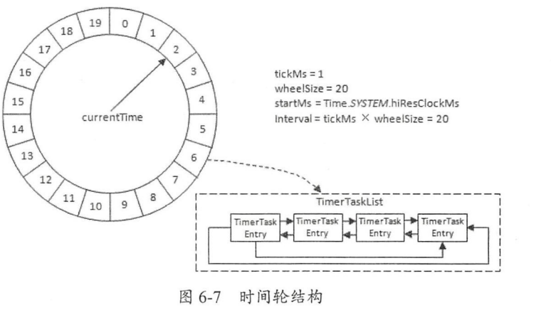
       2. 多层时间轮：有点像钟表（**还需复习**）
    4. 延时操作
    5. 控制器
       1. controller负责管理整个集群中的所有分区和副本的状态。当某个分区的leader副本出现故障时，controller负责为改分区选举新的leader。当检测到某个分区的ISR发生变化时，controller负责通知其他broker更新metadata。
       2. controller_epoch：存储在zk的/controller_epoch节点上是一个永久
       3. 节点，用于记录controller发生变更的次数。初始值为1，当controller发生变更时，改值就加1。每个和controller交互的请求都会写到controller_epoch。如果请求的controller_epoch小于内存中的controller_epoch，说明是向过期的controller发送请求，这个请求是无效的。如果大于，说明已经选举了新的controller
       4. controller处理事件图： 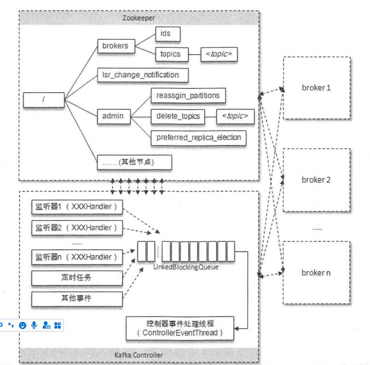
    6. 使用kill - s TERM PIDS 或者 kill 15 PIDS 的方式来关闭进程
    7. 分区leader的选举
       1. 创建分区或分区上线（原先的leader下线）的选举策略：OfflinePartitionLeaderElectionStrategy，从AR列表中找出第一个存活的follower，并且这个follower在ISR中， 注意这里是根据AR的顺序而不是ISR的顺序
       2. 分区进行手动重分配也会执行leader的选举，策略为ReassignPartitionLeaderElectionStrategy，从重分配的AR列表中找出第一个存活的follower，并且这个follower在ISR中
       3. 发生优先副本的选举时，直接将优先副本设置为leader，AR集合中的第一个副本就是优先副本
       4. 某节点被优雅关闭时，ControlledShutdownPartitionLeaderElectionStrategy，从AR集合中找到一个存活的follower，并且这个副本在ISR中，同时确保这个follower不处于正在关闭的节点上
    8. 参数

12. 客户端

    1. 消费者分区策略：客户端参数partition.assignment.strategy
       1. RangeAssignor（默认）：先把消费者组内订阅某topic的消费者按字典序排序，然后按照消费者总数和分区总数进行整除。由于每个topic都是这么分配的，所以如果topic的分区不够消费者平均分配，那么字典序靠前的消费者会多分配一个分区。如果这样的topic存在多个，那么字典序靠前的消费者压力较大

       2. RoundRobinAssignor：将消费者组内所有消费者即消费者订阅的所有主题按照字典序排序，然后轮训将分区依次分配给每个消费者。如果组内的消费者订阅的topic是不相同的，那么会有问题：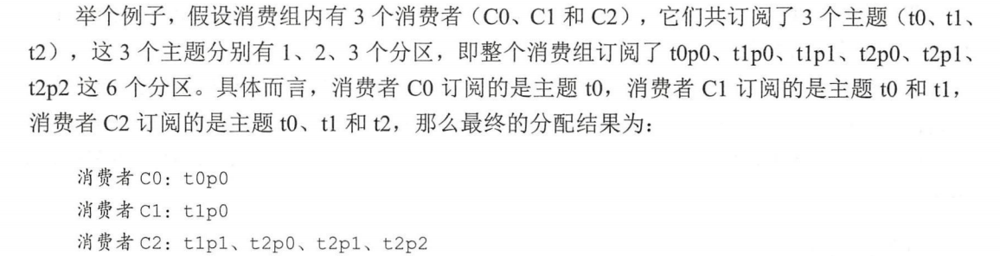

          

       3. StickyAssignor：从0.11开始引入，为了解决两个问题：1、分区的分配尽可能均匀 2、分区的分配尽可能与上次分配的保持相同。当两个发生冲突时第一个目标优先于第二个目标

       4. StickAssignor和ReoundRobinAssignor的区别

          1. 如果组内订阅的topic是一致的，那么此时StickAssignor和ReoundRobinAssignor的分配是一样的。但是当组内有消费者下线时ReoundRobinAssignor会进行auto Rebalanece对剩余的消费者重新分配。而StickAssignor会只重分配下线的那个消费者的分区，对于原有的分区不变
          2. 如果组内订阅的topic是不一致的，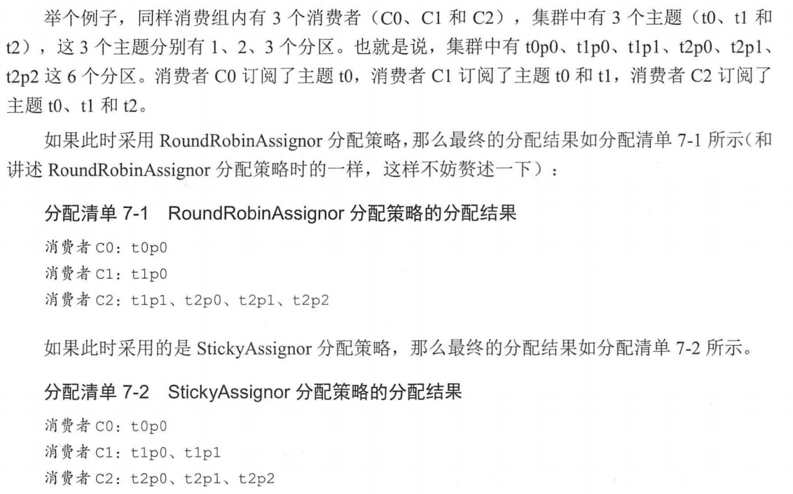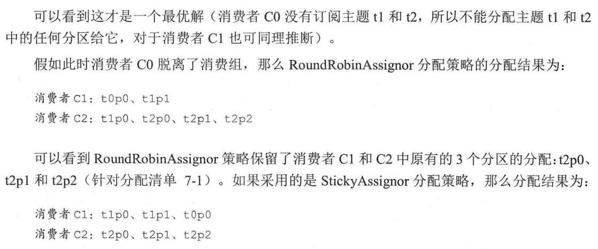

    2. 消费者协调器和组协调器

       1. 疑问？
          1. 如果消费者客户端配置了多个分配策略， 那么以哪个为准
          2. 如果有多个消费者。多个消费配置的分配策略也不同， 以哪个为准
          3. 多个消费者是需要协同的， 协同的过程是怎样的
       2. 每个消费者组的子集在服务端有一个GroupCoordinator对其进行管理，而消费者客户端的ConsumerCoordinator负责与GroupCoordinator进行交互， 主要负责执行消费者rebalance，分区的分配就是在rebalance期间完成
          1. 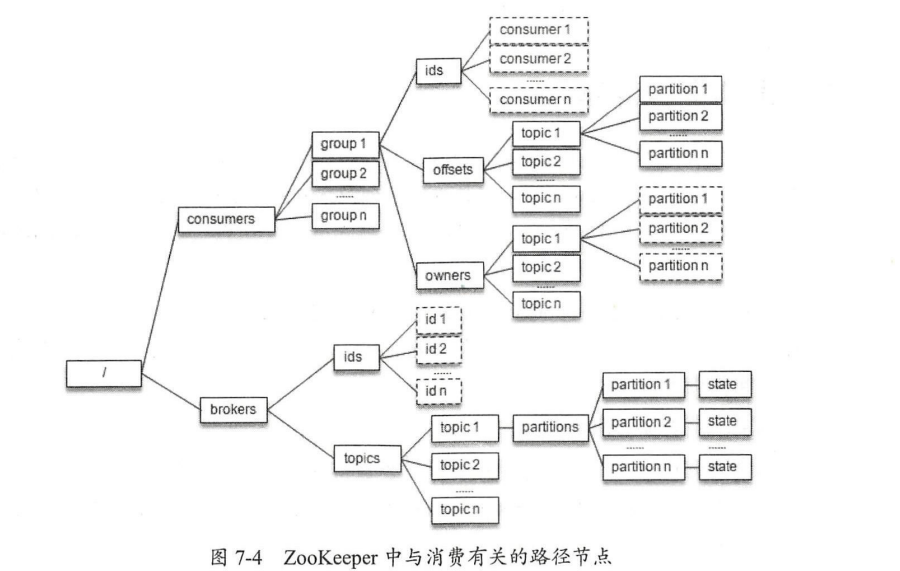
          2. 发在rebalacne时， 一个消费者组下的所有消费者会同时进行rebalance， 而消费者之间并不知道彼此的操作， 如果依赖zk，会有羊群效应
       3. 发生Rebalance的原因：
          1. 新的消费者加入消费者组
          2. 消费者宕机（长时间GC，网络延迟导致未收到心跳）
          3. 有消费者主动退出消费者组
          4. 消费者组对应的GroupCordinator节点发生变更
          5. 组内任一topic或topic的partition数量 发生了变化
       4. 当有消费者加入消费者组的阶段
          1. 第一阶段： FIND_COORDINATOR
             1. 消费者需要确定它所属的组对应的GroupCoordinator所在的broker， 并创建与该broker互相通信的网络连接。如果之前已经保存了对应的broker信息，需要确认网络连接是否正常。如果连接不正常，需要向集群中某个节点（负载最小的节点）发送findCoordinatorRequest请求。
             2. kafka收到findCoordinatorRequest请求之后，根据groupId的hashcode对groupMetadataTopicPartitionCount（topic __ consumer_offset的分区个数）取余。 这样就能找到某个__consumer_offset的分区
             3. 根据分区编号查找该分区的leader所在的broker节点， 该节点就是该消费者组group的GroupCoordinator. 该消费者组的分区分配方案以及组内消费者所提交的消费位移信息都会发送给此分区leader所在的broker节点， 让次broker节点既扮演GroupCoordinator又扮演分区分配方案和组内消费者位移的角色，可以省去很多不必要的中间环节所带来的开销
          2. 第二阶段：JOIN_GROUP, 成功找到消费者所对应的GroupCoordinator之后，消费者会向GrouPCoordinator发送JoinGroupRequest
             1. 消费者发送JoinGroupRequest之后会一直阻塞直到服务端响应
             2. 选举消费者组的leader： 第一个加入消费者组的消费者就是leader，如果leader下线，HashMap中第一个就是leader
             3. 选举分区分配策略：每个消费者都可以设置自己的分区分配策略，根据投票决定
                1. 收集各个消费者支持的所有分配策略，组成候选集candidates
                2. 每个消费者从candidate中找出自身支持的第一个策略，为这个策略投票
                3. 选票最多的就是当前消费者组分配策略
          3. 第三阶段：Sync_Group
          4. 第四阶段：HEARTbeat
       5. consumer_offset
          1. 一般情况下，当集群中第一次消费者消费消息时，会自动创建这个topic

    3. 事务

       1. kafka从0.11开始引入幂等和事务这两个特性，来实现exactly once semantics
          1. 幂等：生产者在进行重试的时候有可能会重复写入消息，利用幂等特性可以避免这种情况
             1. 开启方式：生产者的参数enable.idempotence: true。除了这个参数，也要保证（retries（大于0），acks（-1），max.in.flight.request.per.conneciont(不能大于5)不配错）
             2. 为了实现幂等，kafka引入了producer id和sequence number。每个producer在初始化的时候都会分配一个pid，每条消息发送到每一个分区都一个sequence number，从0开始递增。生产者每发送一条消息就将<pid,partition>对于的sequence number加1。broker端在内存中为每一对<pid,partition>维护一个sequence number，只有当消息中的sequence  number= broker中的sequence number +1，broker才会接受这条消息。kafka的幂等只保证单个生产者幂等。
          2. 事务：因为幂等只支持单分区，所以有了事务。事务可以保证对多个分区的写入操作的原子性。kafka的事务可以使生产消息，消费消息，提交消费位移当做原子操作来处理
             1. 开启事务：生产者 transactional.id: {id},开启事务时候默认开启幂等。
             2. transactionId和producerId一一对应，
             3. transaction的id由用户显式设置。为了保证新的生产者启动之后具有相同的transactionid的旧生产者能立即失效，每个生产者获取pid的同时，还会获取一个单调递增的producer epoch。如果使用同一个transactionId启动两个生产者，先启动的生产者会报错
             4. 缺点
                1. 对于采用日志压缩策略的主体而言，事务中的某些消息有可能被清理（消息具有相同的key）
                2. 事务中的消息可能分布在多个logSegment，当老的logSegment被删除时，消息可能丢失
                3. 消费者通过seek消费消息时，可能会遗漏事务中的某些消息
                4. 消费者在消费时，没有被分配到事务内的分区
             5. 消费者有一个参数：isolation.level， 默认值为read_uncommitted，还可以设置为read_committed. read_committed表示只有commit的消息才能被消费者看到
             6. 为了实现事务功能，kafka引入了TransactionCoordinator, TransactionCoordinator会将事务的状态持久化到__transaction_state中
             7. 实例：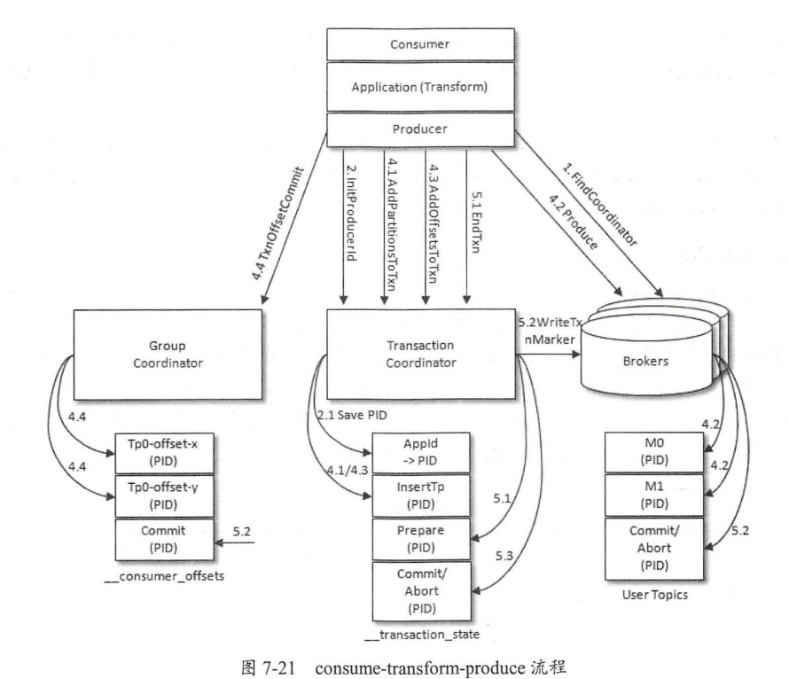
                1. 查找TransactionCoordinator， 和查找GroupCoordinator差不多，公式为transactionId.hashcode() %(_——transaction_state)， 分区的leader就是TransactionCoordinator
                2. 找到TransactionCoordinator之后，给当前生产者分配一个PID。开启幂等或者开启事务都需要这个操作。 
                3. 保存pid到__transaction_state中，幂等时这个请求可以发送到任意broker。保存后会增加该PID的producer_epoch,具有相同PID但是 小于该producer_epoch的其他生产者新开启的事务会被拒绝
                4. 开启事务，生产者调用beginTransaction时认为开启了新事务，只有生产者发送了第一条消息后TransactionCoordinator才认为开启了新事务
                5. Consume_Transform_Produce
                   1. addPartitionsToTxnRequest: 当生产者给一个新的分区发送数据前，需要先给TransactionCoordinator发送addPartitionsToTxnRequest请求， 让TransactionCoordinator把\<transcationId, TopicPartition\>的关系存储在transaction_state中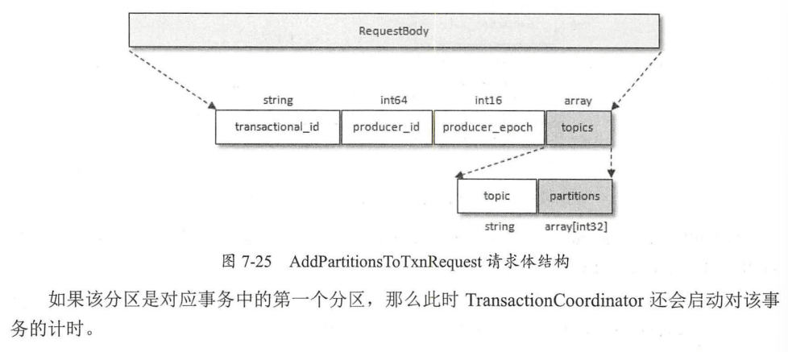
                   2. 

13. 可靠性

    1. 问题？
       1. kafka的多副本之间如何进行数据同步， 发生异常时的处理机制是什么？
       2. 多副本间的数据一致性怎么解决？ 基于的一致性协议又是什么？
       3. 如何确保kafka的可靠性？
       4. kafka的可靠性和可用性之间的关系？

    2. 副本
       1. 失效副本： OSR,OSR的副本处于同步失效或者功能失效的状态。副本滞后leader的时间超过数 replica lag time max ms判定为同步失效， 会把该副本踢出ISR，加入OSR。 根据落后offset的判定方式过时了， 因为此种方式设置太大没有意义，太小会导致ISR频繁伸缩， 而且是全局的，对所有的topic生效，对流入速度不同的topic会有不同的影响。
       2. ISR
          1. 伸缩：
             1. 缩小： 两个定时任务判断repl ca lag time.max ms是否超时
             2. 增加： 当follower追上leader的HW时，添加到ISR中
       3. LEO、HW
       4. leader Epoch
       5. 读写分离
    3. 日志同步机制
    4. 可靠性分析

14. 监控

    1. 监控数据来源
    2. 消费滞后
    3. 同步失效分区

15. 高级应用

    1. TTL
       1. 生产者在header中添加TTL，消费者添加拦截器判断
    2. 延时队列
    3. 死信队列和重试队列
    4. 消息路由
    5. 消息轨迹
    6. 消息审计
    7. 消息代理

16. kafka的源码分析

   17. RDB：

       > bgsave可以在客户端主动触发，也可以又定时任务触发，也可以在slave同步时触发
       >
       > 每次RDB文件都是替换的
       >
       > redis会压缩RDB文件，使用LZF算法
       >
       > 优点：文件紧凑，适合备份，恢复数据时快
       >
       > 缺点：无法秒级持久化，导致和redis数据有较大延迟、版本不兼容

   18. aof

       > 

