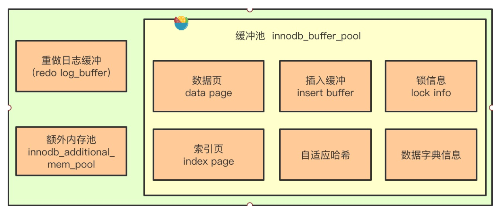

1. 基础知识
   1. 三大范式

   2. innodb和myisam的区别

   3. |              | Myisam                                                       | innodb                                                       |
      | :----------- | ------------------------------------------------------------ | ------------------------------------------------------------ |
      | 存储结构     | myisam每张表都被放在三个文件（frm表定义文件、mydata数据文件、myindex索引文件） | innodb的数据和索引是放在一起的，所以一般innodb的每张表只有2个文件（.idb文件） |
      | 存储空间     | myisam可被压缩，占用空间较小                                 | innodb的表需要更多的内存和存储，他会在内存中简历buffer pool  |
      | 记录存储顺序 | 按记录插入顺序保存                                           | 按主键大小有序插入                                           |
      | 外键         | 不支持                                                       | 支持                                                         |
      | 事务         | 不支持                                                       | 支持                                                         |
      | 锁           | 表级锁                                                       | 行锁、表锁                                                   |
      | 索引         | 非聚簇索引                                                   | 聚簇索引                                                     |
      | 叶子节点     | 存储记录的文件地址                                           | 主键存储所有数据，非主键索引存储索引的数据和主键             |

      myisam每张表都被放在三个文件（frm表定义文件、mydata数据文件、myindex索引文件）

   4. innodb 的四大特性

      1. 插入缓冲（insert buffer）：对于二级索引来讲，叶子节点的插入是随机io，为了提高性能，设计了插入缓冲。具体做法：如果该索引页在缓冲池中，直接插入在缓冲池的页；否则将其放入插入缓冲中，再以一定的频率和索引页合并。**只有二级索引，并且该索引不是唯一的情况下才能使用插入缓冲，因为主键和唯一索引需要去判断数据是否唯一**，**带来的问题：1. 在写密集的时候，插入缓冲会过多占用buffer pool，最多一半，影响性能。2.一旦数据库宕机，恢复时间很长**

      2. 二次写（double write）

         1. 二次写是为了解决脏页刷新到磁盘时发生crash的解决方案。没有double write刷新一半发生crash会导致segment页损坏，这个时候完全不知道页缺失了什么数据

            > InnoDB将数据写入到磁盘是以Page为单位进行操作的。Page Size一般是16KB，其数据校验也是针对这16KB来计算的。由于文件系统对一次大数据页大多数情况下不是原子操作，这意味着如果服务器宕机了，可能只做了部分写入。16K的数据，写入4K时，发生了系统断电/os crash ，只有一部分写是成功的，这种情况下就是partial page write问题。
            >
            > 如果发生写失效，MySQL可以根据redo log进行恢复。这是一个办法，但是必须清楚地认识到，redo log中记录的是对页的物理修改，如偏移量800，写’aaaa’记录。如果这个页本身已经发生了损坏，再对其进行重做是没有意义的。
            >
            > MySQL在恢复的过程中检查page的checksum，checksum就是检查page的最后事务号，发生partial page write问题时，page已经损坏，找不到该page中的事务号。在InnoDB看来，这样的数据页是无法通过checksum验证的，就无法恢复。即时我们强制让其通过验证，也无法从崩溃中恢复，因为当前InnoDB存在的一些日志类型，有些是逻辑操作，并不能做到幂等。
            >
            > # Double write buffer
            >
            > 为了解决这个问题，InnoDB实现了double write buffer，简单来说，就是在写数据页之前，先把这个数据页写到一块独立的物理文件位置（ibdata），然后再写到数据页。这样在宕机重启时，如果出现数据页损坏，那么在应用redo log之前，需要通过该页的副本来还原该页，然后再进行redo log重做，这就是double write。

      3. 自适应hash

      4. 预读（read ahead）

   5. sql语句执行顺序

      1.  **from->2 join->3 on->4 where->5 group by ->6 having ->7 select->8 order by->9 limit**

   6. b+树索引和hash索引的区别

      1. hash只支持等值查询，不支持like 范围查询，而且b+树查询的数据可以是有序的，更符合应用场景
      2. hash会有hash碰撞，性能容易降低

   7. 

2. 索引

   1. 设计索引的原则

      1. 适合索引的列是出现在where子句中的列，或者连接子句中指定的列

      2. 基数较小的类，索引效果较差，没有必要在此列建立索引

      3. 使用短索引，如果对长字符串列进行索引，应该指定一个前缀长度，这样能够节省大量索引空间

      4. 不要过度索引。索引需要额外的磁盘空间，并降低写操作的性能。在修改表内容的时候，索引会进行

      更新甚至重构，索引列越多，这个时间就会越长。所以只保持需要的索引有利于查询即可。

      5. 更新频繁字段不适合创建索引
      6. 尽量的扩展索引，不要新建索引
      7. 区分度较高的列适合创建索引

3. 事务

4. 锁

   1. innodb的行锁是基于索引来完成的

   2. innodb对于行的查询使用next-key lock

   3. Next-locking keying为了解决Phantom Problem幻读问题

   4. 当查询的索引含有唯一属性时，将next-key lock降级为record key

   5. Gap锁设计的目的是为了阻止多个事务将记录插入到同一范围内，而这会导致幻读问题的产生

   6. 有两种方式显式关闭gap锁：（除了外键约束和唯一性检查外，其余情况仅使用record lock） A.

      将事务隔离级别设置为RC B. 将参数innodb_locks_unsafe_for_binlog设置为1

   7. 隔离级别与锁的关系

      1. 在Read Uncommitted级别下，读取数据不需要加共享锁，这样就不会跟被修

         改的数据上的排他锁冲突。		

         在Read Committed级别下，读操作需要加共享锁，但是在语句执行完以后释放共享锁；

         在Repeatable Read级别下，读操作需要加共享锁，但是在事务提交之前并不释放共享锁，也就是必须

         等待事务执行完毕以后才释放共享锁。

         SERIALIZABLE 是限制性最强的隔离级别，因为该级别锁定整个范围的键，并一直持有锁，直到事务完成。

5. binlog redolog undolog

   1. binlog的三种格式

      1. ​     关于这三中格式的binlog，我们在使用的时候到底应该使用哪一种？我的观点如下：

         1. 如果我们的磁盘空间和服务器性能比较OK的情况下，尽量使用Row模式，因为这种模式能够最大程度的保证安全性，虽然产生的日志量很多，但是当你误删数据的时候，你就会感受到binlog给你带来的温暖。
         2. 当我们对一些不太重要的业务库(例如一些log库)进行数据主从复制的时候，尽量使用statement来执行，因为它的速度快，日志量小，而且不牵扯使用函数，是简单的数据同步。
         3. 如果有一些场景需要尽量保证性能，但是又没有十分严格的要求时，我们可以设置为Mixed格式，它可以在statement和Row之间进行切换，保证了业务的写入性能
         4. 最后一点，在RC和RU隔离界别下，不能使用statement格式的binlog日志。

      2. statment

         > 该格式下每一条会修改数据的sql都会记录在binlog中。
         >
         > 优点：不需要记录每一行的变化，减少了binlog日志量，节约了IO，提高性能。它相比row模式能节约很多性能与日志量，具体节约的多少取决于应用的SQL情况。正常同一条记录修改或者插入row格式所产生的日志量还小于Statement产生的日志量，考虑到整表删除等一些大量数据操作，ROW格式会产生大量日志，所以总体来讲statement模式会稍微好一些。
         >
         > 缺点：由于记录的只是执行语句，为了这些语句能在slave上正确运行，因此还必须记录每条语句在执行的时候的一些相关信息，以保证所有语句能在slave得到和在master端执行时候相同的结果。
         >
         > statment格式eg：
         >
         > ```javascript
         > #190328 22:51:03 server id 213  end_log_pos 434 CRC32 0x0569f619        Query   thread_id=4     exec_time=0     error_code=0
         > SET TIMESTAMP=1553784663/*!*/;
         > update yeyz.yyz_test set age=6
         > /*!*/;
         > # at 434
         > #190328 22:51:03 server id 213  end_log_pos 465 CRC32 0x688386c7        Xid = 35
         > COMMIT/*!*/;
         > SET @@SESSION.GTID_NEXT= 'AUTOMATIC' /* added by mysqlbinlog */ /*!*/;
         > DELIMITER ;
         > ```

      3. row

         > 不记录sql语句的上下文信息，只记录哪条记录被修改了。此外，新版的MySQL中对row级别也做了一些优化，当表结构发生变化的时候，会记录语句而不是逐行记录。
         >
         > 1. 优点：  binlog中可以不记录执行的sql语句的上下文相关的信息，仅需要记录那一条记录被修改成什么了。所以Row格式的日志内容会非常清楚的记录下每一行数据修改的细节，可以支持闪回
         > 2. 所有的执行的语句当记录到日志中的时候，都将以每行记录的修改来记录，这样**可能会产生大量的日志内容**,比如一条update语句或者一条alter语句，修改多条记录，则binlog中每一条修改都会有记录，每条记录都发生改变，那么该表每一条记录都会记录到日志中，这样造成binlog日志量会很大
         > 3. row格式实例: 本质是一个sql语句
         >
         > ```javascript
         > ### UPDATE `yeyz`.`yyz_test`
         > ### WHERE
         > ###   @1=2 /* INT meta=0 nullable=1 is_null=0 */
         > ###   @2=4 /* INT meta=0 nullable=1 is_null=0 */
         > ### SET
         > ###   @1=2 /* INT meta=0 nullable=1 is_null=0 */
         > ###   @2=5 /* INT meta=0 nullable=1 is_null=0 */
         > COMMIT/*!*/;
         > SET @@SESSION.GTID_NEXT= 'AUTOMATIC' /* added by mysqlbinlog */ /*!*/;
         > DELIMITER ;
         > ```

      4. mixed

6. buffer pool

   1. 

7. sql优化

8. explain分析

9. 分库分表

10. 分布式事务

11. 具体题

       1. 海量数据怎么分页

       2. 一条sql语句的执行过程

             1. 连接器
             2. 分析器
             3. 优化器：PERFORMANCE_SCHEMA，收集数据库性能参数，使用memory存储引擎，优化器会根据这个数据库的数据进行基于成本的优化
             4. 执行器
             5. innodb：先经过hash看数据页是否在buffer pool，三种日志（redo log，bin log，undo log），还有锁

       3. checkpoint是什么

       4. binlog、redo log、undolog 是什么

       5. mvcc实现原理

             1. readView（max_id,min_id,ids[], currentId）和undolog版本链

       6. 怎么解决幻读

             1. mvcc
             2. next-key lock(record lock和 gap lock（左开右闭）)

       7. mysql有哪些锁

             1. 共享锁
             2. 独占锁
             3. 读锁
             4. 写锁
             5. MDL锁
             6. 表锁、行锁（mysql的行锁基于索引），页锁

       8. b树和b+树的区别

             1. b+树扇出性搞
             2. 稳定
             3. 叶子节点双向链表

       9. union和union all的区别

       10. join的工作流程，怎么优化

       11. 主键、唯一索引、普通索引的区别

              1. 数据是按主键的顺序逻辑存放的，主键也是唯一
              2. 

       12. 什么是分库分表

              1. 水平拆分和垂直拆分

       13. 怎么实现垮裤分页查询

              1. 

       14. mysql的主从复制（半同步复制，gtid复制、组复制等）

                    1. 

       15. char和varachar的区别

                 1. char的空间是固定的
                 2. 存储相同长度的数据，varchar空间更多，因为varchar需要记录长度
                 3. 支持的长度不一样，char最大长度255，varchar（65535）

       16. 如何建立索引

                 1. 适合索引的列是出现在where子句中的列，或者连接子句中指定的列
              2. 基数较小的类，索引效果较差，没有必要在此列建立索引
              3. 使用短索引，如果对长字符串列进行索引，应该指定一个前缀长度，这样能够节省大量索引空间
              4. 不要过度索引。索引需要额外的磁盘空间，并降低写操作的性能。在修改表内容的时候，索引会进行更新甚至重构，索引列越多，这个时间就会越长。所以只保持需要的索引有利于查询即可
                 5. 更新频繁字段不适合创建索引
       6. 尽量的扩展索引，不要新建索引
              7. 区分度较高的列适合创建索引
           
       17. 索引失效场景

                 1. 使用!=或者<>导致索引失效
                 2. 使用函数导致索引失效
                 3. 使用算术运算导致索引失效
                 4. or导致索引失效
                 5. 模糊搜索导致索引失效
                 6. not in。not exists导致索引失效

       18. 百万级别以上的数据怎么删除

                 1. \1. 所以我们想要删除百万数据的时候可以先删除索引（此时大概耗时三分多钟）

                    \2. 然后删除其中无用数据（此过程需要不到两分钟）

                    \3. 删除完成后重新创建索引(此时数据较少了)创建索引也非常快，约十分

                 钟左右

                 ​		4. 与之前的直接删除绝对是要快速很多，更别说万一删除中断,一切删除会回滚。那更是坑了

       19. 最左匹配原则

                 > 顾名思义，就是最左优先，在创建多列索引时，要根据业务需求，where子句中
                 >
                 > 使用最频繁的一列放在最左边。
                 >
                 > 最左前缀匹配原则，非常重要的原则，mysql会一直向右匹配直到遇到范围查询(>、<、between、like)
                 >
                 > 就停止匹配，比如a=1andb=2andc>3andd=4如果建立(a,b,c,d)顺序的索引，d是用不到索引的，如果建
                 >
                 > 立(a,b,d,c)的索引则都可以用到，a,b,d的顺序可以任意调整。
                 >
                 > =和in可以乱序，比如a=1andb=2andc=3建立(a,b,c)索引可以任意顺序，mysql的查询优化器会帮你优化
                 >
                 > 成索引可以识别的形式

   12. 大表数据查询，怎么优化

       \1. 优化shema、sql语句+索引；

       \2. 第二加缓存，memcached, redis； 

       \3. 主从复制，读写分离；

       \4. 垂直拆分，根据你模块的耦合度，将一个大的系统分为多个小的系统，也就是分布式系统；

       \5. 水平切分，针对数据量大的表，这一步 麻烦， 能考验技术水平，要选择一个合理的sharding key,

       为了有好的查询效率，表结构也要改动，

   

