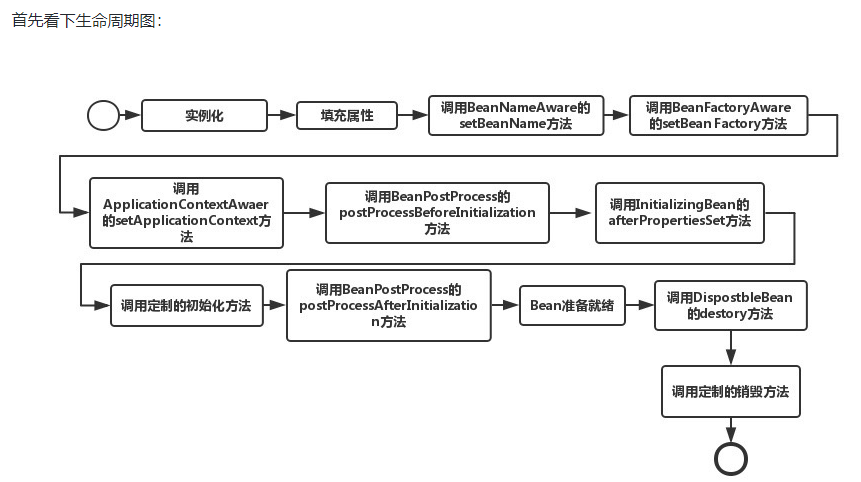
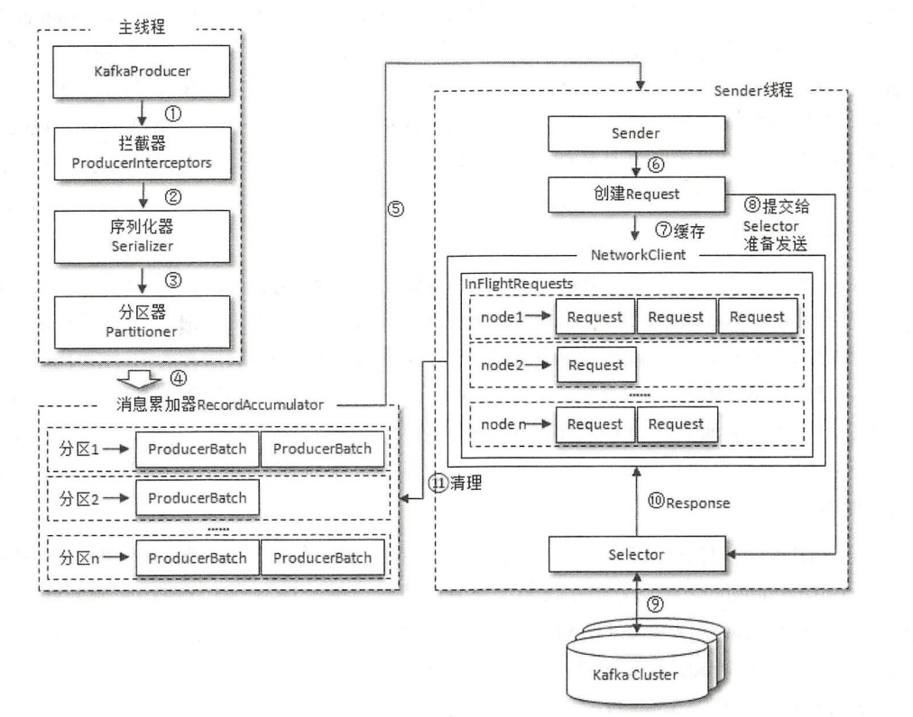

1. jdk

   1. nio
      1. socket通信机制
      2. io多路复用模型
      3. IO模型和java网络编程模型
      4. 三大组件？
      5. epoll原理？和select的区别？边缘触发和水平触发？惊群问题？
      6. netty？
      7. 零拷贝？
         1. mmap
         2. sendfile
      8. tomcat的nio
      9. nio空轮训bug？netty怎么解决？
      
   2. 反射

         1. 反射的两种调用方式

               1. 本地实现:NativeMethodAccessorImpl
               2. 委派实现：DelegatingMethodAccessorImpl.invoke。委派实现会调用本地实现：
               3. 对于普通的method.invoke（）开始的15次都是委派实现，15次以后是本地实现

         2. 为什么不直接使用本地实现 而要多一种委派实现？

               > java的反射机制还设立了另一种动态生成字节码的实现，直接使用invoke指令来调用目标方法。采用委派实现是为了能在本地实现和动态实现之间来回切换。（动态实现未开源）
               >
               > 

         3. 反射为什么慢？

               1. 反射调用分配了更多的栈帧
               2. 创建了更多的对象

   3. 集合
      1. set和list区别？

         > set:无序 ，不可重复，时间复杂度（插入：O（1），contain：O（1））
         >
         > list：有序，可重复，list可用过下标来访问，时间复杂度（插入：O（n），contain：O（n））

      2. fail-fast机制

         > 集合内部会维护一个modCount，初始值为0，改之前会进行cas判断modCount和expectedModecount是否一致，不一致会抛出异常。每次对集合进行增删改完之后都会对modCount++

      3. ArrayList：

         > 1. ArrayList的默认容量是10
         > 2. 当ArrayList的容量不够时，会进行扩容，扩容后的大小是原来的1.5倍：newCapacity = oldCapacity + (oldCapacity >> 1)
         > 3. 扩容时会把原数组的数据copy到新数组：System.arraycopy(0,oldsrc,0,newsrc,length)
      > 4. 
      
   4. ArrayList扩容机制？
      
         > 
      
   5. ArratList和Vertor区别？
      
      > ArrayList: 线程不安全，扩容时1.5倍扩容
         >
         > Vertor: 线程安全，扩容时翻倍扩容

      6. ArrayList和LinkedList区别？
      
         > ArrayList:
      >
         > LinkedList:

      7. Hashmap、hashTable和hashSet区别？

      8. HashMap的node层级结构
      
      1. 示例图：
         
      2. 123
         
      9. HashMap
         1. 特性
      
            > 1. hashMap的存取是没有顺序的
            > 2. KV都可以为null
            > 3. 多线程下该类是不安全的
            > 4. JDK8是数组+链表+红黑树，JDK7是数组+链表
            > 5. 初始容量和装载因子是性能的关键，一般不要动
            > 6. HashMap是懒汉式的，只有put数据才会是初始化
            > 7. 双向链表和红黑树是共存的（数组里有的Node是链表，有的Node是红黑树）
            > 8. 对于传入的两个key，会强制排序，决定是向左还是向右
            > 9. 链表转换成红黑树后会努力将root节点和table[i]节点融合成一个
            > 10. 如果同一个节点的链表数据节点个数 > `TREEIFY_THRESHOLD=8`且数组长度 >= `MIN_TREEIFY_CAPACITY=64`，则会将该链表进化位`RedBlackTree`,如果`RedBlackTree`中节点个数小于`UNTREEIFY_THRESHOLD=6`会退化为链表
      
         2. 为什么负载因子是0.75
      
            > 1. 负载因子提高了空间的利用率，但是增加了冲突的概率会增加链表的长度，可能导致查询和插入性能降低
            >
            > 2. 负载因子很低性能会好点，但是会浪费空间，
            > 3. 0.75在空间和时间上做了很好折中
      
         3. 为什么转换成树的阈值是8？
      
            > 8=0.75*12（16* * 0.75）是基于泊松分布算出来，当长度为8时树化的几率比较低。TreeNode的大小是链表node的两倍，所以要尽可能避免树化
      
         4. 为什么树化还要判断数组长度大于64？
      
            > 避免hashMap建立初期，冲突概率比较大，此时应该去扩容而不是树化
      
         5. get流程
      
            > 1. 计算key的hash值，算出对应数组的下标
            > 2. 如果数组位置为null，返回null
            > 3. 如果不为null，看当前node是否equals key。相等则返回
            > 4. 如果table[i]是treeNode，按红黑树的查找
            >    1. 先获得根节点，左节点，右节点。
            >    2. 根据 左节点 < 根节点 < 右节点 对对数据进行逐步范围的缩小查找。
            >    3. 如果实现了Comparable方法则直接对比。
            >    4. 否则如果根节点不符合则递归性的调用find查找函数。
            > 5. 如果是链表，遍历链表，找到node equals key的那个node
      
         6. put流程？
      
            > 1. 对key计算hash值
            > 2. 现在entry数组有没有初始化，如果没有就初始化
            > 3. 计算参数key的hash，算出该key应该在数组中的位置
            > 4. 如果table[i]==null,直接放进去，如果node和当前key一样，进行覆盖
            > 5. 如果是树，putTreeVal
            > 6. 如果是链表，遍历链表，如果key之前存在，进行覆盖。不存在就在链表的后面添加，如果是添加还需要判断需不需要树化
      
         7. 扩容流程？
      
         8. hashMap的长度为什么是2的幂次方？
      
            1. 计算数组下标时可以把取余运算转换成位运算，速度更快
            2. 扩容比较快，高一位为0位置不变，高一位为1的位置=（当前位置+原始数组长度）。整个过程不用重新计算hash值
      
         9. 为什么要把hashCode右移16位？(h = key.hashCode()) ^ (h >>> 16)
      
            1. 扰动函数：使高位也能参与运算，这样得到的hash值就不止和地位相关，增加了随机性，尽可能使数据均匀分布。之前tomcat被爆漏洞就是因为hash算法太简单了
      
      11. 并发安全？
      
             1. hashmap没有使用任何的锁机制，所以是线程不安全的
             2. 可能造成并发安全的操作：
                1. 一写多读
                2. 扩容
      
   4. ConcurretnHashMap

   5. CopyOnWriteList

   6. jdk新特性
      1. 1.8的新特性
         1. lamdba
         2. 接口的deafult方法
         3. stream
         4. localDatetime
         5. Optional
         6. 独占缓存行注解
      2. jdk9特性
      3. jdk15特性：
         1. 去除synchronized的偏向锁

2. jvm

   1. jvm的内存结构？

      > 1. 类加载器：url 
      > 2. 运行时数据区：
      > 3. 执行引擎，本地方法库

   2. 对象创建过程？

      > 1. 如果开启了逃逸分析，会分析该变量是不是线程私有的，如果是私有的会尝试标量替换把对象打散，把其中的基础数据类型在栈上分配。
      > 2. 如果不能在栈上分配，会尝试在TLAB(thread local aclcation buffer：默认大小是eden区的1%)上分配。（Tlab是为了加快对象分配速度，防止每次分配对象都需要cas，每个TLAB只能由一个线程创建对象，但是创建出来的对象是共享的）
      > 3. 如果TLAB分配失败，如果内存是规整的就进行指针碰撞，否则就在空闲列表找一块内存分配。

   3. 什么情况发生OOm异常

      > 1. 堆内存溢出：内存泄漏、内存不够
      > 2. 方法区溢出：动态创建了大量的类
      > 3. 堆外内存：容易内存泄漏

   4. 判断对象是否是垃圾？

      > java里使用可达性算法，从GC ROOTS出发，能被GC ROOTS找到的对象就是存活的对象，否则就是垃圾对象

   5. 怎么判断一个类是无用的类

      1. 该类的所有实例都已经被回收，即java堆中不存在该类的实例
      2. 该类对应的Class对象没有在任何地方被引用，无法在任何地方通过反射访问该类的方法
      3. 该类的classLoader已经被回收

   6. GC ROOT

      > 1. 虚拟机栈引用的对象
      > 2. 方法区类属性（static修饰的）引用的对象
      > 3. 方法区常量池引用的对象
      > 4. 本地方法栈中引用的对象
      > 5. 被同步锁（synchronized）持有的对象
      > 6. jvm自身只有的对象，比如系统类加载器，基本数据类型对应的class对象
      > 7. 对于YGC，老年代对新生代的引用也可以作为GC ROOT

   7. 4中引用？

      > 1. 强引用：一般就是new出来的对象
      > 2. 软引用（对应SoftRefenerce）：只要内存足够，就不会被回收。软引用可以配合ReferenceQueue一起使用（在创建软引用的时候在构造方法传入一个ReferenceQueue），当软引用已经被回收时，会把该对象加入ReferenceQueue，调用ReferenceQueue.poll()可以知道哪些软引用会被回收。用来做缓存
      > 3. 弱引用（对应WeekRefenerce）：下次垃圾回收就会回收。也可以配合ReferenceQueue一起使用
      > 4. 虚引用（对应platformRefenerce）：一定要配合ReferenceQueue一起使用。jdk8的platformRefenerce不会对gc产生影响。
      > 5. FinalReference:  如果某个对象实现了非空的Finalize()方法，那么会在编译时候生成一个Finalizer。所有的此类对象形成一个Finalizer链条。在gc的时候会取出对象执行finalize方法，并把该Finalizer从链条中删除，所以finalize方法只会执行一次（单独的线程执行）。

   8. PhantomReference和finalizer：

      1. -
      2. -------------------------------------------------------------------------------- 

   9. 软引用为什么可以解决OOM问题？

      > ​	假如有一个应用需要读取大量的本地图片，如果每次读取图片都从硬盘读取，则会严重影响性能，但是如果全部加载到内存当中，又有可能造成内存溢出，此时使用软引用可以解决这个问题。
      >
      > 　设计思路是：用一个HashMap来保存图片的路径 和 相应图片对象关联的软引用之间的映射关系，在内存不足时，JVM会自动回收这些缓存图片对象所占用的空间，从而有效地避免了OOM的问题。在Android开发中对于大量图片下载会经常用到。

   10. 虚引用的作用？

      > 1. 之前mysql使用finalize方法来清理资源，先已经改为虚引用了（finalize线程可能得不到执行，导致无法gc）

   11. 为什么jdk的垃圾回收不回收 虚引用？

       > ​    在Java 8的实现中，确保对象在真正GC前能被对应的ReferenceQueue处理，所以将对象标记为活跃，不回收对象
       >
       > ​    显然，在这种情况下，会导致本可以回收的对象无法回收的问题，所以在Java 9中，确保PhantomReference指向的对象在回收后（而不是原来的回收前），会被对应的ReferenceQueue处理，这样在一定程度上保证了功能，又修复了这个问题

   12. 方法区的回收？

   13. 垃圾回收算法？

       > 1. 标记清楚：
       > 2. 复制算法：
       > 3. 标记整理算法：

   14. 内存分配和回收策略？

       1. 对象分配原则

          > 1. 栈上分配->TLAB->eden分配，如果eden没有足够的空间，执行Minor GC
          > 2. 大对象直接进入老年代：

       2. 回收策略

   15. 对象怎么进入老年代？

       > 1. 大对象直接进入老年代
       > 2. 长期存活的对象进入老年代
       > 3. 动态年龄判断：如果survivor区中相同年龄的对象大于survivor空间的一般，那么大于该年龄的对象进入老年代
       > 4. 空间担保：每次进行GC时，jvm会计算survivor区移到老年代对象的平均大小，如果这个值大于老年代的剩余空间则进行一次full GC

   16. 垃圾回收器？

       1. 
       2. asdf

   17. G1

       1. 参数：
          1. -XX:MaxGCPauseMillis=200 ：指
          2. 

       1. 初始标记：需要stw，只标记GC ROOT能直接关联的对象
       2. 并发标记：在初始标记的基础上继续搜索
       3. 预清理：
       4. 可被终止的预清理：
       5. 重新标记：
       6. 并发清除：
       7. 并发重置状态

   18. zgc

   19. 三色标记法？浮动垃圾？

       1. 把从GC ROOTS开始遍历到的对象按“是否访问过”标记成3中颜色

          > * 白色：没被访问过
          > * 黑色：本对象已访问过，而且本对象引用的其他对象也全部访问过了
          > * 灰色：本对象已访问过，但是本对象引用的其他对象没有全部访问完。全部访问完后，会变成黑色

       2. 遍历访问过程

          > 假设现在有白色、灰色、黑色三个集合，分别存放对应颜色的对象
          >
          > 1. 开始垃圾回收时，所有的对象都在白色集合中
          > 2. 将GC ROOTS直接引用的对象挪到灰色集合汇中
          > 3. 从灰色集合中获取对象
          >    1. 将本对象引用到的其他对象挪到灰色集合中
          >    2. 将本对象挪到黑色集合中
          > 4. 重复步骤3，知道灰色集合为空
          > 5. 此时仍在白色集合的对象就是垃圾，在黑色集合的对象就是存活下来的对象

       3. 当需要支持并发标记时（标记期间，应用程序还在继续跑 继续产生垃圾），对象间的引用关系可能发生变化，多标和漏标的情况就会发生

          1. 多标（浮动垃圾）：

             > 在并发标记期间，有些对象由GC ROOTS可达变成了不可达。这部分是本应该回收但是却没有被回到到的内存。下一次垃圾回收会回收这些对象

          2. 漏标：

       4. 各个垃圾回收器对漏标的处理办法：

          1. CMS:写屏障+增量更新
          2. G1:写屏障+SATB
          3. zgc:读屏障

   20. 分代收集？弱分代假设？分代收集垃圾回收器怎么工作？

       > 1. 弱分代假设的两个理论
       >    1. 大部分对象都是朝生夕死的
       >    2. 少部分年级大的对象持有年纪小的对象的引用
       > 2. 分代收集是弱分代理论1，有了分代之后就只需要在新生代进行频繁GC，提高了收集效率
       > 3. 如果没有分代收集，新创建的对象和生命周期很长的对象放在一起，由于程序在不断运行会产生大量垃圾，所以每次回收都需要遍历所有对象，扫描整个堆空间，会严重影响程序效率，而且效率不高

   21. 类加载过程？类加载方式？tomcat如何破坏双亲委派模型？

       > 1. 类加载就是把class文件加载到内存中，将其转化成方法区运行时的数据结构，同是在堆中生成一个镜像，即Class对象
       > 2. 双亲委派
       >    1. 先交给父加载器加载
       >    2. 加载：类加载器扫描自己的url下的类，转化成路劲，然后加载类的二进制数据
       >    3. 验证：验证文件格式，字节码等
       >    4. 准备：为类的静态变量分配内存，并初始化成为默认值
       >    5. 解析：把符号引用（就是个字符串）装换为直接引用（可以是直接指向目标的指针（指向对象、类变量、类方法的指针），相对偏移量（指向实例变量方法的指针）或是句柄）
       >    6. 初始化：给类的静态变量赋予正确的值，执行静态代码块等
       > 3. Java Agent允许我们在类加载之前修改类，也可结合Attach API使用，在类加载之后，程序运行期间可随时修改类，通过重新加载类替换旧的类

   22. 类加载是并发安全的吗？

       > 是。类加载的时候会把类名当锁
       
   23. new Object（）发生了什么？

       1. 先去检查该类是否被加载了，没有就使用双亲委派进行类加载
       2. 加载->验证->准备->解析->初始化
       3. 栈上分配或分配内存：栈->TLAB->(空闲列表或指针碰撞)
       4. 初始化（实例变量初始化零值）->设置对象头->执行init方法、构造方法

   24. 什么情况发送ygc？什么情况下发送full gc？

       1. ygc

          > 1. Eden区满了

       2. full gc

          > 1. 手动执行System.gc（没有手动禁用GC的前提下）。部分垃圾回收器会执行Full GC
          >
          > 2. 堆伸缩时会发生full gc：
          >
          > 3. 老年代空间不足：大对象进入老年代、长期存活的对象进入老年代
          >
          > 4. metaSpace空间不足：比如使用了OSGI动态生成了大量的类
          >
          > 5. 空间担保：
          >    1. 每次晋升对象的平均大小>老年代剩余空间
          >    2. minor GC后存活的对象超过了老年代的空间
          >    
          > 6. ---------------------------------
          >
          > 7. parallel GC：默认会在要触发full GC之前先进行一次YGC（减轻Fu'll  GC的负担）
          >
          > 8. cms：定期检查老年代的使用量，超过阈值也会对老年代进行并发收集

   25. jvm怎么调优？一般从哪里入手？

       1. 调优的策略：尽量把生命周期短的对象留在新生代，减少对象进入老年代的机会，生命周期长的对象放在老年代

   26. 为什么有垃圾回收还会发生内存泄漏？

       > java里的内存泄漏是指 已经不用的对象长期占用着内存或者说生命周期短的对象长期在内存中。
       >
       > 内存泄漏原因：1. 一般是对象的作用域设置的不合理
       >
       > ​							2. 不用的对象没有手动置为 null

   27. 内存持续上升？怎么定位问题？

       1. 内存泄漏
       2. 如果不是内存泄漏，说明对象过早的进入了老年代，过早进入老年代的原因：
          1. 对象晋升年龄过低
          2. 程序创建了大对象、大数组
          3. 空间担保导致对象进入了老年代
          4. 动态年龄判断导致对象过早进入老年代

   28. jvm参数？

       1. -Xms：最小堆内存
       2. -Xmx：最大堆内存
       3. -XX:NewSize：新生代大小
       4. -XX:NewRatio: 新生代和老年代的比例（最小值为1）
       5. -XX：SurvivorRatio：eden和survivor的比例（最小值为1）

3. juc

   1. 多线程理解？什么是并发安全？

   2. 竞态条件？

      > 当两个线程竞争同一资源时，如果对资源的访问顺序敏感，就称存在竞态条件

   3. 临界区？

      > 导致竞态条件发生的代码区称为临界区

   4. Java的内存模型

   5. as-if-serial

      > as-if-serial是指不管怎么重排序，单线程的程序的执行结果不能该表

   6. java实现同步方式？

      1. ReetranLock

      2. synchronized

      3. 区别：

         > 1. lock是java语言级别的api，synchronized是jvm提供的关键字
         > 2. 

   7. 如何创建一个线程？如何指定线程的执行逻辑？

   8. 线程的6种状态？

      1. new
      2. runnable
      3. blocked
      4. waiting
      5. time waiting
      6. terminated

   9. 对象头？每个对象占多大内存？markWord？monitor？

   10. 对象的内存结构

       1. 对象头
          1. markword：
          2. class pointer
       2. 实例数据
       3. 对齐填充

   11. volatile？

      12. 可见性和有序性怎么保证？

      13. 缓存一致性协议怎么保证可见性？

          > 1. cpu的缓存值有4个状态：独占，共享，已修改，失效
          > 2. 当状态是共享转为已修改时，会通知其他cpu，使其他cpu缓存的值变成失效

   14. synchronized

       1. 锁升级？偏向锁->自旋锁->重量级锁

          > 1. 线程第一次获取锁的时候，获取的是偏向锁，把对象头的markword的前23位设置成获取锁的线程id。当有第二个线程来抢锁时，升级为轻量级锁
          > 2. 获取锁的线程在栈中新建一个lock record，在lock record存放锁对象的markrecord副本，还存放一个owner指针指向锁对象。对象的markword指向lock record，这样就把锁对象和线程绑定起来。后续其他来抢锁的线程会自旋（自适应自旋：如果上次自旋已经获得过锁，那么此次也有可能获取到锁，所以会延长自旋时间）。（1.6之前：自旋个数超过CPU核数的一半  或者自旋次数超过10次才会升级成重量级锁）
          > 3. 

       2. jdk15为什么去掉偏向锁？

          > 1. 偏向锁导致synchronized的代码复杂度太高，导致难以维护
          > 2. 过去使用偏向锁确实能提高性能，因为撤销偏向锁成本非常高，所以只有那些不必要的同步而受益于偏向锁定的应用程序可能会看到性能改进。此外，围绕线程池队列和工作线程构建的应用程序通常在禁用偏置锁定的情况下性能更好，而cas需要的cpu指令变少，所以自旋的成本变低，偏向锁带来的优势就更小了。

       3. 偏向锁的加锁流程

          1. 先撤销
          2. 线程加轻量级锁

       4. 偏向锁的撤销过程

          > 

       5. 轻量级锁加锁过程

          > 1. 如果对象处于无锁不可偏向状态，线程创建lock record
          > 2. 使用cas尝试把对象的Markword指向当前线程
          >    1. cas成功说明加锁成功
          >    2. cas失败，判断对象的markword是否指向当前线程的
          >       1. 是：可重入
          >       2. 加锁失败，进入自旋，自旋一定次数膨胀成重量级锁

       6. synchronized怎么保证可重入性？

          > 

       7. synchronize抛出异常会怎么样？

          > synchronized重入之后，内层抛出异常，跳出synchronized代码块，会释放锁

       8. 实例图：

       9. synchronized和hashcode的关系图：

   15. volatile和synchronized的区别？

   16. lock和synchronized的区别？

   17. final?

   18. 并发容器和同步容器

       1. 同步容器：
       2. 并发容器：

   19. 如何自己实现aqs

       1. 通用性，下层实现透明的同步机制，同时与应用层或者上层业务解耦
       2. 利用cas，可以使用一个变量作为锁的标志位，利用cas的原子性来修改这个标志位
       3. 获取不到锁的优化：
          1. 立即返回
          2. 放入等待队列

   20. aqs

       1. node结构
          1. ```waitStatus,pre,next,Thread```
          2. 123
          
       2. aqs为什么从队尾往前寻找

          > 因为入队方法enq是这么入队的：Node t = tail; cas把tail设置成newNode，然后把t.next=tail;

       3. 公平锁和非公平锁的区别

          1. 非公平锁调用lock后，会先尝试cas抢锁，然后才去调用treAcquire
          2. treAcquire方法，如果此时state= 0，公平锁会判断队列中是否有线程处于等待状态，而非公平锁直接抢锁。

   21. 什么是死锁？

       > 死锁是指两个或两个以上的进程在执行过程中，由于竞争资源造成的一种互相等待的现象，若无外力干扰，他们都无法继续执行下去。

   22. 死锁发生的原因？

       > 1. 系统资源不足
       > 2. 进程运行获取资源的顺序不合理
       > 3. 资源分配不当

   23. 死锁发生条件

       > 1. 互斥条件：一个资源每次只能被一个进程使用。
       > 2. 占有且等待：一个进程因请求资源而阻塞时，对已获得的资源保持不放。
       > 3. 不可强行占有：进程（线程）已获得的资源，在未使用完之前，不能强行剥夺。
       > 4. 循环等待条件：若干进程（线程）之间形成一种头尾相接的循环等待资源关系。

   24. Java死锁怎么排查和解决？

       > 1. 是用arthas的thread -b可以找出当前阻塞其他线程的线程

   25. cpu100%怎么排查和解决？

   26. threadLocal

       1. 

   27. fastThreadLocal

   28. 线程池

       1. 七个核心参数？

          > 1. ThreadFactory:
          > 2. coreSize:
          > 3. queue:
          > 4. maxSize:
          > 5. RejectPolicy:
          > 6. TimeUnit:
          > 7. time:

       2. 四种默认的线程池？

       3. 的锁？

       4. 自定义拒绝策略？
       
          > 序列化 然后保存起来
       
       5. 线程池怎么实现维持核心线程数的？

4. 计网

   1. http

      1. get和post的区别
         1. get一般通过url传参，post的参数放在请求体中
         2. get请求结果会被浏览器主动缓存
         3. get请求的参数会被保存在浏览器的历史记录里

   2. tcp

      1. tcp的特点：	

         1. 面向连接
         2. 可靠
         3. 面向字节流
         4. 全双工

      2. 三次握手：

      3. 两次握手可以吗?

         > 三次握手是为了防止已失效的连接请求报文又传输到了服务端

      4. 四次挥手：

      5. 第四次挥手为什么要等待2MSL（每次发送最后一次ack都会重新把时间更新为2MSL）

         > 1. 保证a发生的ack能够到达b。如果a发生的ack丢失，b会发起超时重传
         > 2. 防止已失效的连接请求出现在本连接中。a在发送完最后一个ack报文后，再经过2MSL，这个连接的所有报文都会从网络中消失，使得下个新的连接不会出现旧的数据。

      6. 为什么是四次挥手？

         > 1. 本来建立连接就需要4次，不过建立的连接的时候可以把syn和ack放到同一个连接。但是在关闭连接的时候，不能一起关闭，因为此时server可能还有数据没有发完       

      7. 拥塞控制

         1. 慢启动：

            > 把滑动窗口cwnd设置成MSS，每收到一个报文的确认就把cwnd加倍，直到cwnd到了ssthresh，然后开始加1而不是翻倍

         2. 拥塞避免：如果没有收到ack，就把ssthrsh减半，把cwnd重新设置成1.

         3. 快速重传：收到3个重复确认号，立即重传从确认号后开始的报文

         4. 快恢复：收到3个重复确认号之后，把ssthresh减半，然后把cwnd设置成ssthresh

   3. udp

   4. tcp和udp的区别

      1. tcp面向连接
      2. tcp可靠
      3. tcp面向字节流，udp面向报文
      4. tcp有拥塞控制
      5. tcp是一对一的，udp支持单播，多播

   5. http和https的区别？

   6. 对称加密和非对称加密？

   7. http请求和响应报文格式？

   8. http常见状态码和请求头?

   9. 长连接和短连接？

   10. redis session共享？

   11. http only？

   12. http1.1新特性？

   13. http2.0新 特性？dubbo使用http2

       1. 新的二进制格式。http使用二进制传输数据
       2. 多路复用。同一个连接允许同时发生多个请求
       3. 头部压缩
       4. 服务器推送

   14. restful？幂等？

   15. post和get区别？

   16. https连接过程

       1. 数字证书：

          > 1. 数字证书由权威CA机构颁发，主要内容有：公钥，证书颁发机构、证书持有者、证书有效期、签名算法、指纹、指纹算法。实例图：
          > 2. 指纹：证书在发布之前，CA机构对证书的内容用指纹算法计算一个hash值，这个hash值就是指纹（hash具有不可逆性，唯一性）
          > 3. 签名：CA机构将指纹和指纹算法通过私钥加密就是证书的签名
          > 4. 怎么验证证书：通过CA机构（世界上权威CA机构的根证书都是预先嵌入到浏览器中的）的公钥去解密证书的签名，得到指纹和指纹算法，通过指纹算法计算证书内容得到新的hash值，如果hash值和指纹相同，说明证书没有被篡改

       2. https的连接过程：

          1. 示例图xxxxxxxxxxxxxxxxxxxxx：

          2. 具体连接过程

             > 1. 发送客户端支持的加密协议以及版本
             > 2. 服务器刷选合适的加密协议，返回证书（证书有服务器端的公钥）
             > 3. 使用CA机构的公钥验证证书合法性
             > 4. 客户端生成对称秘钥，使用服务端的公钥加密，发送到服务端
             > 5. 服务端使用自己的私钥解密，获取对称秘钥，使用对称秘钥加密数据

   17. 大量time_wait怎么处理

   18. 大量close_time怎么处理

   19. 浏览器输入一个域名发生了什么？
       1. 解析域名
       2. tcp连接
       3. ssl连接
       4. 发送请求
       5. nginx->web
       6. 解析请求

5. 操作系统

   1. 进程和线程
   2. 进程怎么通信？
   3. 线程怎么通信？

6. spring

   1. 为什么spring不同class来建立bean，而要用beanDefinition？

      > class的信息太少，只描述了类信息
      >
      > 而beanDefinition描述了spring的bean的元信息，包含了类信息、属性、依赖关系等。beanDefinition可以在容器的初始化阶段被BeanDefinitionRegistryPostProcessor构造和注册，被BeanFactoryPostProcessor修改

   2. BeanDefinitionRegistry

      1. BeanDefinitionRegistry` 是维护 `BeanDefinition` 的注册中心，它内部存放了 IOC 容器中 bean 的定义信息，同时 `BeanDefinitionRegistry` 也是支撑其它组件和动态注册 Bean 的重要组件。在 SpringFramework 中，`BeanDefinitionRegistry` 的实现是 `DefaultListableBeanFactory
      
   3. beanFactoryPostProcessor

      1. BeanFactoryPostProcessor` 是容器的扩展点，它用于 IOC 容器的生命周期中，所有 `BeanDefinition` 都注册到 `BeanFactory` 后回调触发，用于访问 / 修改已经存在的 `BeanDefinition` 。与 `BeanPostProcessor` 相同，它们都是容器隔离的，不同容器中的 `BeanFactoryPostProcessor不会相互起作用

   4. bean的生命周期？

      1. 生命周期图：
      2. 示例图2：
      3. 注意：spring只帮助我们管理singleton的bean的生命周期。对于prototype的bean，spring在创建好了bean之后就不会再管理其生命周期了

   5. bean的scope？

      > 在spring context中只定义了singleton和prototype两个scope
      >
      > 在spring web中新增了request session等scope

   6. 实例化bean的方式

      1. 构造器实例化
      2. 静态工厂实例化
      3. 实例工厂实例化（factory bean）

   7. 注册bean的方式

      1. xml
      2. @Component+@ComponentScan
      3. @Bean+@Configuuration+@ComponentScan
      4. @Import
      5. FactoryBean

   8. @PostConstruct、InitializaingBean.afterPropertiesSet()、init-method执行顺序

      1. @PostConstruct：@PostConstruct注解会被一个专门的BeanPostProcessor来处理（InitDestroyAnnotationBeanPostPorcessor），在它的postProcessBeforeInitialization方法会调用@PostConstruct注解的方法
      2. InitializainBean：在invokeInitMethods方法里，先调用InitializaingBean的afterPropertiesSet，然后调用init-mehtod方法
      3. init-method:
      4. 示例图：
      5. 对比：

   9. beanFactory和applicationContext的区别？

      1. 示例图：

   10. Bean的生命周期有几种控制方式？有什么区别？

       1. beanPostProcessor（@PostConstruct）
       2. InitiaingBean
       3. init-method

   11. 单例bean和原型bean有什么区别？

   12. spring的environment？

       1. environment是spring内置的一种环境抽象，主要是用来描述applicationContext的运行时的一些配置信息和构件信息，比如properties以及profiles。通过${}占位符可以获取properties的属性信息，profile可以用来指定构件，构件可以理解为一组配置信息

   13. @Async的循环依赖

   14. spring aop实现原理

       > 就是把目标对象进行代理，然后暴露出方法的生命周期（执行之前、执行之后、异常、整合起来的环绕），然后对方法的生命周期地方对方法进行增强

   15. 静态代理和动态代理的区别？

       1. 静态代理：

          1. 概念：为每个需要被代理的类实现一个代理类

          > 1. 需要硬编码，而且要为每个需要被代理的类生成其实现，扩展性不高 但是性能高
          > 2. 如果被代理的类增加了方法，代理也必须增加响应的方法

       2. 动态代理：

          1. 概念：在运行时，通过字节码技术动态生成代理类（java有成熟的方案给我们用：jdk动态代理和cglib动态代理）

   16. jdk动态代理和cglib动态代理的区别？

      17. jdk动态代理：Proxy.newProxyInstance(classLoader,interface[],invocationHandler)

          > 1. 被jdk代理的对象必须实现接口
          >
          > 1. 通过实现InvocationHandlet接口创建自己的调用处理器
          >
          > 2. 通过为Proxy类指定ClassLoader对象和一组interface来创建动态代理
          >
          > 3. 通过反射机制获取动态代理类的构造函数，其唯一参数类型就是调用处理器接口类型
          >
          > 4. 通过构造函数创建动态代理类实例，构造时调用处理器对象作为参数参入
          >
          > JDK动态代理是面向接口的代理模式，如果被代理目标没有接口那么Spring也无能为力。

      18. cglib动态代理

          > 1. Spring在运行期间通过 CGlib继承要被动态代理的类，重写父类的方法被cglib代理的.
          > 2. 对象的方法不能是final，因为cglib是通过继承的方式来增强的

   19. jdk的动态代理为什么不能代理类？

       1. 简单点来说就是生成的代理类extends Proxy。而java是单继承的，所以如果被代理类继承了别的类是没办法再去继承Proxy
       2. 源码分析：

   20. spring 默认 用什么代理？

       > spring framework默认使用jdk动态代理
       >
       > 但是spring boot默认使用cglib动态代理

   21. this调用导致aop失效（即this调用没有走代理类）

       1. 

   22. beanFactory和applicationContext那个才是ioc容器？

      > beanFactory: 定义了ioc容器最基础的功能
      >
      > applicationContext：实现了beanFactory接口，不过对于beanFactory的接口方法都是委托给DefaultListableBeanFactory来实现的。除此之外，添加了额外的功能（国际化，事件驱动）。

   11. 基本容器

       1. singletonObjects：一级缓存
       2. earlySingletonObjects：二级缓存
       3. singletonFactories：三级缓存
       4. singletonsCurrentlyInCreation：存放正在创建的bean，创建完bean后会移出去
       5. Set<String> alreadyCreated：至少被创建了一个bean，都会放进来

   12. 三级缓存怎么实现？怎么解决循环依赖

       1. 示例图：

   13. spring 和spring boot的关系

       1. spring和spring mvc整合会有父子容器的概念，spring boot只有一个容器

   14. spring aop的理解？基本概念？

       1. target：被代理的对象
       2. proxy：代理对象，代理对象=target+advice
       3. Joinpoint：连接点，target中定义的所有方法
       4. pointcut：被增强的连接点
       5. advice：增强的代码
       6. aspect：切面，pointcut+advice=切面
       7. weaving：织入，将advice应用到target然后生成proxy对象的过程
       8. Interceptor
       9. MethodInterceptor
       10. ConstructorInterceptor
       11. Incocation
       12. 
       13. 怎么概述aop
           1. AOP 面向切面编程，全称 Aspect Oriented Programming ，它是 OOP 的补充。OOP 关注的核心是对象，AOP 的核心是切面（Aspect）。AOP 可以在不修改功能代码本身的前提下，使用运行时动态代理的技术对已有代码逻辑增强。AOP 可以实现组件化、可插拔式的功能扩展，通过简单配置即可将功能增强到指定的切入点。

   15. 多个切面怎么确定执行顺序？

       1. 默认的切面执行顺序是根据切面类按照字母表的顺序来的
       2. 手动排序：实现Ordered接口的方法，返回值越小越先执行。默认是Intger.MAX_VALUE。
       3. 手动排序：使用@Order注解也可以指定order

   16. spring aop实现原理？

       1. 使用优先级高的beanPostProcessor

   17. @Qualifier注解？

   18. spring mvc流程？

       > 1. dispatcherServlet:把请求交给handlerMapping
       >
       > 2. handlerMapping：handlerMapping的作用就是根据url去匹配handler（其实是HandlerMathod），找到了handler之后，把这次请求涉及到了的拦截器和handler一起封装起来，组成一个HanlerExecutionChain（链条），然后返回给dispatcherServlet
       >
       > 3. dispatcherServlet拿到HanlerExecutionChain后，交给HandlerAdapter去执行。注意看 `HandlerAdapter` 与 Handler 的交互：执行 Handler 之后，虽然我们写的返回值基本都是返回视图名称，或者借助 `@ResponseBody` 响应 json 数据，但在 WebMvc 的框架内部，最终都是封装了一个 `ModelAndView` 对象，返回给 `HandlerAdapter` 。`HandlerAdapter` 再把这个 `ModelAndView` 对象交给 `DispatcherServlet` ，这部分的活也就干完了
       >
       > 4. dispatcherServlet拿到handlerAdapter返回的ModelAndView后，交给ViewResolver
       >
       > 5. 拦截器
       >
       > 6. controller
       >
       > 7. 视图解析器
       >
       >    > SpringMVC定义了两个接口来操作这两个过程：参数解析器HandlerMethodArgumentResolver和返回值处理器HandlerMethodReturnValueHandler
       >
       > 8. 总结：检查request类型-->获取匹配的Handlemethod-->查找拦截器-->组成HandlerExecutionChain执行链-->获取方法执行链对象的适配器（HandlerAdapter）-->然后反射执行业务方法

   19. @RequestMapping实现原理？

       1. 先解析请求的url，拿到path
       2. RequestMappingHandlerMapping有个属性mappingRegistry，mappingRegistry里面有个pathLookup（linkedMultiValueMap），里面存放了path->AbstractHandlerMethodMapping的映射
       3. 根据path找AbstractHandlerMethodMapping，找不到就报404，找到了就返回MethodHandler
       4. 把HandlerMethod和拦截器封装成链条返回

   20. @Response原理

       1. 在handlerAdapter交给controller处理完请求后，会对returnValue进行处理

   21. spring boot自动装配原理？

   22. spring boot怎么实现热部署？

       1. devtools：

          > 1. devtools会监听classpath下的文件变动（通过ClassPathChangeEvent事件），发生了变动就会stop引用，gc，清楚对象引用，重新加载新文件

       2. 原理：

          > 1. 使用了两个classLoader，一个classLoader加载那些不会变的类（第三方的jar包），另一个classLoader加载会更改的类称为：restart classLoader。
          > 2. 在代码有更改的时候，原来的reset ClassLoader被丢弃，重新创建一个restart classLoader来重启应用

   23. spring 事务实现方式？

       1. 编程式事务
       2. 声明式事务 
          1. 使用@Transactional注解

   24. 事务传播级别？？

   25. spring用了哪些设计模式

       1. 单例：spring的bean默认就是单例的
       2. 工厂模式：使用工厂模式创建bean

   26. 

   27. 源码？
       1. spring session源码
          1. MapSession.getId(): 产生一个UUID作为session

7. kafka

   1. 一条消息的发送过程

      1. 示例图：
      
   2. 为什么使用消息队列

      1. 解耦、异步、削峰，可以统一管理所有的消息
      2. 但是增加了系统复杂度，消息队列也需要去解决消息丢失，重复消费的问题

   3. kafka的用途？使用场景？

      1. 消息系统：除了传统的缓冲、异步、削峰之外，kafka还提供了消息的顺序性以及回溯消费，幂等、事务等功能。
      2. 流处理：kafka为流式处理框架提供了可靠的数据来源，还提供了流式处理类库。

   4. ISR、ar、hw、leo、lso、lw？

      1. ISR:**与leader**副本保持一定程度**同步**的副本（包括leader）
      2. AR:分区中**所有副本**统称
      3. HW:consumer能看到partition的最大offset，ISO中最小的LEO就是HW
      4. LEO:下一条待写入消息offset
      5. LSO:LastStableOffset，和kafka 的事务相关。这个参数用来配置消费者的事务隔离级别。字符串类型，有效值为“read_uncommitted”和 “read_committed”，表示消费者所消费到的位置，如果设置为“read_committed”，那么消费者就会忽略事务未提交的消息，即只能消费到 LSO(LastStableOffset)的位置，默认情况下为 “read_uncommitted”，即可以消费到 HW(High Watermark)处的位置。注意：follower副本的事务隔离级别也为“read_uncommitted”，并且不可修改。对于未完成的事务，LSO=事务中第一条消息的位移。对于已提交的事务，LSO=HW。
      6. LW:“低水位”，AR中最小logStartOffset，**副本拉取**请求（FetchRequest，可能触发新建日志分段而**旧的被清理**，导致**logStartoffset增加**）和删除请求DeleteRecordRequest都可能促使LW增长
      7. kafka的lag
         1. 对于read_uncommited级别：lag = HW-consumer offset
         2. 对于read_commited:lag = lso - consumer offset

   5. kafka怎么体现消息的顺序性？

      1. 分区有序，topic无序

   6. kafka的分区策略

      1. 轮询
      2. 随机
      3. 按消息键保存：指定消息的key，相同key的消息会发往同一个分区

   7. 分区器、序列化器、拦截器是什么？执行顺序？

      1. 拦截器->序列化器->分区器

   8. kafkaProducer的整体结构？

   9. kafkaProducer有几个线程？分别做什么工作？

      1. 用户主线程：负责创建消息，然后把经过拦截器、序列化器、分区器的消息放到RecordAccumulator中
      2. sender io线程：负责发送消息，从RecordAccumulator获取消息，封装request，获取消息分区的leader，把消息发向分区leader。RecordAccumulator主要用来缓存消息，以便批量发送，从而提高性能。

   10. “消费组中的消费者个数如果超过topic的分区，那么就会有消费者消费不到数据”这句话是否正确？如果正确，那么有没有什么hack的手段？

       1. 正确。开发者可以继承AbstractPartitionAssignor来实现自定义消费策略，从而实现同一个消费组的任意消费组可以消费订阅主题的所有分区。

   11. 消费者提交消费位移时提交的是当前消费到的最新消息的offset还是offset+1?

       1. 位移保存在kafka的__consumer_offsets的topic中，需要提交的位移是offset+1

   12. kafka为什么这么快？

       1. 顺序写磁盘
       2. 大量使用内存页
       3. 零拷贝
       4. 消息压缩、批量发送

   13. 零拷贝？

          1. 存储消息使用mmap：内核和程序的虚拟地址映射为同一个物理地址
          2. poll消息使用sendFile：数据对应用程序不可见

   14. kafka的日志段如何读写？

   15. kafka的消息是推还是拉，怎么实现的？

       > 由kafkaConsumer自己拉

   16. 怎么保证消息不丢失？

       > 

   17. 如何处理重复消息？

   18. 消息的有序性？

   19. 哪些情况会造成重复消费？

       1. rebalance：未消费完消息，rebalacne后又消费了一次。
       2. 消费者手动提交offset：先消费再更新offset
       3. 生产者重发消息：没做幂等处理

   20. 哪些情况会发送消息漏消费？

       1. 消费组自动提交：刚poll消息，还未消费就宕机
       2. 生产者发送消息：生产者fire-and-forget，不关心消息是否到达broker
       3. acks没有设置all：broker没把消息同步给follower，leader宕机了

   21. kafkaConsumer是非线程安全的，怎么样实现多线程消费？

       1. 可以使用kafkaConsumer来poll消息，但是消费消息可以由其他的线程来做，从而实现消息获取与消息处理的解耦

   22. 消费者和消费者组的关系？

       1. group可以有一或多个consumer实例
       2. groupId用来唯一标识一个consumer group
       3. group订阅与topic的分区，只能分配给组内的单个consumer实例消费

   23. Kafka有哪几处地方有分区分配的概念？简述大致的过程及原理？

   24. 简述Kafka的日志目录结构？

   25. 当你使用kafka-topics.sh创建（删除）了一个topic之后，Kafka背后会执行什么逻辑

       1. 创建：kafka会在log.dir下面创建对应的topic目录

   26. kafka的分区为什么不能减少？

       1. 被删除分区的消息不好处理。
          1. 如果直接存储到现有分区的尾部，消息的时间戳不会递增，那么对于spark flink这类需要消息时间戳的组件会受到影响
          2. 如果分散插入现有分区，那么在消息量大的情况下，内部的复制会占用大量的资源，而且在复制期间，主题的可用性、消息的顺序性、事务问题、分区leader切换等问题都非常难处理

   27. 创建topic如何选择合适的分区？

       1.  可以使用kafka提供的生产者性能测试脚本kafka-producer-perf-test.sh和消费者性能测试脚本kafka-consumer-pref-test.sh来进行测试
       2. 增加分区可以在一定程度上提升系统的吞吐量，但超过阈值后，吞吐量不升反降。
       3. 分区还会影响系统的可用性。如果分区较多，broker节点宕机之后，会有大量的分区进行leader的切换

   28. kafka有哪些内部topic？

       1. __consumer_offsets: 用来保存kafka消费者的位移信息
       2. __transaction_state：用来存储事务日志消息

   29. 优先副本是什么？有什么特殊作用？

       1. 优先副本就是AR集合中的第一个副本，理想情况下，优先副本就是该分区的leader

   30. kafka有哪几处地方有分区分配的概念？简述大致过程和原理

       1. 消息生产者的消息分配需要指定topic下的具体分区
       2. 消费者的分区分配是为消费者指定可以消费消息的分区，partition.assignment.strategy 来设置消费者与订阅主题之间的分区分配策略。
       3. 分区副本的分配方案，即在那个borker中创建了哪个分区的副本

   31. kafka的日志目录结构？

       1. 
       2. 实例图：

   32. kakfa有哪些索引文件

       1. offset：偏移量索引文件
       2. 时间戳索引文件
       3. 事务索引：kafka开启了事务之后才会出现这个索引

   33. 如果指定一个offset，kafka怎么查找对应的消息

       1. kafka通过seek方法指定消费，在执行seek方法之前要执行一次poll方法，等到分配到分区之后去对应的分区的指定位置开始消费，如果指定的位置发生了越界，会根据auto.offset.reset的参数进行消费

   34. 如果制定了timestamp，怎么找到对应的消息

       1. kafka提供了offsetForTimes方法，通过timestamp来查询于此对应分区的位置。该方法会返回时间戳大于等于参数的第一条消息对应的位置和时间戳

   35. kafka log Retention（日志删除）的理解

       1. 基于时间
       2. 基于大小
       3. 基于offset

   36. log compactioin（日志压缩）的理解

       1. 针对每个消息的key进行整合，对于有相同key的不同value，只保留最后一个版本

   37. kafka底层存储的理解（页缓存、内核层，块层，设备层）

       1. 页缓存：操作系统的页缓存
       2. 零拷贝

   38. kafka延时操作的原理（时间轮）

       1. 延时生产
       2. 延时拉取
       3. 延时数据删除

   39. kafka控制器的作用

       1. kafka的集群中有一个broker被选举为kafka Controller：它负责管理整个集群中所有分区和副本的状态。
       2. 当某个分区的leader出现故障时，有controller负责为该分区选举新的leader。
       3. 当检测到某个分区的ISR集合发生变化时，负责通知所有的borker更新元数据信息

   40. Group Coordinator和Consumer Coordinator的关系

       1. GroupCoordinator 是 Kafka 服务端中用于管理消费组的组件。而消费者客户端中的 ConsumerCoordinator 组件负责与 GroupCoordinator 进行交互

   41. 什么时候会发生rebalance

       1. 有新的消费者加入消费者组
       2. 有消费者宕机：也有可能是消费者遇到长时间GC、网络延迟导致未向GroupCoordinator发送心跳，此时GroupCoordinator会认为消费者已经下线
       3. 有消费者主动退出消费者组（发送LeaveGroupRequest请求）：比如客户端调用了unsubscribe方法取消了对某些主题的订阅
       4. 消费者组的GroupCoordinator节点发生了变化
       5. 消费者组订阅的topic或者topic的分区发生了变化

   42. 消费再均衡的原理（消费者协调器和消费者组协调器）

       1. 第一阶段
       2. 第二阶段
       3. 第三阶段
       4. 第四阶段

   43. kafka的幂等

       1. producerId: producer初始化时，会被分配一个producerId，对客户端不可见
       2. sequenceNumber：对于每个producerId，produce发送的每个topic和partition都对应一个从0开始单调递增的sequenceNumber，如果broker收到了重复的sequenceNumber，会丢弃该消息

   44. kafka的事务怎么实现

       1. 生产者提供一个唯一的transactionId，请求事务协调器获取一个pid，transactionId和pid一一对应
       2. 生产者发送数据之前，向事务协调器发送addPartitionsToTxnRequest，事务协调器将该<Transaction,Topic,Partiton>存于__transaction_state内，将其状态置为begin
       3. 

   45. kafka什么地方需要选举？这些地方的选举策略是什么

   46. 失效副本是什么？有什么应对措施

   47. 多副本下，各个副本的HW和LEO的演变过程

   48. kafka为什么不支持读写分离？

       1. 数据一致性

   49. kafka在可靠性方面做了哪些改进（HW,LeaderEpoch）

       1. HW：消费者只能消费HW之前的数据
       2. leader epoch：leader的纪元信息，每当leader变更一次，leader epoch就会加1.解决数据不一致的问题

   50. kafka怎么实现私信队列和重试队列

       1. 重试队列：当消费者多次消费失败后，将消息发送到重试队列
       2. 

   51. kafka的延时队列

       1. 在发送延时消息的时候并不是先投递到要发送的真实主题（real_topic）中，而是先投递到一些 Kafka 内部的主题（delay_topic）中，这些内部主题对用户不可见，然后通过一个自定义的服务拉取这些内部主题中的消息，并将满足条件的消息再投递到要发送的真实的主题中，消费者所订阅的还是真实的主题

   52. kafka怎么做消息审计

   53. kakfa怎么做消息轨迹

       1. 封装客户端 埋点监控

   54. kakfa的配置参数

   55. kafka的监控指标

   56. 怎么计算Lag（read_uncommitted和read_committed状态下不同）

   57. kafka的优缺点（对比rocketmq，rabbitmq）

   58. kafka的过程中有什么问题？怎么就解决

   59. 怎么极大程度上保证kafka的可靠性

   60. 消息的堆积处理？

   61. kafka的主题与分区内部是如何存储的，有什么特点？

   62. 与传统的消息系统相比，kafka的消费模型有什么优点？

   63. kafka如何实现分布式的数据存储与数据读取？

   64. 索引

       1. 什么是稀疏索引？和密集索引的关系以及区别

          > 

       2. kafka的索引是稀疏索引，主要有三类

          1. 时间戳索引
          2. 位移索引
          3. 事务索引

   65. 源码？

8. mysql

   1. 三大范式？

      > 一范式：所有属性都不可分割
      >
      > 二范式：在一范式的基础上，消除了属性对非住属性的依赖
      >
      > 三范式：在二范式的基础上，消除了传递依赖

   2. 一条select语句的执行过程？

      > 

   3. sql执行顺序

      1. **from->2 join->3 on->4 where->5 group by ->6 having ->7 select->8 order by->9 limit**
      
   4. 一条update sql执行过程？

      1. 连接器：
      2. 分析器：
      3. 优化器：memory存储引擎
      4. 执行器：
      5. innodb：buffer pool

   5. innodb和myisam的区别？

      1. 事务：
      2. 外键：
      3. 索引：inndob存储数据是聚簇索引，主键和数据放在一起。myisam的索引和数据是分开的
      4. 日志：innodb有redo log和undo log
      5. count：
      6. 锁：innodb支持行锁、表锁，而myisam只支持表锁
      7. 存储文件：innodb有两个文件：frm是表定义文件，idb是数据文件。myisam有三个文件：frm是表定义文件，myd是数据文件，myi是索引文件
      8. 插入顺序：innodb插入的数据会按主键排序（会导致页分裂），myisam数据的存放顺序和插入顺序一致
      9. 二级索引：innodb的二级索引存的是主键，myisam的索引存的是数据页的地址

   6. myisam查询为什么比innodb快？

      > 1. myisam的二级索引存储的是数据的地址，不需要回表
      > 2. myisam不支持事务等特性，不需要记录redo log等日志

   7. innodb的特性？

      1. 插入缓冲

         >   对于索引（该索引是二级索引并且索引不是唯一的）的插入和更新，不是每一次都直接插入到索引页中，而是先插入到内存中。
         >
         >   具体做法：如果该索引页在buffer pool中，直接插入；如果不在就先放到insert buffer中，再以一定的频率和索引页合并。这样就可以把同一个索引页的多个插入合并到一次IO中，大大提高了写性能。有点像LSM树

      2. 二次写

         1. partial page wirte问题

            > innodb的数据页（page size）一般是16KB，将数据写入磁盘也是以page为单位进行操作。但是文件系统对于16kb的操作不是原子性的，会导致16KB的数据有可能只写入了4KB，然后服务器就宕机了，这会造成数据页的损坏。（redo log记录的是数据页的物理修改，例如：偏移量200，写aaa记录。如果数据页已经损坏，redo log是没办法进行恢复的）、

         2. 为什么redo log不会有partial page wirte问题？

            > 因为redolog的写是以4KB为单位写，这个大小的数据页的写入是具有原子性的

         3. 实现原理：

            > 做个冗余，在写数据页之前，先把这个数据页写到一块独立的物理位置，然后再写数据页。这样在宕机重启的时候，如果发生了数据页损坏，那么在使用redolog 重做之前，使用该副本来还原数据页，然后再进行redo重做。二次型保证的是innodb存储引擎数据页的可靠性

      3. 自适应hash

   8. 为什么自增主键不连续？

      > 1. innodb的自增值是保存在内存中的，8.0之后才会持久化。所以当mysql重启之后，第一次打开表都会去找max（id），然后把max（id）+1作为下一次自增的id的值。
      > 2. 插入失败后，id也不会减1
      > 3. 事务回滚后，id不会减1.
      > 4. 为什么这么设计？
      >    1. 为了解决主键冲突，每次申请主键id都需要去加锁，如果加上回滚功能，申请id时需要等到上一个insert事务提交，而且这样锁的粒度太大，系统的插入性能太慢

   9. 自增主键理解？

   10. 为什么innodb必须要有主键？

      > 1. innodb使用的是聚簇索引，数据是挂在主键下面的。所以几乎每次查询都需要利用主键，如果主键是和业务相关的，我们就可以利用到这个主键加快查询速度。

   11. innodb为什么推荐自增id？

       > 1. 如果不是自增，那么数据就有可能从页的中间插入，会频繁导致页分裂，造成性能下降
       >
       > 2. 

   12. 索引
       1. 索引的优缺点

          > 1. 加快数据查找的速度
          > 2. 给用来排序或者分组的字段添加索引，可以加快分组和排序的速度
          > 3. 加快表与表之间的连接
          > 4. 需要占用物理空间
          > 5. 降低新增、删除、修改的速度

       2. 什么情况需要建立索引

          > 1. 经常用于查询的子弹
          > 2. 用于连接的子弹
          > 3. 需要排序的字段

       3. 什么情况不适合建立索引

          > 1. where用不到的字段不适合索引
          > 2. 表的记录较少
          > 3. 经常需要增删改的字段
          > 4. 参与列计算的字段不适合索引
          > 5. 区分度不高的字段不适合建立索引

       4. 为什么用b+树

          1. msyql是一个OLTP数据库，需要在短时间内返回数据，数据又是放在磁盘上，所以为了加快查询速度，必须降低IO次数
          2. b+树扇出性高，可以在比较低的层级存储大量的数据
          3. b+树比较稳定
          4. 底层有双向链表，更符合应用场景（范围查询）

       5. 索引类型？

          1. 聚簇索引和非聚簇索引
          2. 主键索引、唯一索引、普通索引
          3. 全文索引、自适应hash索引、b+树索引

       6. hash索引和b+树索引的区别

          > hash索引不支持范围查找
          >
          > hash索引不支持排序
          >
          > hash不支持模糊查询
          >
          > hash索引存在hash冲突

       7. 索引覆盖？回表？索引下推？联合索引？

          1. 索引覆盖：

             > 1. 使用explain输出结果的Extra字段为using index时，表示能触发索引覆盖
             > 2. 只需要在一颗索引树上就能获取到sql所需的所有列数据
             
          2. 索引下推

       > mysql5.6的新功能：
           >
       > 

       1. 索引设计原则

          1. 适合索引的列是出现在where子句中的列，或者连接子句中指定的列
          2. 基数较小的类，索引效果较差，没有必要在此列建立索引

          3. 使用短索引，如果对长字符串列进行索引，应该指定一个前缀长度，这样能够节省大量索引空间

          4. 不要过度索引。索引需要额外的磁盘空间，并降低写操作的性能。在修改表内容的时候，索引会进行

          更新甚至重构，索引列越多，这个时间就会越长。所以只保持需要的索引有利于查询即可。

          5. 更新频繁字段不适合创建索引
          6. 尽量的扩展索引，不要新建索引
          7. 区分度较高的列适合创建索引
          
       2. 索引失效场景？

          1. 使用了函数或者算术表达式
          2. 使用了'LIKIE刘' ,>,<,!=
          3. 发生了类型转换
          4. 不同的字段使用了or：name='' or age=123
          5. not int,not exists
          6. 字段可以为null：使用is null或者is not null可能导致索引失效
          7. 联合索引违背最左匹配原则

        3. 最左匹配原则？

       > 如果sql语句用到了组合索引的最左边的字段，那这个sql语句就可以利用这个组合索引去匹配，当遇到范围查询（>,<.between,like）就会停止匹配，后续的字段将无法用到索引

        1. 联合索引建立规则？

       > 1. 经常作为查询条件的字段建立索引（where、order by）
       > 2. 区分度高
       > 3. 短索引
   > 4. 建立的索引符合最左前缀原则

    1. 前缀索引？
       
       > 对文本或者字符串的前几个字符建立索引
       
    2. 百万级别数据怎么删除？
       
    3. 普通索引和联合索引怎么选择？
       
   13. 记录溢出了怎么办（大小超过了一个页的大小）

       > 发生行溢出，把多于的数据放到溢出页中

   14. 锁

       1. 共享锁和排他锁
          1. 共享锁： lock in share mode
          2. 排它锁：for update
       2. 间隙锁是什么？什么情况会加间隙锁？
       3. mysql的语句加上next lock，sql应该怎么写
       4. mysql的语句具体在什么时候加锁？

   15. 事务
       1. acid？

          1. atomic（原子性）：一个事务里的sql要么都执行，要么都不执行
          2. c（一致性）：
          3. i（隔离性）
          4. d（持久性）：事务提交了之后

       2. mvcc？

          > rr下的mvcc：
          >
          > rc下的mvcc：每次select都会生成一个readView

   16. explain？

   17. 脏页？怎样刷新脏页？

   18. 一条sql很慢怎么定位？

   19. sql优化？

   20. mysql的三种日志？

       1. binlog	
          1. binlog的三种格式
       2. redo log
       3. undo log

   21. 什么是撞库、脱库、洗库？

   22. 主从复制？

   14. 为什么会发送主从同步延迟？

   15. 怎么解决主从同步延迟？

   16. 一个6亿的表a，一个3亿的表b，通过外间tid关联，你如何最快的查询出满足条件的第50000到第50200中的这200条数据记录

   17. 主从一致性校验？

   18. 如何分库分表？

   19. 如何实现跨库分页查询？

   20. 分库分表之后怎么平滑上线？

   21. limit 1000000很慢怎么解决

9. redis

   1. 为什么选择redis？

      1. 快

   2. 5种基本数据结构+redis module+redis stream

      1. redis module提供了一种插件的方式接入我们自定义的数据结构，比如说bloom filter
      2. redis stream是用来替换sub/pub的

   3. redis为什么快？

      1. 基于内存
      2. 单线程，减少了线程切换的消耗
      3. epoll机制
      4. redis存储数据使用hash，读取数s据快
      5. redis实现了自己的事件分离器，内部使用了非阻塞的执行方式，吞吐量大

   4. redis渐近式hash?

      1. 

      2. 在渐进式hash过程中，字典会同时使用ht[0], ht[1]两个hash表，字典的删除、查找、更新等操作都会在两个hash表里进行。除此之外，新增的键值对都保存到h[1]中

      3. redis怎么解决hash冲突

         > 拉链法

      4. 扩容条件：

         1. hash表中保存的key数量超过了hash表的大小
         2. 当前没有子进程执行aof重写或者生产rdb文件
         3. 如果保存的节点数与哈希表大小的比例超过了安全阈值（默认值为5），也会进行扩容

   5. redis的线程模型？

      1. redis内部使用文件事件处理器（file event handler），这个文件事件处理器是单线程的，所以redis才叫单线程的模型。它采用IO多路复用的机制同时监听多个socket，根据socker的事件来选择对应的事件处理器进行处理
      2. 文件事件处理器的结构包含4部分
         1. 多个socket
         2. IO多路复用程序
         3. 文件事件分派器
         4. 事件处理器（连接应答处理器，命令请求处理器，命令回复处理器）
      3. 多个socket可能会并发产生不同的操作，每个操作对应不同的事件。但是IO多路复用程序会监听多个socket，将socket产生的事件放入队列中排队，事件分派器每次葱队列中取出一个事件，把该事件交给对应的事件处理器进行处理
      4. 流程图：
      5. 流程图2：

   6. redis6.0为何使用多线程？

      1. 为什么之前不适用多线程？

         > 一般来说redis的瓶颈不在cpu，而在于内存和网络。如果要使用多核cpu，可以搭建多个redis实例来解决。

      2. redis在4.0的时候就有多线程的概念了。比如redis通过多线程方式在后台删除对象

      3. 为什么6.0之前一直不使用多线程？

         > 多线程的模型虽然在某些方面变现优异（非阻塞），但是带来了并发读写的问题，增加了系统复杂度，同时也可能存在线程切换、加锁、死锁带来的损耗。

      4. 为什么要6.0引入多线程？

         > redis的瓶颈不在cpu，在内存和网络。
         >
         > 内存可以通过加内存的方式解决或者搭建集群
         >
         > 网络IO的读写在redis执行期间占用了大部分cpu的时间，如果能把网络处理这块引入多线程，对redis的性能有很大提升。

      5. 多线程实现机制：

      6. 特点：

         1. IO线程要么同时在读socket，要么同时在写socket，不会同时读写
         2. IO线程只负责读写socket解析命令，不负责命令处理，所以不会带来并发安全问题

      7. 总结：

         1. 可以充分利用多核cpu，但是主线程还是只能利用一个核
         2. 多线程可以分摊Redis同步读写IO的压力

   7. 缓存过期策略？

      1. 定时删除：

         1. 概念：设置key的过期时间的同时，为该key创建一个定时器，让定时器在key过期的时候把该key删除
         2. 优点：能保证内存被尽快释放
         3. 缺点：
            1. 如果过期的key很多，删除这些key会耗费cpu时间
            2. 会产生大量的定时器，影响性能

      2. 惰性删除：

         1. 概念：key过期的时候不删除，每次从数据库中获取key的时候去检测是否过期，过期了就删除
         2. 优点：对cpu的占用时间较少
         3. 缺点：如果有大量的key过期但是没被访问，会浪费内存

      3. 定期删除：

         1. 概念：redis默认每隔100ms（hz  10:表示1s执行10次定期删除）就随机抽取一些（maxmemory-samples 5：默认是5个）设置了过期时间的key，检测这些key是否过期，如果过期了就将其删除。如果过期的比例超过1/4，那么继续执行一次定期策略。

         2. 为什么是随机部分，而不是全部

            > 如果redis里面有大量的key都设置了过期时间，全部去检测一遍的话cpu负载很高，会浪费大量的时间在检测上，可能导致redis挂掉。且带来的收益可能很小
            
         3. 带来的问题？

            > 有可能出现大量的key都已经过期了但是并没有被删除，会导致明明大量的key已经过期了但是内存并没有减少

      4. redis的选择：惰性删除+定期删除

   8. 内存淘汰机制？

      1. 不管是定期删除还是惰性删除都不是完全精准的删除，还是会存在key没被删除的场景，所以需要内存淘汰策略进行补充。当内存不够是，会使用内存淘汰机制
      2. 具体策略：
         1. noeviction：当内存不够时返回错误，不会删除任何键（默认策略）
         2. volatile-lru：对设置了过期时间的key使用LRU算法淘汰
         3. allkeys-lru：对所有的key使用LRU算法淘汰
         4. volatile-lfu：对设置了过期时间的key使用LFU算法淘汰（LFU：根据历史访问频率来淘汰数据）
         5. allkeys-lfu：对所有的key使用LFU算法淘汰
         6. volatile-random：对设置了过期时间的key使用随机算法淘汰
         7. allkeys-random：对所有的key使用随机算法淘汰
         8. volatile-ttl：设置了过期时间的key根据过期时间淘汰，越早过期越早淘汰

   9. 主从

      1. 全量同步：

         1. 具体流程

            1. 保存住节点信息
            2. 建立socket连接，如果连不上会无限重试
            3. 发送ping命令：检测socket是否可用、检测主节点当前是否可接受处理命令。如果从节点没有收到pong或者超时，从节点会断开连接，下次定时任务会重试
            4. 权限验证
            5. 从服务器连接主服务器，发送SYNC命令
            6. 主服务器接收到SYNC命名后，开始执行BGSAVE命令生成RDB文件并使用缓冲区记录此后执行的所有写命令
            7. 主服务器BGSAVE执行完后，向所有从服务器发送快照文件，并在发送期间继续记录被执行的写命令
            8.  从服务器收到快照文件后丢弃所有旧数据，载入收到的快照
            9. 主服务器快照发送完毕后开始向从服务器发送缓冲区中的写命令
            10. 从服务器完成对快照的载入，开始接收命令请求，并执行来自主服务器缓冲区的写命令
            11. 流程图1： 
            12. 流程图2：

         2. 部分同步（增量同步），psync：

            > 1. 主从复制各节点的复制偏移量：参与复制的主从节点都会维护自身复制偏移量。master在处理完写入命令之后，会把命令的字节长度做累加，存储在info relication的master_repl_offset中。slave节点也会上报自身的复制偏移量给主节点，主节点也会把从节点的复制偏移量保存起来，存储在info replication的slave_{id}：offset中。slave节点收到master发送的命令之后，也会累加自身偏移量，存储在info replication的slave_repl_offset中
            > 2. 主节点复制积压缓冲区：保存在master节点的一个固定长度的队列，默认大小为1MB。当master有slave时被创建，这时master响应写命令时，不仅把命令发给从节点，还会写入复制积压缓冲区
            > 3. 主节点运行id：当master重启之后id会发生变化，只要slave监听到masterid发生变化，将进行全量复制。使用debug reload‘命令重新加载EDB文件可以保持运行ID不变

         3. 无盘复制：redis2.8.18之后master的子进程直接将RDB通过网络发送给slave，不适用磁盘作为中间存储。

   10. 哨兵

       1. sentinel的三个定时任务

          1. 概念：sentinel通过三个定时任务完成对各个节点的发现和监控

          2. 定时任务一：每隔10s，每个sentinel节点会向主节点和从节点发送info命令获取主从结构的最新拓扑

             1. 实例图：
             2. 通过向主节点执行info命令，获取从节点信息
             3. 当有新节点加入可以快速感知
             4. 有节点不可达后，可以及时更新拓扑

          3. 定时任务二：每隔2s，每个sentinel节点会向redis的数据节点的\__sentinel__:hello的频道上发送当前sentinel节点对主节点的判断以及当前sentinel节点信息。同时，每个sentinel也会订阅该频道，来了解其他sentinel节点以及他们对主节点的判断。

             1. 发现新的sentinel节点

             2. sentinel之间交换主节点的状态，作为后面的客观下线以及领导者选举的依据

             3. 实例图：

             4. 定时任务三：每隔1s，每隔sentinel节点会向主节点、从节点、其余sentinel节点发送一条ping命令做心跳检测，来确认这些节点当前是否可达。

                1. 示例图： 

                   

       2. 主观下线和客观下线

          1. 主观下线：
             1. 每个sentinel节点每隔1s会向主节点、从节点、其他sentinel节点发送ping命令做心跳检测。当这些节点超过down-after-milliseconds没有恢复，sentinel节点就会认为这些节点已经被下线了，这就是主观下线。
          2. 客观下线：
             1. 当sentinel主观下线的节点是主节点时，该sentinel节点会通过sentinel is-master-down-by-addr （<ip> <port> <current_epoch> <runid>）命令向其他sentinel节点询问对该主节点的判断，当超过{quorum}个sentinel节点认为该主节点确实有问题，那么该sentinel节点会做出客观下线的决定

       3. sentinel领导者选举流程

          1. 如果sentinel节点对于主节点做出了客观下线的决定，需要进行故障转移，故障转移只需要一个sentinel节点来完成即可，所以sentinel节点之间会做i一个领导者选举的工作，选出一个sentinel节点作为领导者进行故障转移的工作。redis使用raft算法实现领导者选举

             > 1. 每个在线的sentinel节点都有资格成为领导者,当他确认主节点主观下线的时候，会向其他sentinel节点发送sentinel is-master-down-by-addr命令，要求将自己设置为领导者
             > 2. 收到命令的sentinel节点，如果没有同意过其他sentinel节点的sentinel is-master-down-by-addr命令，则同意该请求，否则拒绝
             > 3. 如果发起sentinel is-master-down-by-addr命令的sentinel节点发现自己票数大于等于quorum，那么它将成为领导者。
             > 4. 如果所有的sentinel投完票之后，没有sentinel节点成为领导者，那么进行下一次选举
             > 5. 选举的过程非常快，基本上谁先完成客观下线，谁就是领导者

       4. 故障转移：sentinel选出的领导者节点进行故障转移

          1. 在从节点列表中选出一个节点作为新的主节点
             1. 过滤：“不健康”（主观下线、断线）、5秒内没有回复过Sentinel节点ping响应、与主节点失联超过down-after-milliseconds*10秒
             2. 选择slave-priority（从节点的优先级）最高的从节点，如果不存在，继续往下找
             3. 选择复制偏移量最大的从节点，如果不存在，继续往下找
             4. 选择runid最小的从节点
          2. sentinel领导者会对第一步选出来的从节点执行 slaveof no one命令让该节点成为主节点
          3. sentinel领导向剩余从节点发送命令，让他们成为新主节点的从节点，复制规则和parallel-syncs参数有关
          4. sentinel集合会将原来的主节点更新为从节点，并保持关注，待其重新上线后命令其复制新的主节点

   11. 集群：集群的从节点只能复制主节点，只支持db0

       1. 怎么实现数据分片
          1. hash分区
             1. 节点取余：简单，但是容易发生数据倾斜（节点上下线会加重倾斜程度），扩容一般也是双倍扩容
             2. 一致性hash：很好的解决了数据倾斜的问题。但是加减节点会造成部分数据不可用，使用少量节点时，节点变化也会影响
             3. 虚拟槽分区：redis使用虚拟槽分区,计算公式：slot=CRC（16）%16383，简化了节点扩容和缩容的难度
          2. 顺序分区
       2. 怎么做故障转移和发现
       3. redis的hash槽？
          1. hashTag
       4. 集群的最大节点个数？
          1. 主节点个数是16384个。因为redis的slot就是16384
       5. Gossip协议：流言协议，节点之间不断通信交换信息，一段时间后所有的节点都会知道集群的完整信息
          1. 通信过程：
             1. 集群中的每个节点都会单独开辟一个TCP通道，用于通信，端口是基础端口号加10000（例如基础端口是6379，通信端口就是16379）
             2. 每个节点在固定的周期内通过特定的规则选择几个节点发送ping消息
             3. 接受ping消息的节点用pong消息作为回应
             4. 

   14. redis的aof和rdb？

       1. RDB:
          
          1. 对内存做一个快照
          
       2. AOF：写完数据再写日志（因为redis不会对命令进行语法检查，这样可以做到只记录成功的命令。但是带来了丢失数据的风险）
          
          1. 每次修改内存的数据时，都把这条命令写入日志。
          
          2. 为什么不是预写日志？
          
             > 1. 为了避免写入无效指令。如果是预写日志，需要做指令检查（单纯的语法检查不够，还要判断指令的有效性，比如删除一个不存在的key）。mysql使用预写日志是因为他本身维护了所有的表信息
          
          3. 当aof文件过大时，使用bgrewriteaof命令进行重写
          
             > 开辟一个子进程对内存进行遍历，转换成一系列的redis操作指令，序列化到新的aof文件。然后把遍历期间发生的增量aof日志追加到这个新的aof文件中。然后替换旧的aof文件
          
       3. redis4.0的混合持久化

          1. 单纯使用RDB容易丢失数据，单纯使用aof会导致aof文件过大而且重放aof文件速度较慢
          2. 混合持久化把rdb文件和增量的aof文件放在一起。重启的时候先加载RDB的内存，然后在重放aof的内容。数据丢失较少而且重启的效率很快

   15. redis的事务？

       1. redis使用mult，exec，watch等命令实现事务

          1. multi：开启事务
          2. exec：执行事务
          3. discard：取消事务
          4. watch：监视key，如果事务执行之前。key被其他命令改动，事务将被打断

       2. 事务失败场景：

          1. 语法错误（参数个数错误，不支持的命令）
          2. 命令执行失败（对string执行lpush等操作）
          3. watch

       3. 为什么不支持回滚：

          ​	有当被调用的Redis命令有语法错误时，这条命令才会执行失败（在将这个命令放入事务队列期间，Redis能够发现此类问题），或者对某个键执行不符合其数据类型的操作：实际上，这就意味着只有程序错误才会导致Redis命令执行失败，这种错误很有可能在程序开发期间发现，一般很少在生产环境发现。支持事务回滚能力会导致设计复杂，这与Redis的初衷相违背，Redis的设计目标是功能简化及确保更快的运行速度。

   16. 缓存击穿、雪崩、穿透怎么解决？

       1. 穿透： 查询一个缓存中不存在、数据库也不存在的key
          1. 缓存过期时间很短的空值：消耗内存、如果数据库中添加了这个key，会导致数据不一致
          2. bloom过滤器：维护困难，如果key是持续不断加入的，过滤器总会被打满
       2. 击穿：查询缓存不存在，数据库存在的key
          1. 加锁排队：当获取到了锁之后，可以短暂sleep，然后再去查询缓存，如果还是没有则重建缓存，获取不到锁的线程直接返回或者阻塞（等获取锁的线程重建缓存之后唤醒）。
          2. 
       3. 雪崩：缓存中的key大量失效
          1. 预防措施：给key设置随机过期时间、永不过期（不设置过期时间、当发现缓存快过期了自动更新缓存）
          2. 已经发生的措施：加锁排队

   17. watch和cas乐观锁？

   18. redis如何实现分布式锁？

       1. redisson
          1. 实现原理
          2. 流程

   19. redis的redlock？

   20. 并发竞争？

   21. 异步队列？

   22. 延时队列？

   21. redis优化策略？

       1. 管道:
       2. 减少socket连接

   22. redis如何保证双写一致性？先更新缓存还是先更新数据库

       1. 三个经典的缓存模式：

          1. Cache-Aside Pattern（旁路缓存）

             > 1. 读请求：先查询缓存，命中直接返回数据。没有命中就去数据库取出数据放入缓存。
             > 2. 写流程：先更新数据库，然后再删除 缓存

          2. Read-Through/Write through

             > read: 由cache provider来负责缓存和数据库的读写。先查询缓存，命中直接返回数据。没有命中就去数据库取出数据放入缓存
             >
             > write:更新数据库，然后更新缓存

          3. 在2的基础上使用异步来执行

       2. 为什么是删除缓存而不是更新缓存：

          1. 
          2. 如果写入的缓存值是经过复杂计算得到的，就会造成多次更新，浪费性能
          3. 有可能有的数据在缓存中，还没有被读取到就被跟更新了

       3. 为什么是先操作数据库而不是先操作缓存？

          1. 
          2. 123

       4. 缓存延时双删是什么？

          1. 
          2. 123

       5. 先更新数据库再删除缓存，万一删除缓存失败了怎么办？

          1. 引入消息队列：
          2. 使用数据库的binlog来异步淘汰key：
          3. 123

   23. redis内存耗尽后怎么办？

       1. 内存淘汰策略

   24. redis怎么做大数据量的插入？

       ```cat data.txt | redis-cli --pipe```

   25. 如何解决redis的并发竞争key的问题？

       1. 分布式锁
       2. 消息队列

   26. 1亿个key，10万个key是已知前缀，怎么把它们全找出来？

       1. keys：会阻塞redis
       2. scan：一次取批，最后汇总。存在重复的概率，需要在客户端进行一次去重

   27. mysql有2000w数据，redis只存20w数据，怎么保证redis的数据就是热数据

   28. 如何排查redis性能问题？

       1. api或者数据结构使用不合理

          1. slowlog get{n}可以获取慢查询
          2. redis-cli -h{ip} -p{port}bigkeys：获取大对象

       2. cpu饱和

       3. 持久化的阻塞：

          1. fork阻塞：RDB和AOF重写时，需要fork子进程

          2. aof刷盘阻塞：如果主线程发现距离上一次的fsync成功超过2秒，为了 数据安全性它会阻塞直到后台线程执行fsync操作完成

          3. huge page写阻塞

             > 子进程在执行重写期间利用Linux写时复制技术降低内存开销，因此只 
             >
             > 有写操作时Redis才复制要修改的内存页。对于开启Transparent HugePages的 
             >
             > 操作系统，每次写命令引起的复制内存页单位由4K变为2MB，放大了512 
             >
             > 倍，会拖慢写操作的执行时间，导致大量写操作慢查询

          4. 内存交换：操作系统可能把redis使用的内存换出到硬盘

          5. 网络

   29. redis的内存划分

       1. 自身内存
       2. 对象内存
       3. 缓冲内存：
          1. 客户端缓冲：所有连接到redis的tcp连接的输入输出缓冲
          2. 复制积压缓冲区：redis2.8提供可重用固定大小缓冲区用于部分复制功能，repl-backlog-size控制默认为1mb。所有从节点共享这个缓冲区。建议设置大点
          3. aof缓冲区
       4. 内存碎片

   30. redis子进程消耗内存

       > Transparent Huge Pages（THP）机制:复制内存页的单位从4KB变 
       >
       > 为2MB，如果父进程有大量写命令，会加重内存拷贝量，从而造成过度内存 
       >
       > 消耗

   31. redis的hot key？

       1. redis4.0.3自带hot key发现机制。使用redis-cli --hotkey即可

   32. redis怎么删除大key（指某个key的value很大）？

       > 1. 如果线上redis出现大key，不可立即执行del，因为del会造成阻塞，导致其他请求超时->redis连接池耗尽->依赖redis的业务出现异常
       > 2. 解决方案：
       >    1. 系统负载低的时候

   33. 主库挂怎么办》？

       1. 使用哨兵，把从库提升为主库

   34. 性能优化？

       1. master不做任务持久化工作，slave可以开启持久化
       2. master和slave在同一个局域网
       3. 主从复制采用单链表结构，而不是图状结构

10. dubbo

    1. dubbo支持的协议？每种协议的优缺点？
    2. dubbo的分层架构
       1. 示例图：
       2. 详解：
          1. service：业务层
          2. config：配置层，主要围绕ServiceConfig和ReferenceConfig，初始化配置信息
          3. Proxy：代理层，provider和consumer都会生成代理类，使得服务接口透明化
          4. Register：注册层，封装了服务注册和发现
          5. Cluster：路由和集群容错层，负责选取具体调用的节点，处理调用请求和容错措施
          6. Monitor：监控层，统计调用时间和次数
          7. Protocol：远程调用层，封装RPC，负责管理Invoker
          8. Exchange：信息交换层，封装请求响应模型
          9. Transport：网络传输层，封装了netty和mina
          10. serialize：序列化和反序列化
    3. dubbo的服务暴露过程
       1. Proxy根据协议将暴露出去的接口封装成Invoker，再使用Exporter包装有一下，register把exporter注册到注册中心
       2. 实例图：
    4. dubbo消费过程？
       1. 调用invoke之后，先从Cluster获取所有可调用的Invoker列表，如果配置了规则，那就过滤一遍Inovker列表
       2. 剩下的Invoker列表再LoadBalance选一个，然后经过filter做一些统计，然后通过CLient做数据传输
       3. Codec做协议构造，然后序列化。发情请求
       4. 服务提供者接受到请求之后进行Coder进行协议处理，，然后反序列化，把请求放到线程池中
       5. 某个线程池中的线程根据请求找到Exporter，然后找到Invoker
       6. 
    5. dubbo怎么实现熔断？
    6. spi机制？
    7. 怎么实现限流？
    8. 序列化实现原理？
    9. dubbo怎么支持事务？
    10. dubbo的负载均衡？
    11. 注册中心挂了后，dubbo还能进行服务调用吗
        1. dubbo会把再内存中保存一份，还会持久化到磁盘

11. 系统设计算法、

    1. 布隆过滤器
    2. Frugal Streaming（流媒体）
    3. geohash s2
    4. 令牌桶和漏铜算法
    5. Lossy Counting 
    6. Operational transformation
    7. Quadtree / Rtree
    8. Ray casting 
    9. Reverse index
    10. Rsync algorithm
    11. Trie algorithm

12. 系统设计真题

    1. 如何设计一个高并发系统？
    2. 需求多变时，怎么设计？
    3. 使用hashMap实现一个带时间的缓存？
    4. 如何设计一个秒杀系统？
    5. java接口设计？
    6. 短连接？
    7. 抢红包？
    8. 扫码登陆？
    9. 延迟队列？
    10. 敏感数据过滤设计？
    11. rpc设计？
    12. 设计 一个系统，每天有100亿条数据，需要在后台做实时展示和查找？
        1. nginx负载均衡，消息队列存储、多线程读取、批量插入、数据分库分表
        2. 消息队列满了怎么办（消费速度跟不上生产）
        3. 批量插入失败怎么办？
        4. 分库分表怎么办
        5. 怎么解决数据迁移问题

13. netty

14. sentinel

15. 分布式

    1. 分布式和微服务的理解？
    2. 为什么要分布式？集群？负载均衡？
    3. cap理论？
    4. paxos和raft？
    5. 分布式事务？
    6. 分布式ID?
    7. rpc？
    8. 一致性hash？
    9. 高可用？限流？降级？熔断？集群？
    10. 限流算法：
        1. 漏桶算法
        2. 令牌桶算法
        3. 滑动窗口
        4. 限流库：
           1. 单机限流：guava
           2. 分布式限流： redis+lua

16. linux

    1. tcpdump抓包过程？
       1. 先查看网卡：ip a | grep
       2. tcpdump -i ens192 -nn host 192.168.3.63 port 5533 -Xs0
    2. 为什么fork函数成功调用后有两个返回值？
       1. 因为子进程在复制时复制了父进程的堆栈，所以两个进程都停留在fork函数中
    3. arthas缺少类库
       1. sed -i 's/dl-cdn.alpinelinux.org/mirrors.aliyun.com/g' /etc/apk/repositories
       2. apk add libstdc++

17. 其他

    1. 怎么跨线程传递THreadLocal

       > 使用阿里的TTL：对ThreadLocal进行store和relay

    2. 生产者消费者模型？（三种方案）

    3. 如果一个Java进程突然消失了，你会怎么去排查这种问题？

       1. linux的OOM killer

          > 该机制会监控那些占用内存过大的进程，为了防止内存耗尽而把该进程杀掉
          >
          > egrep -i 'killed process' /var/log/messages

       2. jvm自身故障

          > jvm发生致命错误导致崩溃时，会生成一个hs_err_pid_xxx.log文件，默认情况在这个文件在工作目录，也可以指定： -XX:ErrorFile=/var/log/hs_err_pid<pid>.log

    4. 出现大量502怎么解决？