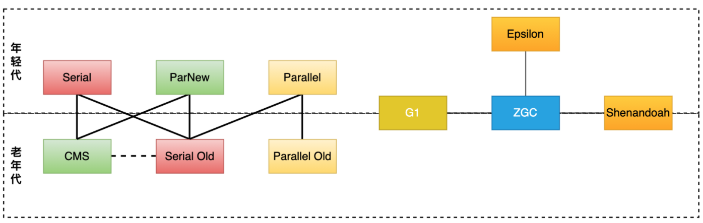

1. jdk

   1. nio
      1. 三大组件？
      2. epoll原理？和select的区别？边缘触发和水平触发？惊群问题？
      3. nio空轮训bug？netty怎么解决？
   2. 集合
      1. set和list区别？

         > set:无序 ，不可重复，时间复杂度（插入：O（1），contain：O（1））
         >
         > list：有序，可重复，list可用过下标来访问，时间复杂度（插入：O（n），contain：O（n））

      2. ArrayList扩容机制？

         > 

      3. ArratList和Vertor区别？

         > ArrayList: 线程不安全，扩容时1.5倍扩容
         >
         > Vertor: 线程安全，扩容时翻倍扩容

      4. ArrayList和LinkedList区别？

         > ArrayList:
         >
         > LinkedList:

      5. Hashmap、hashTable和hashSet区别？

      6. HashMap
         1. put流程？

            > 1. 现在entry数组有没有初始化，如果没有就初始化
            > 2. 计算参数key的hash，算出该key应该在数组中的位置
            > 3. 拿到该位置的node，

         2. 扩容流程？

         3. hashMap的长度为什么是2的幂次方？

            1. 计算数组下标时可以把取余运算转换成位运算
      2. 扩容比较快，高一位为0位置不变，高一位为1的位置=（当前位置+原始数组长度）。整个过程不用重新计算hash值
      
   4. 为什么要把hashCOde右移16位？
      
         1. 扰动函数：使高位也能干扰hash值，增加了随机性
         
         5. 并发安全？
         
            1. hashmap没有使用任何的锁机制，所以是线程不安全的
            2. 可能造成并发安全的操作：
               1. 一写多读
               2. 扩容
         
      7. ConcurretnHashMap
      
      8. CopyOnWriteList
      
      9. jdk新特性
         1. 1.8的新特性
            1. lamdba
            2. 接口的deafult方法
            3. stream
            4. localDatetime
            5. Optional
            6. 独占缓存行注解
         2. jdk9特性
         3. jdk15特性：
            1. 去除synchronized的偏向锁

2. jvm

   1. jvm的内存结构？

      > 1. 类加载器：url 
      > 2. 运行时数据区：
      > 3. 执行引擎，本地方法库

   2. 对象创建过程？

      > 1. 如果开启了逃逸分析，会分析该变量是不是线程私有的，如果是私有的会尝试标量替换把对象打散，把其中的基础数据类型在栈上分配。
      > 2. 如果不能在栈上分配，会尝试在TLAB(thread local aclcation buffer：默认大小是eden区的1%)上分配。（Tlab是为了加快对象分配速度，防止每次分配对象都需要cas，每个TLAB只能由一个线程创建对象，但是创建出来的对象是共享的）
      > 3. 如果TLAB分配失败，如果内存是规整的就进行指针碰撞，否则就在空闲列表找一块内存分配。

   3. 什么情况发生OOm异常

      > 1. 内存泄漏
      > 2. 内存不够

   4. 判断对象是否是垃圾？

      > java里使用可达性算法，从GC ROOTS出发，能被GC ROOTS找到的对象就是存活的对象，否则就是垃圾对象

   5. 怎么判断一个类是无用的类

      1. 该类的所有实例都已经被回收，即java堆中不存在该类的实例
      2. 该类对应的Class对象没有在任何地方被引用，无法在任何地方通过反射访问该类的方法
      3. 该类的classLoader已经被回收

   6. GC ROOT

      > 1. 虚拟机栈引用的对象
      > 2. 方法区类属性（static修饰的）引用的对象
      > 3. 方法区常量池引用的对象
      > 4. 本地方法栈中引用的对象
      > 5. 被同步锁（synchronized）持有的对象
      > 6. jvm自身只有的对象，比如系统类加载器，基本数据类型对应的class对象
      > 7. 对于YGC，老年代对新生代的引用也可以作为GC ROOT

   7. 4中引用？

      > 1. 强引用：一般就是new出来的对象
      > 2. 软引用（对应SoftRefenerce）：只要内存足够，就不会被回收。软引用可以配合ReferenceQueue一起使用（在创建软引用的时候在构造方法传入一个ReferenceQueue），当软引用已经被回收时，会把该对象加入ReferenceQueue，调用ReferenceQueue.poll()可以知道哪些软引用会被回收。用来做缓存
      > 3. 弱引用（对应WeekRefenerce）：下次垃圾回收就会回收。也可以配合ReferenceQueue一起使用
      > 4. 虚引用（对应platformRefenerce）：一定要配合ReferenceQueue一起使用。jdk8的platformRefenerce不会对gc产生影响。
      > 5. FinalReference:  如果某个对象实现了非空的Finalize()方法，那么会在编译时候生成一个Finalizer。所有的此类对象形成一个Finalizer链条。在gc的时候会取出对象执行finalize方法，并把该Finalizer从链条中删除，所以finalize方法只会执行一次（单独的线程执行）。

   8. PhantomReference和finalizer：

      1. -
      2. -------------------------------------------------------------------------------- 

   9. 软引用为什么可以解决OOM问题？

      > ​	假如有一个应用需要读取大量的本地图片，如果每次读取图片都从硬盘读取，则会严重影响性能，但是如果全部加载到内存当中，又有可能造成内存溢出，此时使用软引用可以解决这个问题。
      >
      > 　设计思路是：用一个HashMap来保存图片的路径 和 相应图片对象关联的软引用之间的映射关系，在内存不足时，JVM会自动回收这些缓存图片对象所占用的空间，从而有效地避免了OOM的问题。在Android开发中对于大量图片下载会经常用到。

   10. 虚引用的作用？

      > 1. 之前mysql使用finalize方法来清理资源，先已经改为虚引用了（finalize线程可能得不到执行，导致无法gc）

   11. 为什么jdk的垃圾回收不回收 虚引用？

       > ​    在Java 8的实现中，确保对象在真正GC前能被对应的ReferenceQueue处理，所以将对象标记为活跃，不回收对象
       >
       > ​    显然，在这种情况下，会导致本可以回收的对象无法回收的问题，所以在Java 9中，确保PhantomReference指向的对象在回收后（而不是原来的回收前），会被对应的ReferenceQueue处理，这样在一定程度上保证了功能，又修复了这个问题

   12. 方法区的回收？

   13. 垃圾回收算法？

       > 1. 标记清楚：
       > 2. 复制算法：
       > 3. 标记整理算法：

   14. 内存分配和回收策略？

       1. 对象分配原则

          > 1. 栈上分配->TLAB->eden分配，如果eden没有足够的空间，执行Minor GC
          > 2. 大对象直接进入老年代：

       2. 回收策略

   15. 对象怎么进入老年代？

       > 1. 大对象直接进入老年代
       > 2. 长期存活的对象进入老年代
       > 3. 动态年龄判断：如果survivor区中相同年龄的对象大于survivor空间的一般，那么大于该年龄的对象进入老年代
       > 4. 空间担保：每次进行GC时，jvm会计算survivor区移到老年代对象的平均大小，如果这个值大于老年代的剩余空间则进行一次full GC

   16. 垃圾回收器？

       1. 
       2. asdf

   17. G1

       1. 参数：
          1. -XX:MaxGCPauseMillis=200 ：指
          2. 

       1. 初始标记：需要stw，只标记GC ROOT能直接关联的对象
       2. 并发标记：在初始标记的基础上继续搜索
       3. 预清理：
       4. 可被终止的预清理：
       5. 重新标记：
       6. 并发清除：
       7. 并发重置状态

   18. zgc

   19. 三色标记法？浮动垃圾？

       1. 把从GC ROOTS开始遍历到的对象按“是否访问过”标记成3中颜色

          > * 白色：没被访问过
          > * 黑色：本对象已访问过，而且本对象引用的其他对象也全部访问过了
          > * 灰色：本对象已访问过，但是本对象引用的其他对象没有全部访问完。全部访问完后，会变成黑色

       2. 遍历访问过程

          > 假设现在有白色、灰色、黑色三个集合，分别存放对应颜色的对象
          >
          > 1. 开始垃圾回收时，所有的对象都在白色集合中
          > 2. 将GC ROOTS直接引用的对象挪到灰色集合汇中
          > 3. 从灰色集合中获取对象
          >    1. 将本对象引用到的其他对象挪到灰色集合中
          >    2. 将本对象挪到黑色集合中
          > 4. 重复步骤3，知道灰色集合为空
          > 5. 此时仍在白色集合的对象就是垃圾，在黑色集合的对象就是存活下来的对象

       3. 当需要支持并发标记时（标记期间，应用程序还在继续跑 继续产生垃圾），对象间的引用关系可能发生变化，多标和漏标的情况就会发生

          1. 多标（浮动垃圾）：

             > 在并发标记期间，有些对象由GC ROOTS可达变成了不可达。这部分是本应该回收但是却没有被回到到的内存。下一次垃圾回收会回收这些对象

          2. 漏标：

       4. 各个垃圾回收器对漏标的处理办法：

          1. CMS:写屏障+增量更新
          2. G1:写屏障+SATB
          3. zgc:读屏障

   20. 分代收集？弱分代假设？分代收集垃圾回收器怎么工作？

       > 1. 弱分代假设的两个理论
       >    1. 大部分对象都是朝生夕死的
       >    2. 少部分年级大的对象持有年纪小的对象的引用
       > 2. 分代收集是弱分代理论1，有了分代之后就只需要在新生代进行频繁GC，提高了收集效率
       > 3. 如果没有分代收集，新创建的对象和生命周期很长的对象放在一起，由于程序在不断运行会产生大量垃圾，所以每次回收都需要遍历所有对象，扫描整个堆空间，会严重影响程序效率，而且效率不高

   21. 类加载过程？类加载方式？tomcat如何破坏双亲委派模型？

       > 1. 类加载就是把class文件加载到内存中，将其转化成方法区运行时的数据结构，同是在堆中生成一个镜像，即Class对象
       > 2. 双亲委派
       >    1. 先交给父加载器加载
       >    2. 加载：类加载器扫描自己的url下的类，转化成路劲，然后加载类的二进制数据
       >    3. 验证：验证文件格式，字节码等
       >    4. 准备：为类的静态变量分配内存，并初始化成为默认值
       >    5. 解析：把符号引用（就是个字符串）装换为直接引用（可以是直接指向目标的指针（指向对象、类变量、类方法的指针），相对偏移量（指向实例变量方法的指针）或是句柄）
       >    6. 初始化：给类的静态变量赋予正确的值，执行静态代码块等
       > 3. Java Agent允许我们在类加载之前修改类，也可结合Attach API使用，在类加载之后，程序运行期间可随时修改类，通过重新加载类替换旧的类

   22. new Object（）发生了什么？

       1. 先去检查该类是否被加载了，没有就使用双亲委派进行类加载
       2. 加载->验证->准备->解析->初始化
       3. 栈上分配或分配内存：栈->TLAB->(空闲列表或指针碰撞)
       4. 初始化（实例变量初始化零值）->设置对象头->执行init方法、构造方法

   23. 什么情况发送ygc？什么情况下发送full gc？

       1. ygc

          > 1. Eden区满了

       2. full gc

          > 1. 手动执行System.gc（没有手动禁用GC的前提下）。部分垃圾回收器会执行Full GC
          >
          > 2. 堆伸缩时会发生full gc：
          >
          > 3. 老年代空间不足：大对象进入老年代、长期存活的对象进入老年代
          >
          > 4. metaSpace空间不足：比如使用了OSGI动态生成了大量的类
          >
          > 5. 空间担保：
          >    1. 每次晋升对象的平均大小>老年代剩余空间
          >    2. minor GC后存活的对象超过了老年代的空间
          >    
          > 6. ---------------------------------
          >
          > 7. parallel GC：默认会在要触发full GC之前先进行一次YGC（减轻Fu'll  GC的负担）
          >
          > 8. cms：定期检查老年代的使用量，超过阈值也会对老年代进行并发收集

   24. jvm怎么调优？一般从哪里入手？

       1. 调优的策略：尽量把生命周期短的对象留在新生代，减少对象进入老年代的机会，生命周期长的对象放在老年代

   25. 为什么有垃圾回收还会发生内存泄漏？

       > java里的内存泄漏是指 已经不用的对象长期占用着内存或者说生命周期短的对象长期在内存中。
       >
       > 内存泄漏原因：1. 一般是对象的作用域设置的不合理
       >
       > ​							2. 不用的对象没有手动置为 null

   26. 内存持续上升？怎么定位问题？

       1. 内存泄漏
       2. 如果不是内存泄漏，说明对象过早的进入了老年代，过早进入老年代的原因：
          1. 对象晋升年龄过低
          2. 程序创建了大对象、大数组
          3. 空间担保导致对象进入了老年代
          4. 动态年龄判断导致对象过早进入老年代

   27. jvm参数？

       1. -Xms：最小堆内存
       2. -Xmx：最大堆内存
       3. -XX:NewSize：新生代大小
       4. -XX:NewRatio: 新生代和老年代的比例（最小值为1）
       5. -XX：SurvivorRatio：eden和survivor的比例（最小值为1）

3. juc

   1. 多线程理解？什么是并发安全？

   2. java实现同步方式？

   3. 如何创建一个线程？如何指定线程的执行逻辑？

   4. 线程的6种状态？

   5. 对象头？每个对象占多大内存？markWord？monitor？

   6. volatile？

      1. 可见性和有序性怎么保证？

      2. 缓存一致性协议怎么保证可见性？

         > 1. cpu的缓存值有4个状态：独占，共享，已修改，失效
         > 2. 当状态是共享转为已修改时，会通知其他cpu，使其他cpu缓存的值变成失效

   7. synchronized

      1. 锁升级？偏向锁->自旋锁->重量级锁

         > 1. 线程第一次获取锁的时候，

      2. jdk15为什么去掉偏向锁？

         > 水电费

      3. synchronized怎么保证可重入性？

         > synchronized锁住对象的时候会有个计数器，记录了持有锁的线程获取锁的次数，执行完synchronize代码块之后，该计数器就会-1，如果计数器为0，那么就释放锁了。

      4. synchronize抛出异常会怎么样？

         > synchronized重入之后，内层抛出异常，跳出synchronized代码块，会释放锁

   8. volatile和synchronized的区别？

   9. lock和synchronized的区别？

   10. 并发容器和同步容器

       1. 同步容器：
       2. 并发容器：

   11. 什么是死锁？

       > 死锁是指两个或两个以上的进程在执行过程中，由于竞争资源造成的一种互相等待的现象，若无外力干扰，他们都无法继续执行下去。

   12. 死锁发生的原因？

       > 1. 系统资源不足
       > 2. 进程运行获取资源的顺序不合理
       > 3. 资源分配不当

   13. 死锁发生条件

       > 1. 互斥条件：一个资源每次只能被一个进程使用。
       > 2. 占有且等待：一个进程因请求资源而阻塞时，对已获得的资源保持不放。
       > 3. 不可强行占有：进程（线程）已获得的资源，在未使用完之前，不能强行剥夺。
       > 4. 循环等待条件：若干进程（线程）之间形成一种头尾相接的循环等待资源关系。

   14. Java死锁怎么排查和解决？

       > 1. 是用arthas的thread -b可以找出当前阻塞其他线程的线程

   15. cpu100%怎么排查和解决？

   16. Java的内存模型？

   17. as-if-serial?

   18. final？

   19. aqs

   20. threadLocal

   21. fastThreadLocal

   22. 线程池

       1. 七个核心参数？

          > 1. ThreadFactory:
          > 2. coreSize:
          > 3. queue:
          > 4. maxSize:
          > 5. RejectPolicy:
          > 6. TimeUnit:
          > 7. time:

       2. 线程池的锁？

       3. 自定义拒绝策略？

          > 序列化 然后保存起来

5. 计网

   1. http
   2. tcp
   3. udp
   4. http和https的区别？
   5. 对称加密和非对称加密？
   6. http请求和响应报文格式？
   7. http常见状态码和请求头?
   8. 长连接和短连接？
   9. redis session共享？
   10. http only？
   11. http1.1新特性？
   12. http2.0新 特性？dubbo使用http2
   13. restful？幂等？
   14. post和get区别？
   15. https连接过程
   16. 
   17. 浏览器输入一个域名发生了什么？
       1. 解析域名
       2. tcp连接
       3. ssl连接
       4. 发送请求
       5. nginx->web
       6. 解析请求

5. spring

   1. 为什么spring不同class来建立bean，而要用beanDefinition？

      > 

   2. bean的生命周期？

      1. 生命周期图：
      2. 注意：spring只帮助我们管理singleton的bean的生命周期。对于prototype的bean，spring在创建好了bean之后就不会再管理其生命周期了

   3. bean的scope？

      > 在spring context中只定义了singleton和prototype两个scope
      >
      > 在spring web中新增了request session等scope

   4. 静态代理和动态代理的区别？

      1. 静态代理：

         > 1. 需要硬编码，而且要为每个需要被代理的类生成其实现，扩展性不高 但是性能高

      2. 动态代理：

         > 1. 

   5. jdk动态代理和cglib动态代理的区别？

      1. jdk动态代理

         > 被jdk代理的对象必须实现接口

      2. cglib动态代理

         > 被cglib代理的对象的方法不能是final，因为cglib是通过继承的方式来增强的

   6. spring 默认 用什么代理？

      > spring framework默认使用jdk动态代理
      >
      > 但是spring boot默认使用cglib动态代理

   7. ioc的初始化过程？

   8. beanFactory和applicationContext那个才是ioc容器？

      > beanFactory: 定义了ioc容器最基础的功能
      >
      > applicationContext：实现了beanFactory接口，不过对于beanFactory的接口方法都是委托给DefaultListableBeanFactory来实现的。除此之外，添加了额外的功能（国际化，事件驱动）。

   9. 三级缓存怎么实现？怎么解决循环依赖

      > asdf

   10. spring aop的理解？基本概念？

   11. spring aop实现原理？

   12. @Qualifier注解？

   13. spring mvc流程？

   14. spring boot自动装配原理？

   15. spring boot怎么实现热部署？

   16. spring 事务实现方式？

       1. 编程式事务
       2. 声明式事务 
          1. 使用@Transactional注解

   17. 事务传播级别？？

   18. spring用了哪些设计模式

       1. 单例：spring的bean默认就是单例的
       2. 工厂模式：使用工厂模式创建bean

   19. 

   20. 源码？
       1. spring session源码
          1. MapSession.getId(): 产生一个UUID作为session

6. kafka

   1. kafka的用途？使用场景？

   2. ISR、ar、hw、leo、lso、lw？

   3. kafkaa怎么体现消息的顺序性？

   4. 分区器、序列化器、拦截器是什么？执行顺序？

   5. kafkaProducer的整体结构？

   6. kafkaProducer有几个线程？分别做什么工作？

   7. “消费组中的消费者个数如果超过topic的分区，那么就会有消费者消费不到数据”这句话是否正确？如果正确，那么有没有什么hack的手段？

   8. 消费者提交消费位移时提交的是当前消费到的最新消息的offset还是offset+1?

   9. kafka为什么这么快？

   10. 零拷贝？

      1. 存储消息使用mmap：内核和程序的虚拟地址映射为同一个物理地址
      2. poll消息使用sendFile：数据对应用程序不可见

   11. kafka的日志段如何读写？

   12. kafka的消息是推还是拉，怎么实现的？

       > 由kafkaConsumer自己拉

   13. 怎么保证消息不丢失？

       > 

   14. 如何处理重复消息？

   15. 消息的有序性？

   16. 哪些情况会造成重复消费？

   17. 哪些情况会发送消息漏消费？

   18. kafkaConsumer是非线程安全的，怎么样实现多线程消费？

   19. 消费者和消费者组的关系？

   20. Kafka有哪几处地方有分区分配的概念？简述大致的过程及原理？

   21. 简述Kafka的日志目录结构？

   22. 当你使用kafka-topics.sh创建（删除）了一个topic之后，Kafka背后会执行什么逻辑

   23. kafka的分区为什么不能减少？

   24. 创建topic如何选择合适的分区？

   25. kafka有哪些内部topic？

   26. 优先副本是什么？有什么特殊作用？

   27. 

   28. 消息的堆积处理？

   29. kafka的主题与分区内部是如何存储的，有什么特点？

   30. 与传统的消息系统相比，kafka的消费模型有什么优点？

   31. kafka如何实现分布式的数据存储与数据读取？

   32. 索引

       1. 什么是稀疏索引？和密集索引的关系以及区别

          > 

       2. kafka的索引是稀疏索引，主要有三类

          1. 时间戳索引
          2. 位移索引
          3. 事务索引

   33. 源码？

7. mysql

   1. 三大范式？

      > 一范式：所有属性都不可分割
      >
      > 二范式：在一范式的基础上，消除了属性对非住属性的依赖
      >
      > 三范式：在二范式的基础上，消除了传递依赖

   2. 一条select语句的执行过程？

      > 

   3. 一条update sql执行过程？

      1. 连接器：
      2. 分析器：
      3. 优化器：memory存储引擎
      4. 执行器：
      5. innodb：buffer pool

   4. innodb和myisam的区别？

      1. 事务：
      2. 外键：
      3. 索引：inndob存储数据是聚簇索引，主键和数据放在一起。myisam的索引和数据是分开的
      4. 日志：innodb有redo log和undo log
      5. count：
      6. 锁：innodb支持行锁、表锁，而myisam只支持表锁
      7. 存储文件：innodb有两个文件：frm是表定义文件，idb是数据文件。myisam有三个文件：frm是表定义文件，myd是数据文件，myi是索引文件
      8. 插入顺序：innodb插入的数据会按主键排序（会导致页分裂），myisam数据的存放顺序和插入顺序一致
      9. 二级索引：innodb的二级索引存的是主键，myisam的索引存的是数据页的地址

   5. myisam查询为什么比innodb快？

      > 1. myisam的二级索引存储的是数据的地址，不需要回表
      > 2. myisam不支持事务等特性，不需要记录redo log等日志

   6. innodb的特性？

      1. 插入缓冲

         >   对于索引（该索引是二级索引并且索引不是唯一的）的插入和更新，不是每一次都直接插入到索引页中，而是先插入到内存中。
         >
         >   具体做法：如果该索引页在buffer pool中，直接插入；如果不在就先放到insert buffer中，再以一定的频率和索引页合并。这样就可以把同一个索引页的多个插入合并到一次IO中，大大提高了写性能。有点像LSM树

      2. 二次写

         1. partial page wirte问题

            > innodb的数据页（page size）一般是16KB，将数据写入磁盘也是以page为单位进行操作。但是文件系统对于16kb的操作不是原子性的，会导致16KB的数据有可能只写入了4KB，然后服务器就宕机了，这会造成数据页的损坏。（redo log记录的是数据页的物理修改，例如：偏移量200，写aaa记录。如果数据页已经损坏，redo log是没办法进行恢复的）、

         2. 为什么redo log不会有partial page wirte问题？

            > 因为redolog的写是以4KB为单位写，这个大小的数据页的写入是具有原子性的

         3. 实现原理：

            > 做个冗余，在写数据页之前，先把这个数据页写到一块独立的物理位置，然后再写数据页。这样在宕机重启的时候，如果发生了数据页损坏，那么在使用redolog 重做之前，使用该副本来还原数据页，然后再进行redo重做。二次型保证的是innodb存储引擎数据页的可靠性

      3. 自适应hash

   7. 为什么自增主键不连续？

      > 1. innodb的自增值是保存在内存中的，8.0之后才会持久化。所以当mysql重启之后，第一次打开表都会去找max（id），然后把max（id）+1作为下一次自增的id的值。
      > 2. 插入失败后，id也不会减1
      > 3. 事务回滚后，id不会减1.
      > 4. 为什么这么设计？
      >    1. 为了解决主键冲突，每次申请主键id都需要去加锁，如果加上回滚功能，申请id时需要等到上一个insert事务提交，而且这样锁的粒度太大，系统的插入性能太慢

   8. 自增主键理解？

   9. 为什么innodb必须要有主键？

      > 1. innodb使用的是聚簇索引，数据是挂在主键下面的。所以几乎每次查询都需要利用主键，如果主键是和业务相关的，我们就可以利用到这个主键加快查询速度。

   10. innodb为什么推荐自增id？

       > 1. 如果不是自增，那么数据就有可能从页的中间插入，会频繁导致页分裂，造成性能下降
       >
       > 2. 

   11. 索引
       1. 为什么用b+树

          1. msyql是一个OLTP数据库，需要在短时间内返回数据，数据又是放在磁盘上，所以为了加快查询速度，必须降低IO次数
          2. b+树扇出性高，可以在比较低的层级存储大量的数据
          3. b+树比较稳定
          4. 底层有双向链表，更符合应用场景（范围查询）

       2. 索引类型？

          1. 聚簇索引和非聚簇索引
          2. 全文索引、自适应hash索引、b+树索引

       3. 索引覆盖？回表？索引下推？联合索引？

          1. 索引覆盖：

             > 1. 使用explain输出结果的Extra字段为using index时，表示能触发索引覆盖
         > 2. 只需要在一颗索引树上就能获取到sql所需的所有列数据
       
      2. 索引下推
           
         > mysql5.6的新功能：
             >
         > 
       
   4. 索引失效场景？
      
      1. 使用了函数或者算术表达式
          2. 使用了'LIKIE刘' ,>,<,!=
      3. 发生了类型转换
          4. 不同的字段使用了or：name='' or age=123
          5. not int,not exists
          6. 字段可以为null：使用is null或者is not null可能导致索引失效
          7. 联合索引违背最左匹配原则
      
       5. 最左匹配原则？
      
       6. 联合索引建立规则？
      
       7. 前缀索引？
      
       8. 百万级别数据怎么删除？
      
       9. 普通索引和联合索引怎么选择？
      
   14. 锁

       1. 间隙锁是什么？什么情况会加间隙锁？
       2. mysql的语句具体在什么时候加锁？

   15. 事务
       1. acid？

       2. mvcc？

          > rr下的mvcc：
          >
          > rc下的mvcc：每次select都会生成一个readView

   16. explain？

   17. 脏页？怎样刷新脏页？

   18. 一条sql很慢怎么定位？

   19. sql优化？

   20. mysql的三种日志？

   21. 什么是撞库、脱库、洗库？

   22. 主从复制？

   23. 一个6亿的表a，一个3亿的表b，通过外间tid关联，你如何最快的查询出满足条件的第50000到第50200中的这200条数据记录

   24. 主从一致性校验？

   25. 如何分库分表？

   26. 如何实现跨库分页查询？

   27. 分库分表之后怎么平滑上线？

   28. limit 1000000很慢怎么解决

8. redis

   1. 为什么选择redis？

      1. 快

   2. 5种基本数据结构+redis module+redis stream

      1. redis module提供了一种插件的方式接入我们自定义的数据结构，比如说bloom filter
      2. redis stream是用来替换sub/pub的

   3. redis为什么快？

      1. 基于内存
      2. 单线程，减少了线程切换的消耗
      3. epoll机制
      4. redis存储数据使用hash，读取数据快
      5. redis实现了自己的事件分离器，内部使用了非阻塞的执行方式，吞吐量大

   4. redis渐近式hash?

      1. 

      2. 在渐进式hash过程中，字典会同时使用ht[0], ht[1]两个hash表，字典的删除、查找、更新等操作都会在两个hash表里进行。除此之外，新增的键值对都保存到h[1]中

      3. redis怎么解决hash冲突

         > 拉链法

      4. 扩容条件：

         1. hash表中保存的key数量超过了hash表的大小
         2. 当前没有子进程执行aof重写或者生产rdb文件
         3. 如果保存的节点数与哈希表大小的比例超过了安全阈值（默认值为5），也会进行扩容

   5. redis的线程模型？

      1. redis内部使用文件事件处理器（file event handler），这个文件事件处理器是单线程的，所以redis才叫单线程的模型。它采用IO多路复用的机制同时监听多个socket，根据socker的事件来选择对应的事件处理器进行处理
      2. 文件事件处理器的结构包含4部分
         1. 多个socket
         2. IO多路复用程序
         3. 文件事件分派器
         4. 事件处理器（连接应答处理器，命令请求处理器，命令回复处理器）
      3. 多个socket可能会并发产生不同的操作，每个操作对应不同的事件。但是IO多路复用程序会监听多个socket，将socket产生的事件放入队列中排队，事件分派器每次葱队列中取出一个事件，把该事件交给对应的事件处理器进行处理
      4. 流程图：
      5. 流程图2：

   6. redis6.0为何使用多线程？

      1. 为什么之前不适用多线程？

         > 一般来说redis的瓶颈不在cpu，而在于内存和网络。如果要使用多核cpu，可以搭建多个redis实例来解决。

      2. redis在4.0的时候就有多线程的概念了。比如redis通过多线程方式在后台删除对象

      3. 为什么6.0之前一直不使用多线程？

         > 多线程的模型虽然在某些方面变现优异（非阻塞），但是带来了并发读写的问题，增加了系统复杂度，同时也可能存在线程切换、加锁、死锁带来的损耗。

      4. 为什么要6.0引入多线程？

         > redis的瓶颈不在cpu，在内存和网络。
         >
         > 内存可以通过加内存的方式解决或者搭建集群
         >
         > 网络IO的读写在redis执行期间占用了大部分cpu的时间，如果能把网络处理这块引入多线程，对redis的性能有很大提升。

      5. 多线程实现机制：

      6. 特点：

         1. IO线程要么同时在读socket，要么同时在写socket，不会同时读写
         2. IO线程只负责读写socket解析命令，不负责命令处理，所以不会带来并发安全问题

      7. 总结：

         1. 可以充分利用多核cpu，但是主线程还是只能利用一个核
         2. 多线程可以分摊Redis同步读写IO的压力

   7. 缓存过期策略？

      1. 定时删除：

         1. 概念：设置key的过期时间的同时，为该key创建一个定时器，让定时器在key过期的时候把该key删除
         2. 优点：能保证内存被尽快释放
         3. 缺点：
            1. 如果过期的key很多，删除这些key会耗费cpu时间
            2. 会产生大量的定时器，影响性能

      2. 惰性删除：

         1. 概念：key过期的时候不删除，每次从数据库中获取key的时候去检测是否过期，过期了就删除
         2. 优点：对cpu的占用时间较少
         3. 缺点：如果有大量的key过期但是没被访问，会浪费内存

      3. 定期删除：

         1. 概念：redis默认每隔100ms（hz  10:表示1s执行10次定期删除）就随机抽取一些（maxmemory-samples 5：默认是5个）设置了过期时间的key，检测这些key是否过期，如果过期了就将其删除。如果过期的比例超过1/4，那么继续执行一次定期策略。

         2. 为什么是随机部分，而不是全部

            > 如果redis里面有大量的key都设置了过期时间，全部去检测一遍的话cpu负载很高，会浪费大量的时间在检测上，可能导致redis挂掉。且带来的收益可能很小
            
         3. 带来的问题？

            > 有可能出现大量的key都已经过期了但是并没有被删除，会导致明明大量的key已经过期了但是内存并没有减少

      4. redis的选择：惰性删除+定期删除

   8. 内存淘汰机制？

      1. 不管是定期删除还是惰性删除都不是完全精准的删除，还是会存在key没被删除的场景，所以需要内存淘汰策略进行补充。当内存不够是，会使用内存淘汰机制
      2. 具体策略：
         1. noeviction：当内存不够时返回错误，不会删除任何键（默认策略）
         2. volatile-lru：对设置了过期时间的key使用LRU算法淘汰
         3. allkeys-lru：对所有的key使用LRU算法淘汰
         4. volatile-lfu：对设置了过期时间的key使用LFU算法淘汰（LFU：根据历史访问频率来淘汰数据）
         5. allkeys-lfu：对所有的key使用LFU算法淘汰
         6. volatile-random：对设置了过期时间的key使用随机算法淘汰
         7. allkeys-random：对所有的key使用随机算法淘汰
         8. volatile-ttl：设置了过期时间的key根据过期时间淘汰，越早过期越早淘汰

   9. 主从

      1. 全量同步：

         1. 具体流程

            1. 保存住节点信息
            2. 建立socket连接，如果连不上会无限重试
            3. 发送ping命令：检测socket是否可用、检测主节点当前是否可接受处理命令。如果从节点没有收到pong或者超时，从节点会断开连接，下次定时任务会重试
            4. 权限验证
            5. 从服务器连接主服务器，发送SYNC命令
            6. 主服务器接收到SYNC命名后，开始执行BGSAVE命令生成RDB文件并使用缓冲区记录此后执行的所有写命令
            7. 主服务器BGSAVE执行完后，向所有从服务器发送快照文件，并在发送期间继续记录被执行的写命令
            8.  从服务器收到快照文件后丢弃所有旧数据，载入收到的快照
            9. 主服务器快照发送完毕后开始向从服务器发送缓冲区中的写命令
            10. 从服务器完成对快照的载入，开始接收命令请求，并执行来自主服务器缓冲区的写命令
            11. 流程图1： 
            12. 流程图2：

         2. 部分同步（增量同步），psync：

            > 1. 主从复制各节点的复制偏移量：参与复制的主从节点都会维护自身复制偏移量。master在处理完写入命令之后，会把命令的字节长度做累加，存储在info relication的master_repl_offset中。slave节点也会上报自身的复制偏移量给主节点，主节点也会把从节点的复制偏移量保存起来，存储在info replication的slave_{id}：offset中。slave节点收到master发送的命令之后，也会累加自身偏移量，存储在info replication的slave_repl_offset中
            > 2. 主节点复制积压缓冲区：保存在master节点的一个固定长度的队列，默认大小为1MB。当master有slave时被创建，这时master响应写命令时，不仅把命令发给从节点，还会写入复制积压缓冲区
            > 3. 主节点运行id：当master重启之后id会发生变化，只要slave监听到masterid发生变化，将进行全量复制。使用debug reload‘命令重新加载EDB文件可以保持运行ID不变

         3. 无盘复制：redis2.8.18之后master的子进程直接将RDB通过网络发送给slave，不适用磁盘作为中间存储。

   10. 哨兵

       1. sentinel的三个定时任务

          1. 概念：sentinel通过三个定时任务完成对各个节点的发现和监控

          2. 定时任务一：每隔10s，每个sentinel节点会向主节点和从节点发送info命令获取主从结构的最新拓扑

             1. 实例图：
             2. 通过向主节点执行info命令，获取从节点信息
             3. 当有新节点加入可以快速感知
             4. 有节点不可达后，可以及时更新拓扑

          3. 定时任务二：每隔2s，每个sentinel节点会向redis的数据节点的\__sentinel__:hello的频道上发送当前sentinel节点对主节点的判断以及当前sentinel节点信息。同时，每个sentinel也会订阅该频道，来了解其他sentinel节点以及他们对主节点的判断。

             1. 发现新的sentinel节点

             2. sentinel之间交换主节点的状态，作为后面的客观下线以及领导者选举的依据

             3. 实例图：

             4. 定时任务三：每隔1s，每隔sentinel节点会向主节点、从节点、其余sentinel节点发送一条ping命令做心跳检测，来确认这些节点当前是否可达。

                1. 示例图： 

                   

       2. 主观下线和客观下线

          1. 主观下线：
          2. 客观下线：

       3. sentinel领导者选举流程

       4. 故障转移

   11. 集群

       1. 怎么实现数据分片
       2. 怎么做故障转移和发现

   12. redis的hash槽？

   13. 集群的最大节点个数？

       1. 主节点个数是16384个。因为redis的slot就是16384

   14. redis的aof和rdb？

       1. RDB:
          1. 
       2. AOF：写完数据再写日志（因为redis不会对命令进行语法检查，这样可以做到只记录成功的命令。但是带来了丢失数据的风险）
          1. 

   15. redis的事务？

       1. redis使用mult，exec，watch等命令实现事务

          1. multi：开启事务
          2. exec：执行事务
          3. discard：取消事务
          4. watch：监视key，如果事务执行之前。key被其他命令改动，事务将被打断

       2. 事务失败场景：

          1. 语法错误（参数个数错误，不支持的命令）
          2. 命令执行失败（对string执行lpush等操作）
          3. watch

       3. 为什么不支持回滚：

          ​	有当被调用的Redis命令有语法错误时，这条命令才会执行失败（在将这个命令放入事务队列期间，Redis能够发现此类问题），或者对某个键执行不符合其数据类型的操作：实际上，这就意味着只有程序错误才会导致Redis命令执行失败，这种错误很有可能在程序开发期间发现，一般很少在生产环境发现。支持事务回滚能力会导致设计复杂，这与Redis的初衷相违背，Redis的设计目标是功能简化及确保更快的运行速度。

   16. 缓存击穿、雪崩、穿透怎么解决？

       1. 穿透： 查询一个缓存中不存在、数据库也不存在的key
          1. 缓存过期时间很短的空值：消耗内存、如果数据库中添加了这个key，会导致数据不一致
          2. bloom过滤器：维护困难，如果key是持续不断加入的，过滤器总会被打满
       2. 击穿：查询缓存不存在，数据库存在的key
          1. 加锁排队：当获取到了锁之后，可以短暂sleep，然后再去查询缓存，如果还是没有则重建缓存，获取不到锁的线程直接返回或者阻塞（等获取锁的线程重建缓存之后唤醒）。
          2. 
       3. 雪崩：缓存中的key大量失效
          1. 预防措施：给key设置随机过期时间、永不过期（不设置过期时间、当发现缓存快过期了自动更新缓存）
          2. 已经发生的措施：加锁排队

   17. watch和cas乐观锁？

   18. redis如何实现分布式锁？

       1. redisson
          1. 实现原理
          2. 流程

   19. redis的redlock？

   20. 并发竞争？

   21. 异步队列？

   22. 延时队列？

   23. redis如何保证双写一致性？先更新缓存还是先更新数据库

       1. 三个经典的缓存模式：

          1. Cache-Aside Pattern（旁路缓存）

             > 1. 读请求：先查询缓存，命中直接返回数据。没有命中就去数据库取出数据放入缓存。
             > 2. 写流程：先更新数据库，然后再删除 缓存

          2. Read-Through/Write through

             > read: 由cache provider来负责缓存和数据库的读写。先查询缓存，命中直接返回数据。没有命中就去数据库取出数据放入缓存
             >
             > write:更新数据库，然后更新缓存

          3. 在2的基础上使用异步来执行

       2. 为什么是删除缓存而不是更新缓存：

          1. 
          2. 如果写入的缓存值是经过复杂计算得到的，就会造成多次更新，浪费性能
          3. 有可能有的数据在缓存中，还没有被读取到就被跟更新了

       3. 为什么是先操作数据库而不是先操作缓存？

          1. 
          2. 123

       4. 缓存延时双删是什么？

          1. 
          2. 123

       5. 先更新数据库再删除缓存，万一删除缓存失败了怎么办？

          1. 引入消息队列：
          2. 使用数据库的binlog来异步淘汰key：
          3. 123

   24. redis内存耗尽后怎么办？

       1. 内存淘汰策略

   25. redis怎么做大数据量的插入？

       ```cat data.txt | redis-cli --pipe```

   26. 如何解决redis的并发竞争key的问题？

       1. 分布式锁
       2. 消息队列

   27. 1亿个key，10万个key是已知前缀，怎么把它们全找出来？

       1. keys：会阻塞redis
       2. scan：一次取批，最后汇总。存在重复的概率，需要在客户端进行一次去重

   28. mysql有2000w数据，redis只存20w数据，怎么保证redis的数据就是热数据

   29. 如何排查redis性能问题？

   30. redis的hot key？

       1. redis4.0.3自带hot key发现机制。使用redis-cli --hotkey即可

   31. redis怎么删除大key（指某个key的value很大）？

       > 1. 如果线上redis出现大key，不可立即执行del，因为del会造成阻塞，导致其他请求超时->redis连接池耗尽->依赖redis的业务出现异常
       > 2. 解决方案：
       >    1. 系统负载低的时候

   32. 主库挂怎么办》？

       1. 使用哨兵，把从库提升为主库

   33. 性能优化？

       1. master不做任务持久化工作，slave可以开启持久化
       2. master和slave在同一个局域网
       3. 主从复制采用单链表结构，而不是图状结构

10. dubbo

    1. dubbo支持的协议？
    2. dubbo怎么实现熔断？
    3. dubbo调用过程？
    4. 怎么实现限流？
    5. 序列化实现原理？
    6. dubbo怎么支持事务？
    7. dubbo的负载均衡？

11. 系统设计

    1. 如何设计一个高并发系统？
    2. 需求多变时，怎么设计？
    3. 使用hashMap实现一个带时间的缓存？
    4. 如何设计一个秒杀系统？
    5. java接口设计？
    6. 短连接？
    7. 抢红包？
    8. 扫码登陆？
    9. 延迟队列？
    10. 敏感数据过滤设计？
    11. rpc设计？

12. netty

13. sentinel

14. 分布式

    1. 分布式和微服务的理解？
    2. 为什么要分布式？集群？负载均衡？
    3. cap理论？
    4. paxos和raft？
    5. 分布式事务？
    6. 分布式ID?
    7. rpc？
    8. 一致性hash？
    9. 高可用？限流？降级？熔断？集群？
    10. 限流算法：
        1. 漏桶算法
        2. 令牌桶算法
        3. 滑动窗口
        4. 限流库：
           1. 单机限流：guava
           2. 分布式限流： redis+lua

15. linux

    1. tcpdump抓包过程？
       1. 先查看网卡：ip a | grep
       2. tcpdump -i ens192 -nn host 192.168.3.63 port 5533 -Xs0

16. 其他

    1. 怎么跨线程传递THreadLocal

       > 使用阿里的TTL：对ThreadLocal进行store和relay

    2. 生产者消费者模型？（三种方案）

    3. 如果一个Java进程突然消失了，你会怎么去排查这种问题？

       1. linux的OOM killer

          > 该机制会监控那些占用内存过大的进程，为了防止内存耗尽而把该进程杀掉
          >
          > egrep -i 'killed process' /var/log/messages

       2. jvm自身故障

          > jvm发生致命错误导致崩溃时，会生成一个hs_err_pid_xxx.log文件，默认情况在这个文件在工作目录，也可以指定： -XX:ErrorFile=/var/log/hs_err_pid<pid>.log

    4. 出现大量502怎么解决？