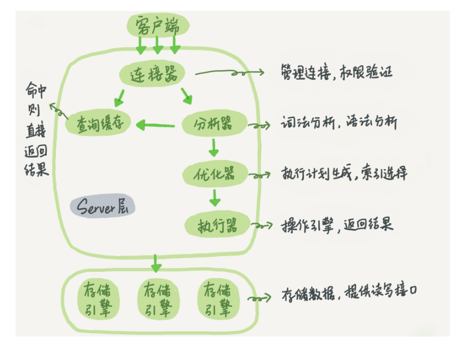

# sql执行过程



## 解析

### dialect(方言)

sql虽然有ansi标准，但是ansi sql第一版的发布时间是1989年，很多数据库诞生的时间比1989年还早，所以这个 标准只是把各个数据库厂商的sql取了个交集。这就导致ansi标准很不完善，比如没有关于分页的内容，导致各个数据库分页的写法都不一致，有的数据库甚至不支持分页（oracle）。一般来说，对于ansi标准之外的语法，称之为dialect。

### sql的关键字和保留字

保留字是特殊的关键字。

关键字可以直接使用，保留字使用需要加引号。

### mysql select statement

```
SELECT 
    [ALL | DISTINCT | DISTINCTROW ]
    [HIGH_PRIORITY]
    [STRAIGHT_JOIN]
    [SQL_SMALL_RESULT] [SQL_BIG_RESULT] [SQL_BUFFER_RESULT]
    [SQL_CACHE | SQL_NO_CACHE] [SQL_CALC_FOUND_ROWS]
    select_expr [, select_expr] ...
    [into_option]
    [FROM table_references
      [PARTITION partition_list]]
    [WHERE where_condition]
    [GROUP BY {col_name | expr | position}
      [ASC | DESC], ... [WITH ROLLUP]]
    [HAVING where_condition]
    [ORDER BY {col_name | expr | position}
      [ASC | DESC], ...]
    [LIMIT {[offset,] row_count | row_count OFFSET offset}]
    [PROCEDURE procedure_name(argument_list)]
    [into_option]
    [FOR UPDATE | LOCK IN SHARE MODE]

into_option: {
    INTO OUTFILE 'file_name'
        [CHARACTER SET charset_name]
        export_options
  | INTO DUMPFILE 'file_name'
  | INTO var_name [, var_name] ...
}
```

### antlr4

spark、sharding-sphere

使用起来很方便

### javacc

calcite(flink、datastudio)


## 校验

根据AST判断table，column存不存在，还有一个比较重要的是权限校验

权限校验

