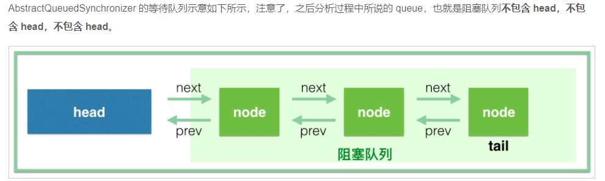
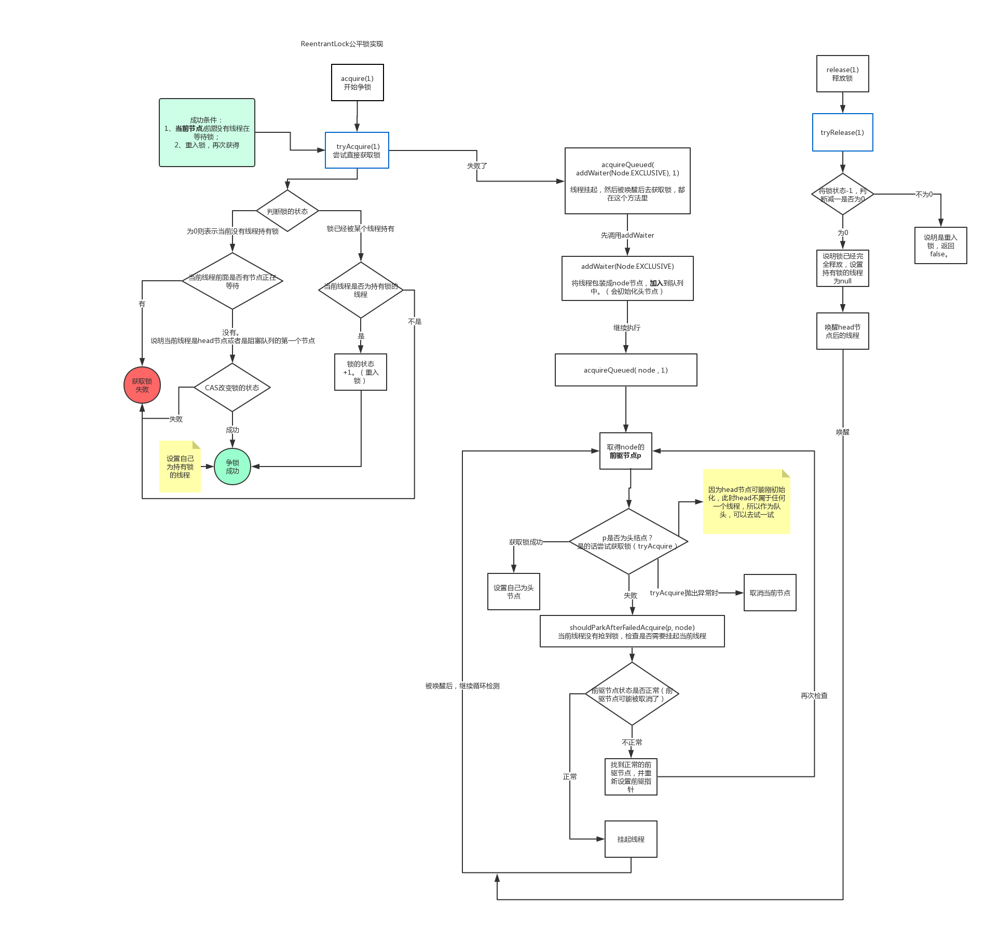

1. volatile（b站马士兵）

   1. 什么是volatile

      > volatile是java从语言上保证了共享变量的可见性。可见性是指，当有一个线程修改一个共享变量时，另一个变量能读到修改的值

   2. 怎么保证可见性（插入cpu指令 lock指令）

      > 禁止指令重排
      >
      > 强制将修改的值写入主存
      >
      > 会导致其他cpu缓存的值失效
      
   3. 单核cpu还有必要时用volatile吗

      > volatile不只是要保证其修饰变量的可见性，还要保证该变量之前的共享变量的可见性。因此，在单核机器上，volatile还是有其存在的意义的，就是要禁止重排序，如果不用volatile，单核的情况下依然存在重排序，重排序的结果就是你得不到你想要的结果

2. happen-before原则

3. synchronized

   1. 定义

      > synchronized是对某个对象执行加锁操作

   2. 锁升级

      1. 偏向锁
      2. 轻量级锁
      3. 重量级锁

   3. 为什么jdk15放弃偏向锁

4. final

   > 1. JMM禁止编译器把final域的写重排序到构造函数之外；
   > 2. 编译器会在final域写之后，构造函数return之前，插入一个storestore屏障（关于内存屏障可以看[这篇文章](https://juejin.cn/post/6844903600318054413)）。这个屏障可以禁止处理器把final域的写重排序到构造函数之外。

5. sleep和wait的区别

   > sleep()方法是Thread的静态方法，而wait是Object实例方法
   >
   > wait()方法必须要在同步方法或者同步块中调用，也就是必须已经获得对象锁。而sleep()方法没有这个限制可以在任何地方种使用。另外，wait()方法会释放占有的对象锁，使得该线程进入等待池中，等待下一次获取资源。而sleep()方法只是会让出CPU并不会释放掉对象锁；
   >
   > sleep()方法在休眠时间达到后如果再次获得CPU时间片就会继续执行，而wait()方法必须等待Object.notift/Object.notifyAll通知后，才会离开等待池，并且再次获得CPU时间片才会继续执行。

6. AQS

   1. aqs的变量

      1. Node head：永远是空，可以理解为获取到锁的线程
      2. Node tail：Thread+waitStatus+pre+next，waitStatus代表是next节点的状态
      3. int state：0代表无锁
      4. Thread exclusiveOwnerThread

   2. 示意图

   3. 公平锁流程

      1. Thread1进来加锁：

         1. 调用acquire（1）方法

            ```java
            if (!tryAcquire(arg) &&
                acquireQueued(addWaiter(Node.EXCLUSIVE), arg))
                selfInterrupt();
            ```

            1. tryAcquuire(arg (1))， 尝试获取锁：拿到当前线程和aqs的state。

               > 1. 如果当前status=0，说明当前没有线程持有锁，因为此时公平锁，所以得讲究先来后到，那么就去判断是否有需要排队（h != t && ((s = h.next) == null || s.thread != Thread.currentThread())：h！=t==false表示当前没有队列（没有队列就不需要去排队）， s=h.next == null表示有线程正在入队（见aqs的enq方法）如果有说需要去排队，也有可能是空队列（所以后续加入队列后，还会判断自己是不是头节点，如果是还会进行cas尝试加锁），s.thread！= Thread.currentThread表示head节点下一个不是当前线程，所以需要去排队）。如果不需要排队，直接cas对state+1，cas成功把thread设置为当前线程
               > 2. 如果status！=0，说明已经有线程持有了锁，判断持有锁的线程是不是当前线程，如果是，说明是线程重入锁，把state加1即可
               > 3. 如果status！=0，并且持有锁的线程不是当前线程，直接返回false，false表示不需要排队
               > 4. 
               > 5. 此处是先获取tail再获取head，是因为head先初始化，这样一定能保证获取到的head是有效的。如果先获取head再获取tail，有可能出现head=null，tail！=null的情况

            2. tryAcquire成功。此时thread = thread1，state=1，head=null，tail=null

      2. THread2进来加锁

         1. 调用acquire方法：

            1. !tryAcquire(arg) ：此时state=1，并且当前线程不是持有锁的线程，所以失败

            2. acquireQueued(addWaiter(Node.EXCLUSIVE), arg)：

               1. 先看addWaiter（）：

                  > 1. 判断tail！=null：说明队列不为空，把自己的pre设置为tail，然后cas把自己设置为队尾，cas成功后把前一个node（原来的tail）的next指向自己，返回。
                  > 2. 如果队列为空或者cas失败，进入enq（node）方法：enq方法就是把当前节点放到队尾

               2. acquireQueued方法： 

            3. selfInterrupt()

      3. Thread3进来加锁

      4. Thread1继续加锁

      5. Thread1释放两次锁

   4. 非公平锁

      1. 

7. hashMap

8. concurrentHashMap

9. Sync

   1. 公平锁
   2. 非公平锁

10. 线程池

   11. 线程池执行过程

   12. 自定义异常策略

13. ConcurrentHashMap

14. ReadWriteLock

15. 复习

    1. 怎么新建一个线程
       1. 执行一个Thread对象的start方法
       2. 怎么定义线程的执行逻辑
          1. 重新thread的run方法：因为Thread实现了Runnable接口
          2. 新建一个Runnable，重写run方法（在这里面实现执行逻辑）：因为Thread内部有一个Runnable对象
          3. 新建Callable，重写call方法（在这里面实现执行逻辑），把callable传给FutureTask（futureTask也实现了Runnable接口），把futureTask传给thread：因为runnable没有返回值。里面的runner线程就是执行FutureTask的线程
    2. sleep和wait的区别
       1. wait会释放锁，sleep不会
       2. 调用intercepe方法后，wait会抛出异常，sleep也会
       3. synchronized（obj）if(){obj.wait(0)}: if必须换成while。因为获取锁之后还需要去判断是否满足要求。
       4. wait方法只释放当前共享变量的锁
    3. aqs流程图： 

    

