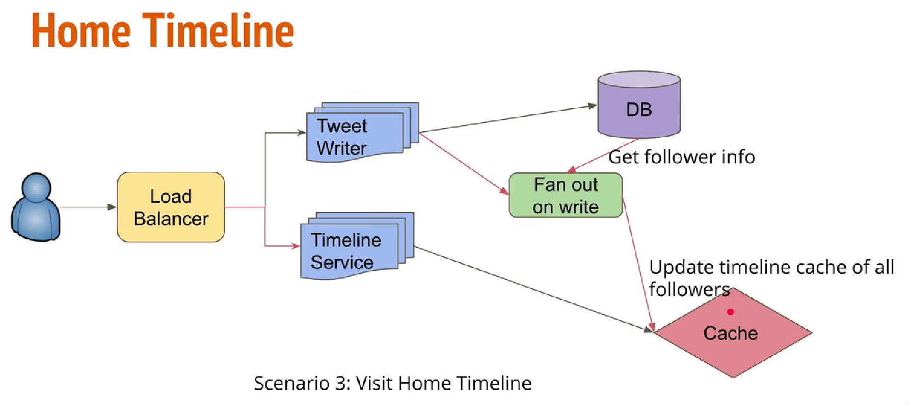
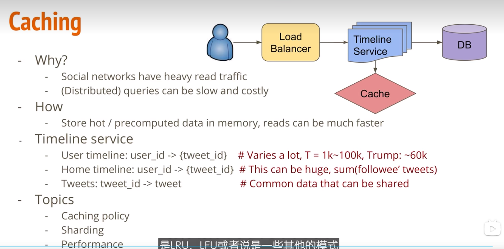

# 系统设计原则

1. 

   1. 确认需求
   2. 容量评估
   3. 整体设计
   4. 详细组件设计
   5. 容错和伸缩
   6. 扩展话题

   

   

   

# 真题：

1. 如何设计一个twitter
   1. 确认需求：
      1. 发布删除twitt
      2. timeline：UserTimeLine（某个用户发布的twitt  timeline）和HomeTimeLine（自己的timeline）
      3. 关注用户
      4. 喜欢某个twitt，点赞
      5. 搜索twitt
   2. 实现：为每个用户在cache里面维护一个timeline，每个用户写twitt时，不但往自己的timeline写数据，还往粉丝的timeline里面写数据
   3. 问题：如果都往粉丝的timeline写，对于大V而言 粉丝极多，写的过程可能及其漫长
   4. 解决方案
      1. 对于粉丝少的用户，不往僵尸粉的timeline里推送，活跃粉继续推送
      2.  对于粉丝多的用户，不往粉丝的timeline推送，当粉丝刷新hometimeline时，把timeline和大V的timeline做一次merge
   5. 
   6. 

1. 怎么设计一个分布式系统

2. 怎么保证一个系统的稳定性

   1. 目标：可感知、可预防和应急、可快速处理

3. 如果流量规模再提高几个量级。我的系统会出什么问题

4. 写一段程序，让其运行时的表现为触发了5次Young GC、3次Full GC、然后3次Young GC；

5. 如果一个Java进程突然消失了，你会怎么去排查这种问题？
   1. linux的OOM killer

      > 该机制会监控那些占用内存过大的进程，为了防止内存耗尽而把该进程杀掉
      >
      > egrep -i 'killed process' /var/log/messages

   2. jvm自身故障

      > jvm发生致命错误导致崩溃时，会生成一个hs_err_pid_xxx.log文件，默认情况在这个文件在工作目录，也可以指定： -XX:ErrorFile=/var/log/hs_err_pid<pid>.log
   
6. 扫码登陆实现

7. 出现大量502怎么解决

   > 

# 一. 如何设计百万用户的系统

1. 保持web层无状态。 方便横向扩展
2. 每一层建立冗余
3. 尽可能缓存数据
4. 支持多个数据中心
5. CDN
6. 通过分片扩展数据。对名人要有单独的分区
7. 将层拆分成单独的服务
8. 监控系统并使用自动化工具

# 三. 面试系统设计框架

1. 理解问题并确定设计范围。 不要迅速给出答案，先提问题
   1. 我们将实现哪些功能
   2. 产品有多少用户
   3. 公司的技术栈

四. 设计一个限流系统

1. 客户端限流还是服务端限流
2. 限流规则： 根据ip？用户？根据服务？
3. 工作在网关还是服务中
4. 服务端限流要给客户端反馈
5. 记录限流数据
6. 算法

