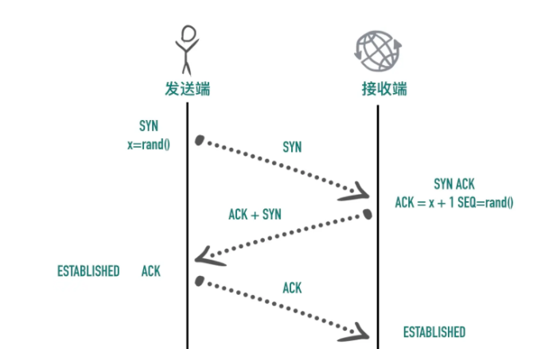

1. 为什么要三次握手
   
   1. 为了确认双发都有发送和接收的能力
   
2. tcp协议

   1. tcp是一个面向连接、可靠的、基于字节流的全双工协议

      1. 面向连接：使用tcp协议正式发送数据之前需要通过握手建立连接，结束通信时通过4次回收断开连接

   2. 三次握手流程

      1. syn=1，初始化seq=x。发送端进入SYN-SNET状态
      2. syn=1，ack=1，ack=x+1，seq=y。服务器端处于SYN-RCVID状态。a进入ESTAB-LISHED状态
      3. ack=1，ack=y+1。b收到确认后，也进入ESTAB-LISHED状态
      4. 状态图：
      5. 

   3. 为什么需要三次握手

      1. 客户端多次发送syn的请求报文，如果发送网络拥堵，有可能出现旧连接比新连接先到达服务器的情况，有可能出现连接覆盖
      2. 同步序列号

      > “[TCP建立连接为什么是三次握手？](https://link.zhihu.com/?target=https%3A//groups.google.com/d/topic/pongba/kF6O7-MFxM0/discussion)”的问题，在众多回复中，有[一条回复](https://link.zhihu.com/?target=https%3A//groups.google.com/d/msg/pongba/kF6O7-MFxM0/5S7zIJ4yqKUJ)写道：“这个问题的本质是, 信道不可靠, 但是通信双发需要就某个问题达成一致. 而要解决这个问题,  无论你在消息中包含什么信息, 三次通信是理论上的最小值. 所以三次握手不是TCP本身的要求, 而是为了满足"在不可靠信道上可靠地传输信息"这一需求所导致的. 请注意这里的本质需求,信道不可靠, 数据传输要可靠. 三次达到了, 那后面你想接着握手也好, 发数据也好, 跟进行可靠信息传输的需求就没关系了. 因此,如果信道是可靠的, 即无论什么时候发出消息, 对方一定能收到, 或者你不关心是否要保证对方收到你的消息, 那就能像UDP那样直接发送消息就可以了.”。这可视为对“三次握手”目的的另一种解答思路。

   4. 两次握手行不行？

      1. 服务器容易收到攻击

   5. 断开连接过程

      1. fin=1，seq=u。a进入FIN-WAIT-1状态
      2. ack=u+1,seq=v。b进入close-wait状态。a收到b的确认报文后进入fin-wait-2状态
      3. （b-a断开连接）fin=1，seq=w，ack=u+1。b进入last-ack状态
      4. ack=1，ack=w+1，seq=u+1。a进入time-wait状态（等待2MSL）。b收到确认后进入close状态

   6. 第四次挥手为什么要等待2MSL

      1. 保证连接被正常关闭
      2. 保证旧连接的信息被清除

   7. 因为ip是无连接、不可靠的协议，ip只尽可能把数据包从发送至传输给接收者，不保证包的达到顺序和传输顺序一直，也不保证包是否重复，不保证接收者一定能收到包。所以tcp需要自己实现一个机制来保障可靠性

      1. 校验和：tcp的头部有两个字节来表示校验和，如果收到一个校验和有差错的报文，tcp会直接丢弃
      2. 包的序列号：解决了接受数据的乱序、重复问题：tcp收到乱序的报文会重新排序，，收到重复的报文会丢弃重复的数据
      3. 超时重传：tcp发送数据后会启动一个定时器，等待对方的确认报文。如果指定时间没有收到确认报文，就会重传数据包，然后等待更长时间，多次重传失败后tcp会放弃该报文
      4. 流量控制
      5. 拥塞控制

   8. tcp是面向流的，没有边界，tcp不好控制。而且数据包的大小是由应用层控制

   9. Nagle算法

   10. 快速重传

   11. 拥塞控制

3. udp协议

4. http
   1. 版本
      1. 1.0
      2. 1.1：长连接（可重复利用tcp）、管道（可发送多个请求）、断点续传、host头
      3. 2.0：头部压缩、二进制格式（原先是明文）、数据流（可同时发送多个包，每个包会标记属于哪个请求）、IO多路复用、服务器推送
      
   2. http的方法
      1. get：按照restful规范，get是向服务器获取数据。浏览器的url有长度限制。只允许ascii码，参数都在url上。get带请求体有可能会被某些库丢弃
      2. post：post是向服务器新增数据。参数放在请求体里面，长度和格式都无限制。
      
   3. http和https的区别
      1. 端口
      2. https在三次握手之后，还要进行ssl握手
      3. 明文传输和加密传输
      4. https需要ca证书
      
   4. http常见的header

      > 

5. https握手流程

6. 

7. kcp协议

8. 问题

   1. 什么时候tcp会一次性发送数据

      > kernel send buffer size < MTU && kernel send buffer size < peer kernel recv buffer size && kernel send buffer size < congestion window size