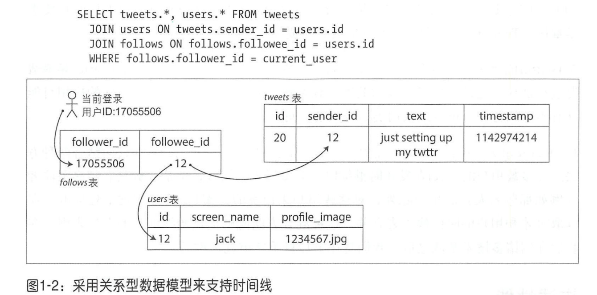
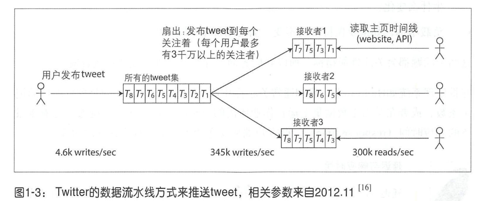

# 一、 可靠、可扩展与可维护的应用系统

1. twitter消息方案处理： 用户可以发送消息，消息会被推送到所有的关注者。所有的用户可以按时间线浏览关注的数据
   1. 方案一：用户查看时间线时，查找所有的关注人，列出这些人的twitter，最后按时间排序返回。实例图：
   2. 方案二：对每个用户的时间线维护一个缓存，当用户推送twitt时，查询其关注者，把twitt插入到每个关注者的时间线缓存中。示例图：
   3. twitter刚开始用的方案一，后面读负载压力太大，改用第二种方案。但是有些用户的粉丝太多，这类用户每发布一个twitt会导致大量的写入。所以最后twitter在大多数用户发布时采用方案二，对于粉丝多的用户采用方案一，这类推文单独提取，在读取时和用户的时间线合并。
2. 响应时间
   1. 将响应时间百分数添加到服务系统监控中，持续跟踪该指标，例如设置一个10min的滑动窗口，监控其中的响应时间，计算窗口中的中位数和各种百分比分位数。可以每分钟做一次排序，也可以采用一些近似算法如正向衰减，t-digest, HdrHistogram

# 二、数据存储与检索

1. 存储引擎：
   1. 事务处理型与分析型
   2. 面向日志结构和面向页
2. SSM-tree: KV存储，用顺序写代替了随机写，牺牲了读性能增加了写性能，SSTables内有序，ssTable内可以二分查找。外层有布隆过滤器进行优化，对SSTable还可以分层，如LevelDB
3. b-tree： 和SSM比它是原地更新
   1. 一些数据库不使用覆盖页和WAL来进行崩溃恢复，而是使用写时复制。修改的页被写入不同的位置，树中的父页的新版本被创建，并指向新的位置，这种方法对并发控制也很有帮助
   2. 双向链表
   3. 采用分段制度，比如mysql的segment，让相邻的页可以按顺序保存在磁盘上
4. SSM和b-tree的优缺点
   1. b-TREE必须写两次数据：一次wal，一次数据页。即使该页中只有几个字节更改，也必须承受整个页的开销。一些存储引擎甚至覆盖相同的页两次，以避免在电源故障的情况下出现部分更新（24,25）。比如innodb，它的数据页大小为16k，而现代磁盘的原子性写入大小为4k，所以需要有二次写来防止出现部分更新的情况。
   2. 由于反复压实和SStable的合并，SSM的一次写入可能会引起多次磁盘写，这种情况称之为写放大
   3. SSM的压缩过程中可能会干扰正在进行的读写操作，在高写入吞吐量时，压缩和写入会争抢磁盘带宽