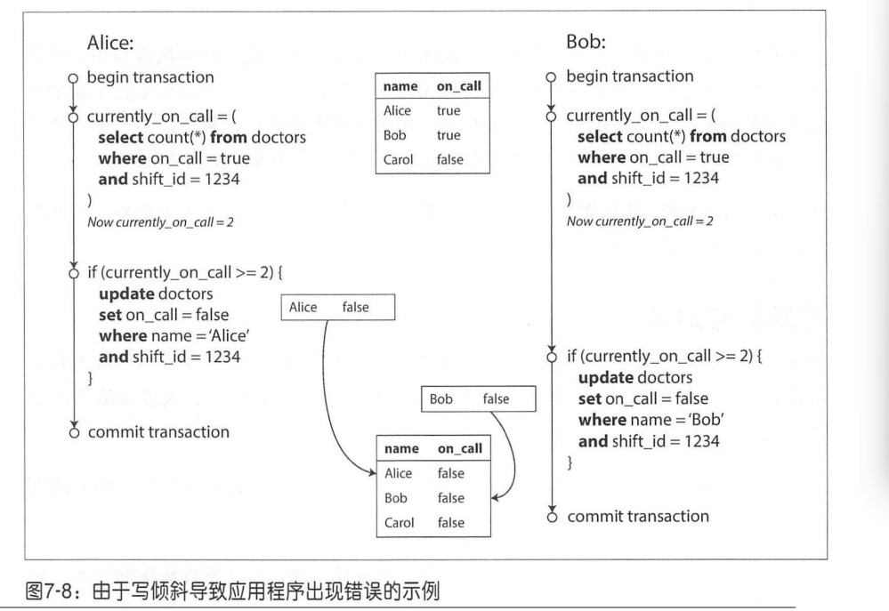
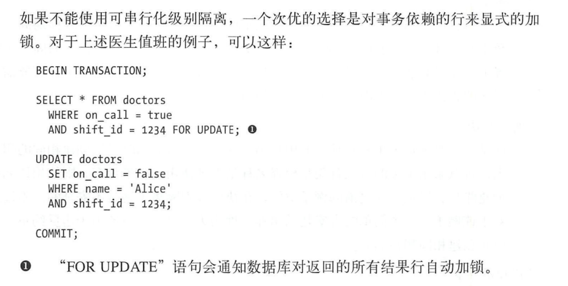

# 一、 可靠、可扩展与可维护的应用系统

1. twitter消息方案处理： 用户可以发送消息，消息会被推送到所有的关注者。所有的用户可以按时间线浏览关注的数据
   1. 方案一：用户查看时间线时，查找所有的关注人，列出这些人的twitter，最后按时间排序返回。实例图：
   2. 方案二：对每个用户的时间线维护一个缓存，当用户推送twitt时，查询其关注者，把twitt插入到每个关注者的时间线缓存中。示例图：
   3. twitter刚开始用的方案一，后面读负载压力太大，改用第二种方案。但是有些用户的粉丝太多，这类用户每发布一个twitt会导致大量的写入。所以最后twitter在大多数用户发布时采用方案二，对于粉丝多的用户采用方案一，这类推文单独提取，在读取时和用户的时间线合并。
2. 响应时间
   1. 将响应时间百分数添加到服务系统监控中，持续跟踪该指标，例如设置一个10min的滑动窗口，监控其中的响应时间，计算窗口中的中位数和各种百分比分位数。可以每分钟做一次排序，也可以采用一些近似算法如正向衰减，t-digest, HdrHistogram

# 二、数据存储与检索

1. 存储引擎：
   1. 事务处理型与分析型
   2. 面向日志结构和面向页
2. SSM-tree: KV存储，用顺序写代替了随机写，牺牲了读性能增加了写性能，SSTables内有序，ssTable内可以二分查找。外层有布隆过滤器进行优化，对SSTable还可以分层，如LevelDB
3. b-tree： 和SSM比它是原地更新
   1. 一些数据库不使用覆盖页和WAL来进行崩溃恢复，而是使用写时复制。修改的页被写入不同的位置，树中的父页的新版本被创建，并指向新的位置，这种方法对并发控制也很有帮助
   2. 双向链表
   3. 采用分段制度，比如mysql的segment，让相邻的页可以按顺序保存在磁盘上
4. SSM和b-tree的优缺点
   1. b-TREE必须写两次数据：一次wal，一次数据页。即使该页中只有几个字节更改，也必须承受整个页的开销。一些存储引擎甚至覆盖相同的页两次，以避免在电源故障的情况下出现部分更新（24,25）。比如innodb，它的数据页大小为16k，而现代磁盘的原子性写入大小为4k，所以需要有二次写来防止出现部分更新的情况。
   2. 由于反复压实和SStable的合并，SSM的一次写入可能会引起多次磁盘写，这种情况称之为写放大
   3. SSM的压缩过程中可能会干扰正在进行的读写操作，在高写入吞吐量时，压缩和写入会争抢磁盘带宽

# 三、数据复制

1. 复制数据变化的方法
   1. 主从复制
   2. 多住节点复制
   3. 无主节点复制
2. 问题？
   1. 同步复制还是异步复制？
      1. 同步复制保证从节点也写入了数据，主节点才认为写入成功，在这之前用户需要一直等待
      2. 同步复制可以保证数据的可靠性，不会发生数据丢失，因为如果主节点故障，从节点有最新的数据。但是如果从节点发送故障或者其他原因导致从节点一直不能写入，则主节点也无法写入成功，会导致不可用。
      3. 而异步复制不会影响主节点不可用，但是无法保证数据可靠性。虽然无法保证数据可靠性，但还是被广泛使用
      4. 半同步复制：部分从节点采用同步复制，部分从节点采用异步复制。如果同步复制的从节点不可用或者性能下降，则将另一个异步复制的从节点提升为同步模式
      5. 主节点发生故障时，异步复制可能会丢失数据。而且主节点恢复后成为从节点，同步数据时会发生数据不一致的情况，违背了持久性
   2. 如何处理失败的副本？
   3. 如何保证所有副本之间的数据是一致的？
3. 配置新的从节点
   1. 在某个时间点对主节点的数据副本产生一个一致性快照，避免长时间锁定数据库
   2. 将快照复制到新的从节点
   3. 从节点连接主节点，并请求快照之后的数据更改日志。因为第一步创建快照时，快照与系统复制日志的某个确定位置相关联，这个位置信息再pg中叫“log sequence number”，mysql中叫“binlog coordinates”
   4. 从节点接受主节点的日志后，在本地重放
4. 复制
   1. pg,oracle数据库支持wal复制，也就是物理复制，存储的版本要一致
   2. mysql使用的binlog复制，也就是逻辑复制，更好兼容

5. 复制滞后问题：对于读多的场景，会添加许多从节点来增加读能力，读节点多了为了性能考虑只能采用异步复制，异步复制暂时会导致主从数据不一致
   1. 写后读（读写一致性）：写完了之后能立即看到最新的数据
      1. 某些接口从主节点读：比如读取自己的主页这种只能由自己修改的页面

   2. 单调读：
      1. 单调读可以保证不会出现这种回滚的情况
      2. 实现方式：确保某个用户的请求总是从某个固定副本读取

   3. 前缀一致读：
      1. 问题：
      2. 多主数据库会出现这种情况。或者说不存在全局写入顺序就会出现这种情况
      3. 把具有因果关系的顺序写入一个分区

# 四、数据分区

1. 分区方式：以KV存储为例
   1. 基于关键字区间分区：比如A开头的在一个分区，B C开头的在一个分区。如果关键字是时间，会导致热点。主要问题还是这种的硬编码，基本上都会导致热点数据。可以在时间戳前加些前缀来使数据均匀分布
   2. 基于关键字hash：
      1. 选定稳定的hash函数：即在不同的机器上相同的输入经过hash函数计算后能得到相同的输出，java的hashcode显然不属于这种，java的hashcode在不同的机器上是不一样的，所以不能使用java的hashcode对数据进行分区
      2. 负载倾斜与热点：基于hash的分区可以减轻热点，但是无法做到完全避免。一个极端的情况是。所有的读写都针对一个KEY，最终导致所有的请求都被路由到一个分区。比如社交媒体上，名人发布了热点事件。如今大多数系统无法自动消除这种高度倾斜的负载，只能通过应用层来减轻倾斜程度。例如，如果某个关键字被认定为热点，在关键字的开头或者结尾处添加一个随机数，比如增加两位十进制的数，就可以将原关键字扩展成100个，从而分配到不同的分区。但是这种方案读取的时候需要读取100个key的数据， 然后进行合并
      3. 特例：一致性hash
   3. 分区再平衡：把数据从一个节点转移到另一个节点
      1. 平衡之后，负载，数据存储、读写请求应该在集群中更均匀的分布
      2. 再平衡过程中，数据库应该可以继续提供读写服务
      3. 平衡策略

# 五、事务

1. 隔离级别
   1. read_uncommited: 会有脏读脏写问题：
   2. read_commited: 会有自增问题
      1. 是大多数据库默认的隔离级别:
      2. 问题：不可重复读或者叫做读倾斜（read skew）
      3. 某些场景不能容忍不可重复读的问题：
         1. 数据库备份，会造成备份的数据不一致
   3. 可重复读: 使用MVCC来解决不可重复读
2. 防止丢失更新:读-修改-写回 
   1. 原子写操作：UPDATE counters SET value = value + 1 WHERE key ＝’于00 ’；
   2. 显示加锁：select *from  ..... for update(for update表示数据库对返回的所有结果行加锁)
3. 写倾斜与幻读
   1. 写倾斜：
   2. 写倾斜解决办法：显示加锁
   3. 更多写倾斜例子：
      1. 
      2. 
      3. 写倾斜的问题的关键在于查询的结果为空，导致没法加锁。比如会议室预定系统，可以先插入未来几个月的数据，然后sql语句就能加锁了。
      4. 大多数情况下，解决写倾斜还是推荐串行化的隔离级别
   4. 串行化：它保证即使事务可能会并行执行，但最终的结果与一个一个串行执行的结果相同 
      1. 两阶段加锁
      2. 谓词锁：
      3. 索引区间锁：
      4. 
      5. 

# 六、分布式系统挑战

# 七、一致性与共识

