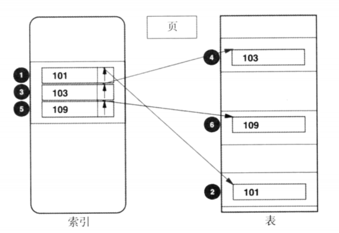
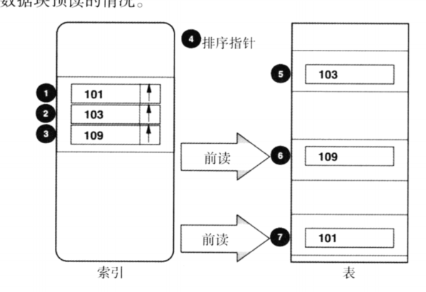
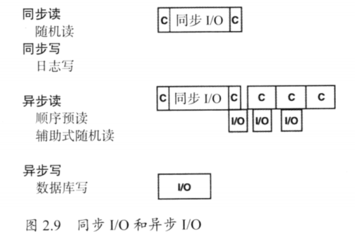

###### 笔记

1. 表和索引结构

   1. 表和索引的物理结构

      > ​	表和索引都被存储在页中，页的大小一般为4K。当表和索引被加载或者重组时，每个页都会预留一定比例的空闲空间，以满足向其添加新的表行和索引行的需求
      >
      > ​	缓冲池和IO都基于页，一次将一个完整的页读取到缓冲池，一次IO页可能读取多个页到缓冲池（空间局部性）
      >
      > ​	预读：由于DBMS知道要读取哪些页，所以可以在页被真正请求之前就将其读取出来，我们称之为预读（顺序预读、多块IO、多重顺序前读）

   2. 辅助式随机读和顺序读：跳跃式顺序读、列表预读及数据块预读

      1. 跳跃式顺序读:如果一系列不连续的行按照同一个方向扫描，那么访问的模式是跳跃式的，这也比随机读要快很多，示例图：

   3. 同步IO和异步IO的意义

      1. 示例图：
      2. 同步IO读写指在进行IO操作时，DBMS不能进行其他操作，直至IO操作完成。同步读的第一个c表示定位我们所需要的行消耗的cpu时间，同步IO表示访问该页，第二个c表示处理该行的cpu时间，每一步都必须等待，直至上一步完成
      3. 异步IO读：先进行一次同步IO，在处理行是可以同时进行IO，
      4. 在DBMS请求一个页时，磁盘可能会加载一组页到磁盘缓冲区，这种机制叫磁盘前读

2. SQL处理过程

   1. 匹配列和过滤列
   2. 最左前缀原则的列都是匹配列，之后的列能参与过滤的叫做过滤列

3. 创建理想的索引

   1. 三星索引
      1. sql示例：
         1. ``` select cno,fname from cust where lname between :lanme1 and lname2 and city = :city order by fname;```

