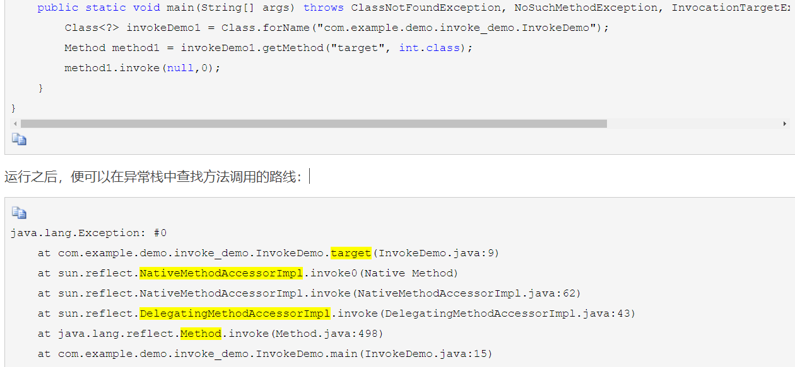

jdk

1. nio

   1. socket通信机制
      1. accept、read、write、close
   2. io多路复用模型
   3. IO模型和java网络编程模型
   4. 三大组件？
   5. epoll原理？和select、poll的区别？边缘触发和水平触发？惊群问题？
      1. select、poll和epoll都是同步IO，都需要自己把数据从内核复制到用户空间
      2. select：
         1. select仅知道有IO事件发生了，但却不知道对应那个文件描述符，只能遍历所有的文件描述符（O（n）时间复杂度）
         2. 连接数限制1024，增加连接数要重新编译内核
         3. 需要大的数据结构存放fd，而且需要在内核空间和用户空间来回复制，开销比较大
      3. poll：
         1. poll仅知道有IO事件发生了，但却不知道对应那个文件描述符，只能遍历所有的文件描述符（O（n）时间复杂度）
         2. 也需要大的数据结构存放fd，而且需要在内核空间和用户空间来回复制，开销比较大
         3. 没有最大连接数的限制
      4. epoll：
         1. 没有最大连接数的限制
         2. 使用mmap减少复制的开销
         3. 只有活跃的fd才会调用callback函数，把就绪的fd加入到就绪链表，epoll去查看这个就绪链表是不是为空即可
      5. 边缘触发和水平触发
         1. 边缘触发：只有来了新的数据时，fd才会返回
         2. 水平触发：每次socket可读时fd都会返回
         3. nginx的listenFD是水平触发（为了不丢失连接的请求），ConnFD是边缘触发（nginx是为web这种比较空闲的场景设计的）
      6. 惊群效应：
         1. 有多个进程监听同一个端口，当端口有事件发生时，这些进程都被唤醒，但是最终只能有一个进程处理这个事件，造成了资源浪费（理想情况下只需要唤醒一个进程即可）
      7. linux2.6已经解决accept的惊群效应（前提没有使用select、poll、epoll），通过标志位实现，有这个标志位就只会唤醒有一个进程
      8. linux2.6解决了epoll在fork之前的惊群效应
      9. nginx实现了互斥锁解决epoll在fork之后的惊群效应
         1. 当有新的连接事件时，所有的进程都会被唤醒去执行accept，但只有一个进程能抢到锁，才能执行accept，其他没抢到锁的进程重新进入睡眠状态。锁只能保证只有一个进程去调用accept函数，解决了很多进程调用accept返回错误。
   6. netty？
   7. 零拷贝？
      1. mmap
      2. sendfile
   8. tomcat的nio
   9. nio空轮训bug？netty怎么解决？

2. 反射

   1. 反射的两种调用方式

      1. 本地实现:NativeMethodAccessorImpl
      2. 委派实现：DelegatingMethodAccessorImpl.invoke。委派实现会调用本地实现：
      3. 对于普通的method.invoke（）开始的15次都是委派实现，15次以后是本地实现

   2. 为什么不直接使用本地实现 而要多一种委派实现？

      > java的反射机制还设立了另一种动态生成字节码的实现，直接使用invoke指令来调用目标方法。采用委派实现是为了能在本地实现和动态实现之间来回切换。（动态实现未开源）
      >
      > 

   3. 反射为什么慢？

      1. 反射调用分配了更多的栈帧
      2. 创建了更多的对象

3. 集合

   1. set和list区别？

      > set:无序 ，不可重复，时间复杂度（插入：O（1），contain：O（1））
      >
      > list：有序，可重复，list可用过下标来访问，时间复杂度（插入：O（n），contain：O（n））

   2. fail-fast机制

      > 集合内部会维护一个modCount，初始值为0，改之前会进行cas判断modCount和expectedModecount是否一致，不一致会抛出异常。每次对集合进行增删改完之后都会对modCount++

   3. ArrayList：

      > 1. ArrayList的默认容量是10
      > 2. 当ArrayList的容量不够时，会进行扩容，扩容后的大小是原来的1.5倍：newCapacity = oldCapacity + (oldCapacity >> 1)
      > 3. 扩容时会把原数组的数据copy到新数组：System.arraycopy(0,oldsrc,0,newsrc,length)

   > 4. 

4. ArrayList扩容机制？

   > 

5. ArratList和Vertor区别？

   > ArrayList: 线程不安全，扩容时1.5倍扩容
   >
   > Vertor: 线程安全，扩容时翻倍扩容

   6. ArrayList和LinkedList区别？

      > ArrayList:

   >LinkedList:

   7. Hashmap、hashTable和hashSet区别？

   8. HashMap的node层级结构

   9. 示例图：

   10. 123

   11. HashMap

       1. 特性

          > 1. hashMap的存取是没有顺序的
          > 2. KV都可以为null
          > 3. 多线程下该类是不安全的
          > 4. JDK8是数组+链表+红黑树，JDK7是数组+链表
          > 5. 初始容量和装载因子是性能的关键，一般不要动
          > 6. HashMap是懒汉式的，只有put数据才会是初始化
          > 7. 双向链表和红黑树是共存的（数组里有的Node是链表，有的Node是红黑树）
          > 8. 对于传入的两个key，会强制排序，决定是向左还是向右
          > 9. 链表转换成红黑树后会努力将root节点和table[i]节点融合成一个
          > 10. 如果同一个节点的链表数据节点个数 > `TREEIFY_THRESHOLD=8`且数组长度 >= `MIN_TREEIFY_CAPACITY=64`，则会将该链表进化位`RedBlackTree`,如果`RedBlackTree`中节点个数小于`UNTREEIFY_THRESHOLD=6`会退化为链表

       2. 为什么负载因子是0.75

          > 1. 负载因子提高了空间的利用率，但是增加了冲突的概率会增加链表的长度，可能导致查询和插入性能降低
          >
          > 2. 负载因子很低性能会好点，但是会浪费空间，
          > 3. 0.75在空间和时间上做了很好折中

       3. 为什么转换成树的阈值是8？

          > 8=0.75*12（16* * 0.75）是基于泊松分布算出来，当长度为8时树化的几率比较低。TreeNode的大小是链表node的两倍，所以要尽可能避免树化

       4. 为什么树化还要判断数组长度大于64？

          > 避免hashMap建立初期，冲突概率比较大，此时应该去扩容而不是树化

       5. get流程

          > 1. 计算key的hash值，算出对应数组的下标
          > 2. 如果数组位置为null，返回null
          > 3. 如果不为null，看当前node是否equals key。相等则返回
          > 4. 如果table[i]是treeNode，按红黑树的查找
          >    1. 先获得根节点，左节点，右节点。
          >    2. 根据 左节点 < 根节点 < 右节点 对对数据进行逐步范围的缩小查找。
          >    3. 如果实现了Comparable方法则直接对比。
          >    4. 否则如果根节点不符合则递归性的调用find查找函数。
          > 5. 如果是链表，遍历链表，找到node equals key的那个node

       6. put流程？

          > 1. 对key计算hash值
          > 2. 现在entry数组有没有初始化，如果没有就初始化
          > 3. 计算参数key的hash，算出该key应该在数组中的位置
          > 4. 如果table[i]==null,直接放进去，如果node和当前key一样，进行覆盖
          > 5. 如果是树，putTreeVal
          > 6. 如果是链表，遍历链表，如果key之前存在，进行覆盖。不存在就在链表的后面添加，如果是添加还需要判断需不需要树化

       7. 扩容流程？

       8. hashMap的长度为什么是2的幂次方？

          1. 计算数组下标时可以把取余运算转换成位运算，速度更快
          2. 扩容比较快，高一位为0位置不变，高一位为1的位置=（当前位置+原始数组长度）。整个过程不用重新计算hash值

       9. 为什么要把hashCode右移16位？(h = key.hashCode()) ^ (h >>> 16)

          1. 扰动函数：使高位也能参与运算，这样得到的hash值就不止和地位相关，增加了随机性，尽可能使数据均匀分布。之前tomcat被爆漏洞就是因为hash算法太简单了

   12. 并发安全？

             1. hashmap没有使用任何的锁机制，所以是线程不安全的
                2. 为什么会造成死循环？
                3. 可能造成并发安全的操作：
                4. 一写多读
                5. 扩容

6. concurrentHashMap

   1. sizeCtl的含义
      1. -1：table正在初始化
      2. -N: 正在扩容。取-N的二进制的低16位为M，扩容的线程就是M-1
      3. 如果table没有初始化，表示table需要初始化的大小
      4. 如果table初始化完成，表示table扩容的阈值。（table.size() * 0.75）
   2. put流程：
      1. 计算hash值
      2. 如果table没有初始化，进行初始化
      3. 如果table[i]为null，cas写入
      4. 如果table[i]的hash（fh）为-1，表示正在扩容，那么当前线程会去帮助扩容
      5. 如果table[i]！=null，并且也不在扩容。对table[i]进行加锁
         1. 如果fh>0,说明当前节点是链表，遍历链表，如果存在key就进行覆盖，不存在就添加到队尾。添加完后会判断binCount（表示当前链表下的节点个数，红黑树的binCount固定为2），如果超过8，进行树化
         2. 如果fh<0，说明当前节点是红黑树，进行红黑树的put
   3. resize流程：
   4. 如何保证线程安全？
      1. 储存Map数据的数组时被volatile关键字修饰，一旦被修改，其他线程就可见修改。因为是数组存储，所以只有改变数组内存值是才会触发volatile的可见性
      2. 如果put操作时hash计算出的槽点内没有值，采用自旋+CAS保证put一定成功，且不会覆盖其他线程put的值
      3. 如果put操作时节点正在扩容，即发现槽点为转移节点，会等待扩容完成后再进行put操作，保证扩容时老数组不会变化
      4. 对槽点进行操作时会锁住槽点，保证只有当前线程能对槽点上的链表或红黑树进行操作红黑树旋转时会锁住根节点，保证旋转时线程安全
   5. 和1.7的不同
      1. 没有分段锁，每个segment有一个锁
      2. 扩容性能更高，支持多线程扩容（1.7的多线程是针对segment）
   6. 扩容时其他线程进行put或者 remove会发送什么？
      1. 如果当前链表迁移完成，头结点会设置成fwd节点，put线程会帮助扩容。
      2. 如果没有完成扩容，put线程会被锁住。
   7. 为什么get不需要加锁
      1. Node的val是volatile的，volatile保证了多线程的可见性
   8. 扩容过程，读能否访问到数据？
      1. 可以。如果当前节点没有被设置成fwd节点，可以进行读写
      2. 如果处理过了，当前线程会去帮助扩容
   9. concurrentHashMap怎么发现当前节点正在扩容？
      1. concurrentHashMap增加了转移节点，转移节点的hash是-1，如果发现当前节点的hash值是-1，说明正在扩容
   10. cas在concurrentHashMap的应用？
           1. put设置value的时候使用cas

7. CopyOnWriteList

8. readWriteLock

9. 注解实现原理？

   1. 注解本质是一个继承了Annotation的特殊接口，其具体实现类是Java运行时生成的动态代理类。通过代理对象调用自定义注解（接口）的方法，会最终调用AnnotationInvocationHandler的invoke方法

10. jdk新特性

   11. 1.8的新特性

       1. lamdba
       2. 接口的deafult方法
       3. stream
       4. localDatetime
       5. Optional
       6. 独占缓存行注解

   12. jdk9特性

   13. jdk15特性：

       1. 去除synchronized的偏向锁