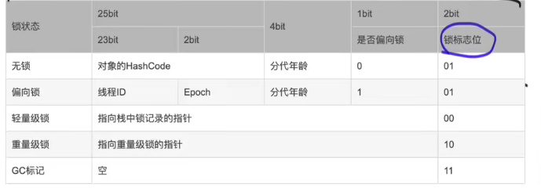

juc

1. 多线程理解？什么是并发安全？

2. 竞态条件？

   > 当两个线程竞争同一资源时，如果对资源的访问顺序敏感，就称存在竞态条件

3. 临界区？

   > 导致竞态条件发生的代码区称为临界区

4. Java的内存模型

5. as-if-serial

   > as-if-serial是指不管怎么重排序，单线程的程序的执行结果不能该表

6. java实现同步方式？

   1. ReetranLock

   2. synchronized

   3. 区别：

      > 1. lock是java语言级别的api，synchronized是jvm提供的关键字
      > 2. synchronized是独占的，lock可以是独占也可以共享
      > 3. synchronized获取不到锁一直等待，lock可以使用带超时的获取锁
      > 4. synchronized是非公平的，lock可以公平也可以非公平

7. 如何创建一个线程？如何指定线程的执行逻辑？

   1. 创建线程：调用一个状态为new 的Thread对象的start方法
   2. 执行逻辑
      1. 继承thread
      2. 传runnable
      3. 传callable
      4. 三者本质都是 实现了runnable接口

8. 线程的6种状态？

   1. new
   2. runnable
   3. blocked
   4. waiting
   5. time waiting
   6. terminated

9. 对象头？每个对象占多大内存？markWord？monitor？

10. 对象的内存结构

    1. 对象头
       1. markword：
       2. class pointer
    2. 实例数据
    3. 对齐填充

11. volatile？

   12. 可见性和有序性怎么保证？

             1. 有序性：插入内存屏障（StoreLoad，LoadStore，LoadLoad，StoreStore） 禁止重排序
             2. 可见性：插入的内存屏障会使得每次修改变量都会刷新到主存，并使其他处理器的缓存失效。当其他cpu发现缓存失效时，会从主存中获取数据

   13. 缓存一致性协议怎么保证可见性？

       > 1. cpu的缓存值有4个状态：独占，共享，已修改，失效
       > 2. 当状态是共享转为已修改时，会通知其他cpu，使其他cpu缓存的值变成失效

14. synchronized

    1. 锁升级？偏向锁->自旋锁->重量级锁

       > 1. 线程第一次获取锁的时候，获取的是偏向锁，把对象头的markword的前23位设置成获取锁的线程id。当有第二个线程来抢锁时，升级为轻量级锁
       > 2. 获取锁的线程在栈中新建一个lock record，在lock record存放锁对象的markrecord副本，还存放一个owner指针指向锁对象。对象的markword指向lock record，这样就把锁对象和线程绑定起来。后续其他来抢锁的线程会自旋（自适应自旋：如果上次自旋已经获得过锁，那么此次也有可能获取到锁，所以会延长自旋时间）。（1.6之前：自旋个数超过CPU核数的一半  或者自旋次数超过10次才会升级成重量级锁）
       > 3. 

    2. jdk15为什么去掉偏向锁？

       > 1. 偏向锁导致synchronized的代码复杂度太高，导致难以维护
       > 2. 过去使用偏向锁确实能提高性能，因为撤销偏向锁成本非常高，所以只有那些不必要的同步而受益于偏向锁定的应用程序可能会看到性能改进。此外，围绕线程池队列和工作线程构建的应用程序通常在禁用偏置锁定的情况下性能更好，而cas需要的cpu指令变少，所以自旋的成本变低，偏向锁带来的优势就更小了。

    3. 偏向锁的加锁流程

       1. 先撤销
       2. 线程加轻量级锁

    4. 偏向锁的撤销过程

       > 

    5. 轻量级锁加锁过程

       > 1. 如果对象处于无锁不可偏向状态，线程创建lock record
       > 2. 使用cas尝试把对象的Markword指向当前线程
       >    1. cas成功说明加锁成功
       >    2. cas失败，判断对象的markword是否指向当前线程的
       >       1. 是：可重入
       >       2. 加锁失败，进入自旋，自旋一定次数膨胀成重量级锁

    6. synchronized怎么保证可重入性？

       > 

    7. synchronize抛出异常会怎么样？

       > synchronized重入之后，内层抛出异常，跳出synchronized代码块，会释放锁

    8. 实例图：

    9. synchronized和hashcode的关系图：

15. volatile和synchronized的区别？

16. lock和synchronized的区别？

17. final?

18. 并发容器和同步容器

    1. 同步容器：
    2. 并发容器：

19. 如何自己实现aqs

    1. 通用性，下层实现透明的同步机制，同时与应用层或者上层业务解耦
    2. 利用cas，可以使用一个变量作为锁的标志位，利用cas的原子性来修改这个标志位
    3. 获取不到锁的优化：
       1. 立即返回
       2. 放入等待队列

20. aqs

    1. node结构

       1. ```waitStatus,pre,next,Thread```
       2. 123

    2. aqs为什么从队尾往前寻找

       > 因为入队方法enq是这么入队的：Node t = tail; cas把tail设置成newNode，然后把t.next=tail;

    3. 公平锁和非公平锁的区别

       1. 非公平锁调用lock后，会先尝试cas抢锁，然后才去调用treAcquire
       2. treAcquire方法，如果此时state= 0，公平锁会判断队列中是否有线程处于等待状态，而非公平锁直接抢锁。

21. readWriteLock

22. 什么是死锁？

    > 死锁是指两个或两个以上的进程在执行过程中，由于竞争资源造成的一种互相等待的现象，若无外力干扰，他们都无法继续执行下去。

23. 死锁发生的原因？

    > 1. 系统资源不足
    > 2. 进程运行获取资源的顺序不合理
    > 3. 资源分配不当

24. 死锁发生条件

    > 1. 互斥条件：一个资源每次只能被一个进程使用。
    > 2. 占有且等待：一个进程因请求资源而阻塞时，对已获得的资源保持不放。
    > 3. 不可强行占有：进程（线程）已获得的资源，在未使用完之前，不能强行剥夺。
    > 4. 循环等待条件：若干进程（线程）之间形成一种头尾相接的循环等待资源关系。

25. Java死锁怎么排查和解决？

    > 1. 是用arthas的thread -b可以找出当前阻塞其他线程的线程

26. cpu100%怎么排查和解决？

27. threadLocal

    1. 

28. fastThreadLocal

29. 线程池

    1. 七个核心参数？

       > 1. ThreadFactory:
       > 2. coreSize:
       > 3. queue:
       > 4. maxSize:
       > 5. RejectPolicy:
       > 6. TimeUnit:
       > 7. time:

    2. 四种默认的线程池？

    3. 线程池中的锁？

       1. mainLock：添加worker的时候会加锁
       2. worker继承了AQS：worker每执行一次任务都会上锁，执行完了之后就会释放锁。用来维护线程的中断状态。worker的lock是不可重入的

    4. 自定义拒绝策略？

       > 序列化 然后保存起来

    5. 线程池怎么实现维持核心线程数的？

       1. 线程池的线程会一直getTask,从队列里拿任务。
       2. 当线程池中的线程数大于核心线程数，会调用带超时的获取任务方法，指定时间没获取到任务返回null，然后线程就会被回收
       3. 如果线程池中的先吃小于等于核心线程数，会一直阻塞，直到获取到了任务。

    6. 线程池的线程怎么保活？

       1. getTask方法：