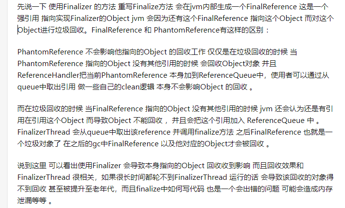

1. jvm的内存结构？

   > 1. 类加载器：url 
   > 2. 运行时数据区：
   > 3. 执行引擎，本地方法库

2. 对象创建过程？

   > 1. 如果开启了逃逸分析，会分析该变量是不是线程私有的，如果是私有的会尝试标量替换把对象打散，把其中的基础数据类型在栈上分配。
   > 2. 如果不能在栈上分配，会尝试在TLAB(thread local aclcation buffer：默认大小是eden区的1%)上分配。（Tlab是为了加快对象分配速度，防止每次分配对象都需要cas，每个TLAB只能由一个线程创建对象，但是创建出来的对象是共享的）
   > 3. 如果TLAB分配失败，如果内存是规整的就进行指针碰撞，否则就在空闲列表找一块内存分配。

3. 什么情况发生OOm异常

   > 1. 堆内存溢出：内存泄漏、内存不够
   > 2. 方法区溢出：动态创建了大量的类
   > 3. 堆外内存：容易内存泄漏

4. 判断对象是否是垃圾？

   > java里使用可达性算法，从GC ROOTS出发，能被GC ROOTS找到的对象就是存活的对象，否则就是垃圾对象

5. 怎么判断一个类是无用的类

   1. 该类的所有实例都已经被回收，即java堆中不存在该类的实例
   2. 该类对应的Class对象没有在任何地方被引用，无法在任何地方通过反射访问该类的方法
   3. 该类的classLoader已经被回收

6. GC ROOT

   > 1. 虚拟机栈引用的对象
   > 2. 方法区类属性（static修饰的）引用的对象
   > 3. 方法区常量池引用的对象
   > 4. 本地方法栈中引用的对象
   > 5. 被同步锁（synchronized）持有的对象
   > 6. jvm自身只有的对象，比如系统类加载器，基本数据类型对应的class对象
   > 7. 对于YGC，老年代对新生代的引用也可以作为GC ROOT

7. 4中引用？

   > 1. 强引用：一般就是new出来的对象
   > 2. 软引用（对应SoftRefenerce）：只要内存足够，就不会被回收。软引用可以配合ReferenceQueue一起使用（在创建软引用的时候在构造方法传入一个ReferenceQueue），当软引用已经被回收时，会把该对象加入ReferenceQueue，调用ReferenceQueue.poll()可以知道哪些软引用会被回收。用来做缓存
   > 3. 弱引用（对应WeekRefenerce）：下次垃圾回收就会回收。也可以配合ReferenceQueue一起使用
   > 4. 虚引用（对应platformRefenerce）：一定要配合ReferenceQueue一起使用。jdk8的platformRefenerce不会对gc产生影响。
   > 5. FinalReference:  如果某个对象实现了非空的Finalize()方法，那么会在编译时候生成一个Finalizer。所有的此类对象形成一个Finalizer链条。在gc的时候会取出对象执行finalize方法，并把该Finalizer从链条中删除，所以finalize方法只会执行一次（单独的线程执行）。

8. PhantomReference和finalizer：

   1. -
   2. -------------------------------------------------------------------------------- 

9. 软引用为什么可以解决OOM问题？

   > ​	假如有一个应用需要读取大量的本地图片，如果每次读取图片都从硬盘读取，则会严重影响性能，但是如果全部加载到内存当中，又有可能造成内存溢出，此时使用软引用可以解决这个问题。
   >
   > 　设计思路是：用一个HashMap来保存图片的路径 和 相应图片对象关联的软引用之间的映射关系，在内存不足时，JVM会自动回收这些缓存图片对象所占用的空间，从而有效地避免了OOM的问题。在Android开发中对于大量图片下载会经常用到。

10. 虚引用的作用？

   > 1. 之前mysql使用finalize方法来清理资源，先已经改为虚引用了（finalize线程可能得不到执行，导致无法gc）

11. 为什么jdk的垃圾回收不回收 虚引用？

    > ​    在Java 8的实现中，确保对象在真正GC前能被对应的ReferenceQueue处理，所以将对象标记为活跃，不回收对象
    >
    > ​    显然，在这种情况下，会导致本可以回收的对象无法回收的问题，所以在Java 9中，确保PhantomReference指向的对象在回收后（而不是原来的回收前），会被对应的ReferenceQueue处理，这样在一定程度上保证了功能，又修复了这个问题

12. 方法区的回收？

13. 垃圾回收算法？

    > 1. 标记清楚：
    > 2. 复制算法：
    > 3. 标记整理算法：

14. 内存分配和回收策略？

    1. 对象分配原则

       > 1. 栈上分配->TLAB->eden分配，如果eden没有足够的空间，执行Minor GC
       > 2. 大对象直接进入老年代：

    2. 回收策略

15. 对象怎么进入老年代？

    > 1. 大对象直接进入老年代
    > 2. 长期存活的对象进入老年代
    > 3. 动态年龄判断：如果survivor区中相同年龄的对象大于survivor空间的一般，那么大于该年龄的对象进入老年代
    > 4. 空间担保：每次进行GC时，jvm会计算survivor区移到老年代对象的平均大小，如果这个值大于老年代的剩余空间则进行一次full GC

16. 垃圾回收器？

    1. 
    2. asdf

17. G1

    1. 参数：
       1. -XX:MaxGCPauseMillis=200 ：指
       2. 

    2. 初始标记：需要stw，只标记GC ROOT能直接关联的对象
    3. 并发标记：在初始标记的基础上继续搜索
    4. 预清理：
    5. 可被终止的预清理：
    6. 重新标记：
    7. 并发清除：
    8. 并发重置状态

18. zgc

19. 三色标记法？浮动垃圾？

    1. 把从GC ROOTS开始遍历到的对象按“是否访问过”标记成3中颜色

       > * 白色：没被访问过
       > * 黑色：本对象已访问过，而且本对象引用的其他对象也全部访问过了
       > * 灰色：本对象已访问过，但是本对象引用的其他对象没有全部访问完。全部访问完后，会变成黑色

    2. 遍历访问过程

       > 假设现在有白色、灰色、黑色三个集合，分别存放对应颜色的对象
       >
       > 1. 开始垃圾回收时，所有的对象都在白色集合中
       > 2. 将GC ROOTS直接引用的对象挪到灰色集合汇中
       > 3. 从灰色集合中获取对象
       >    1. 将本对象引用到的其他对象挪到灰色集合中
       >    2. 将本对象挪到黑色集合中
       > 4. 重复步骤3，知道灰色集合为空
       > 5. 此时仍在白色集合的对象就是垃圾，在黑色集合的对象就是存活下来的对象

    3. 当需要支持并发标记时（标记期间，应用程序还在继续跑 继续产生垃圾），对象间的引用关系可能发生变化，多标和漏标的情况就会发生

       1. 多标（浮动垃圾）：

          > 在并发标记期间，有些对象由GC ROOTS可达变成了不可达。这部分是本应该回收但是却没有被回到到的内存。下一次垃圾回收会回收这些对象

       2. 漏标：

    4. 各个垃圾回收器对漏标的处理办法：

       1. CMS:写屏障+增量更新
       2. G1:写屏障+SATB
       3. zgc:读屏障

20. 分代收集？弱分代假设？分代收集垃圾回收器怎么工作？

    > 1. 弱分代假设的两个理论
    >    1. 大部分对象都是朝生夕死的
    >    2. 少部分年级大的对象持有年纪小的对象的引用
    > 2. 分代收集是弱分代理论1，有了分代之后就只需要在新生代进行频繁GC，提高了收集效率
    > 3. 如果没有分代收集，新创建的对象和生命周期很长的对象放在一起，由于程序在不断运行会产生大量垃圾，所以每次回收都需要遍历所有对象，扫描整个堆空间，会严重影响程序效率，而且效率不高

21. 类加载过程？类加载方式？tomcat如何破坏双亲委派模型？

    > 1. 类加载就是把class文件加载到内存中，将其转化成方法区运行时的数据结构，同是在堆中生成一个镜像，即Class对象
    > 2. 双亲委派
    >    1. 先交给父加载器加载
    >    2. 加载：类加载器扫描自己的url下的类，转化成路劲，然后加载类的二进制数据
    >    3. 验证：验证文件格式，字节码等
    >    4. 准备：为类的静态变量分配内存，并初始化成为默认值
    >    5. 解析：把符号引用（就是个字符串）装换为直接引用（可以是直接指向目标的指针（指向对象、类变量、类方法的指针），相对偏移量（指向实例变量方法的指针）或是句柄）
    >    6. 初始化：给类的静态变量赋予正确的值，执行静态代码块等（cinit方法）
    > 3. Java Agent允许我们在类加载之前修改类，也可结合Attach API使用，在类加载之后，程序运行期间可随时修改类，通过重新加载类替换旧的类

22. 类加载是并发安全的吗？

    > 是。累加器器有一个map<String className, new Object()>,类加载的时候会通过map.get(String className)，把返回的对象当成锁

23. new Object（）发生了什么？

    1. 先去检查该类是否被加载了，没有就使用双亲委派进行类加载
    2. 类加载过程：加载->验证->准备->解析->初始化
    3. 栈上分配或分配内存：栈->TLAB->(空闲列表或指针碰撞)
    4. 初始化（实例变量初始化零值）->设置对象头->执行init方法、构造方法

24. 什么情况发送ygc？什么情况下发送full gc？

    1. ygc

       > 1. Eden区满了

    2. full gc

       > 1. 手动执行System.gc（没有手动禁用GC的前提下）。部分垃圾回收器会执行Full GC
       >
       > 2. 堆伸缩时会发生full gc：
       >
       > 3. 老年代空间不足：大对象进入老年代、长期存活的对象进入老年代
       >
       > 4. metaSpace空间不足：比如使用了OSGI动态生成了大量的类
       >
       > 5. 空间担保：
       >
       >    1. 每次晋升对象的平均大小>老年代剩余空间
       >    2. minor GC后存活的对象超过了老年代的空间
       >
       > 6. ---------------------------------
       >
       > 7. parallel GC：默认会在要触发full GC之前先进行一次YGC（减轻Fu'll  GC的负担）
       >
       > 8. cms：定期检查老年代的使用量，超过阈值也会对老年代进行并发收集

25. jvm怎么调优？一般从哪里入手？

    1. 调优的策略：尽量把生命周期短的对象留在新生代，减少对象进入老年代的机会，生命周期长的对象放在老年代

26. 为什么有垃圾回收还会发生内存泄漏？

    > java里的内存泄漏是指 已经不用的对象长期占用着内存或者说生命周期短的对象长期在内存中。
    >
    > 内存泄漏原因：1. 一般是对象的作用域设置的不合理
    >
    > ​							2. 不用的对象没有手动置为 null

27. 内存持续上升？怎么定位问题？

    1. 内存泄漏
    2. 如果不是内存泄漏，说明对象过早的进入了老年代，过早进入老年代的原因：
       1. 对象晋升年龄过低
       2. 程序创建了大对象、大数组
       3. 空间担保导致对象进入了老年代
       4. 动态年龄判断导致对象过早进入老年代

28. jvm参数？

    1. -Xms：最小堆内存
    2. -Xmx：最大堆内存
    3. -XX:NewSize：新生代大小
    4. -XX:NewRatio: 新生代和老年代的比例（最小值为1）
    5. -XX：SurvivorRatio：eden和survivor的比例（最小值为1）