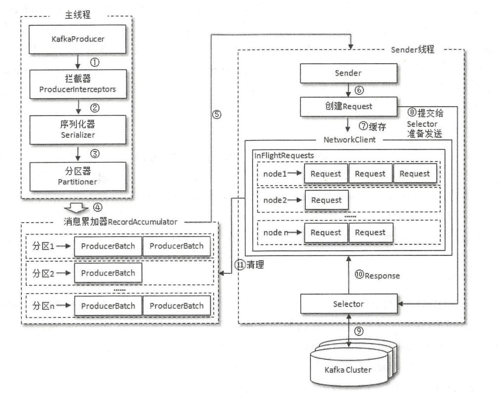
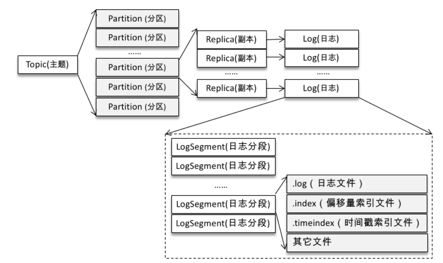

kafka

1. 一条消息的发送过程

   1. 示例图：

2. 为什么使用消息队列

   1. 解耦、异步、削峰，可以统一管理所有的消息
   2. 但是增加了系统复杂度，消息队列也需要去解决消息丢失，重复消费的问题

3. kafka的用途？使用场景？

   1. 消息系统：除了传统的缓冲、异步、削峰之外，kafka还提供了消息的顺序性以及回溯消费，幂等、事务等功能。
   2. 流处理：kafka为流式处理框架提供了可靠的数据来源，还提供了流式处理类库。

4. ISR、ar、hw、leo、lso、lw？

   1. ISR:**与leader**副本保持一定程度**同步**的副本（包括leader）
   2. AR:分区中**所有副本**统称
   3. HW:consumer能看到partition的最大offset，ISO中最小的LEO就是HW
   4. LEO:下一条待写入消息offset
   5. LSO:LastStableOffset，和kafka 的事务相关。这个参数用来配置消费者的事务隔离级别。字符串类型，有效值为“read_uncommitted”和 “read_committed”，表示消费者所消费到的位置，如果设置为“read_committed”，那么消费者就会忽略事务未提交的消息，即只能消费到 LSO(LastStableOffset)的位置，默认情况下为 “read_uncommitted”，即可以消费到 HW(High Watermark)处的位置。注意：follower副本的事务隔离级别也为“read_uncommitted”，并且不可修改。对于未完成的事务，LSO=事务中第一条消息的位移。对于已提交的事务，LSO=HW。
   6. LW:“低水位”，AR中最小logStartOffset，**副本拉取**请求（FetchRequest，可能触发新建日志分段而**旧的被清理**，导致**logStartoffset增加**）和删除请求DeleteRecordRequest都可能促使LW增长
   7. kafka的lag
      1. 对于read_uncommited级别：lag = HW-consumer offset
      2. 对于read_commited:lag = lso - consumer offset

5. kafka怎么体现消息的顺序性？

   1. 分区有序，topic无序

6. kafka的分区策略

   1. 轮询
   2. 随机
   3. 按消息键保存：指定消息的key，相同key的消息会发往同一个分区

7. 分区器、序列化器、拦截器是什么？执行顺序？

   1. 拦截器->序列化器->分区器

8. kafkaProducer的整体结构？

9. kafkaProducer有几个线程？分别做什么工作？

   1. 用户主线程：负责创建消息，然后把经过拦截器、序列化器、分区器的消息放到RecordAccumulator中
   2. sender io线程：负责发送消息，从RecordAccumulator获取消息，封装request，获取消息分区的leader，把消息发向分区leader。RecordAccumulator主要用来缓存消息，以便批量发送，从而提高性能。

10. “消费组中的消费者个数如果超过topic的分区，那么就会有消费者消费不到数据”这句话是否正确？如果正确，那么有没有什么hack的手段？

    1. 正确。开发者可以继承AbstractPartitionAssignor来实现自定义消费策略，从而实现同一个消费组的任意消费组可以消费订阅主题的所有分区。

11. 消费者提交消费位移时提交的是当前消费到的最新消息的offset还是offset+1?

    1. 位移保存在kafka的__consumer_offsets的topic中，需要提交的位移是offset+1

12. kafka为什么这么快？

    1. 顺序写磁盘
    2. 大量使用内存页
    3. 零拷贝
    4. 消息压缩、批量发送

13. 零拷贝？

          1. 存储消息使用mmap：内核和程序的虚拟地址映射为同一个物理地址
          2. poll消息使用sendFile：数据对应用程序不可见

14. kafka的日志段如何读写？

15. kafka的消息是推还是拉，怎么实现的？

    > 由kafkaConsumer自己拉

16. 怎么保证消息不丢失？

    > 

17. 如何处理重复消息？

18. 消息的有序性？

19. 哪些情况会造成重复消费？

    1. rebalance：未消费完消息，rebalacne后又消费了一次。
    2. 消费者手动提交offset：先消费再更新offset
    3. 生产者重发消息：没做幂等处理

20. 哪些情况会发送消息漏消费？

    1. 消费组自动提交：刚poll消息，还未消费就宕机
    2. 生产者发送消息：生产者fire-and-forget，不关心消息是否到达broker
    3. acks没有设置all：broker没把消息同步给follower，leader宕机了

21. kafkaConsumer是非线程安全的，怎么样实现多线程消费？

    1. 可以使用kafkaConsumer来poll消息，但是消费消息可以由其他的线程来做，从而实现消息获取与消息处理的解耦

22. 消费者和消费者组的关系？

    1. group可以有一或多个consumer实例
    2. groupId用来唯一标识一个consumer group
    3. group订阅与topic的分区，只能分配给组内的单个consumer实例消费

23. Kafka有哪几处地方有分区分配的概念？简述大致的过程及原理？

24. 简述Kafka的日志目录结构？

25. 当你使用kafka-topics.sh创建（删除）了一个topic之后，Kafka背后会执行什么逻辑

    1. 创建：kafka会在log.dir下面创建对应的topic目录

26. kafka的分区为什么不能减少？

    1. 被删除分区的消息不好处理。
       1. 如果直接存储到现有分区的尾部，消息的时间戳不会递增，那么对于spark flink这类需要消息时间戳的组件会受到影响
       2. 如果分散插入现有分区，那么在消息量大的情况下，内部的复制会占用大量的资源，而且在复制期间，主题的可用性、消息的顺序性、事务问题、分区leader切换等问题都非常难处理

27. 创建topic如何选择合适的分区？

    1.  可以使用kafka提供的生产者性能测试脚本kafka-producer-perf-test.sh和消费者性能测试脚本kafka-consumer-pref-test.sh来进行测试
    2.  增加分区可以在一定程度上提升系统的吞吐量，但超过阈值后，吞吐量不升反降。
    3.  分区还会影响系统的可用性。如果分区较多，broker节点宕机之后，会有大量的分区进行leader的切换

28. kafka有哪些内部topic？

    1. __consumer_offsets: 用来保存kafka消费者的位移信息
    2. __transaction_state：用来存储事务日志消息

29. 优先副本是什么？有什么特殊作用？

    1. 优先副本就是AR集合中的第一个副本，理想情况下，优先副本就是该分区的leader

30. kafka有哪几处地方有分区分配的概念？简述大致过程和原理

    1. 消息生产者的消息分配需要指定topic下的具体分区
    2. 消费者的分区分配是为消费者指定可以消费消息的分区，partition.assignment.strategy 来设置消费者与订阅主题之间的分区分配策略。
    3. 分区副本的分配方案，即在那个borker中创建了哪个分区的副本

31. kafka的日志目录结构？

    1. 
    2. 实例图：

32. kakfa有哪些索引文件

    1. offset：偏移量索引文件
    2. 时间戳索引文件
    3. 事务索引：kafka开启了事务之后才会出现这个索引

33. 如果指定一个offset，kafka怎么查找对应的消息

    1. kafka通过seek方法指定消费，在执行seek方法之前要执行一次poll方法，等到分配到分区之后去对应的分区的指定位置开始消费，如果指定的位置发生了越界，会根据auto.offset.reset的参数进行消费

34. 如果制定了timestamp，怎么找到对应的消息

    1. kafka提供了offsetForTimes方法，通过timestamp来查询于此对应分区的位置。该方法会返回时间戳大于等于参数的第一条消息对应的位置和时间戳

35. kafka log Retention（日志删除）的理解

    1. 基于时间
    2. 基于大小
    3. 基于offset

36. log compactioin（日志压缩）的理解

    1. 针对每个消息的key进行整合，对于有相同key的不同value，只保留最后一个版本

37. kafka底层存储的理解（页缓存、内核层，块层，设备层）

    1. 页缓存：操作系统的页缓存
    2. 零拷贝

38. kafka延时操作的原理（时间轮）

    1. 延时生产
    2. 延时拉取
    3. 延时数据删除

39. kafka控制器的作用

    1. kafka的集群中有一个broker被选举为kafka Controller：它负责管理整个集群中所有分区和副本的状态。
    2. 当某个分区的leader出现故障时，有controller负责为该分区选举新的leader。
    3. 当检测到某个分区的ISR集合发生变化时，负责通知所有的borker更新元数据信息

40. Group Coordinator和Consumer Coordinator的关系

    1. GroupCoordinator 是 Kafka 服务端中用于管理消费组的组件。而消费者客户端中的 ConsumerCoordinator 组件负责与 GroupCoordinator 进行交互

41. 什么时候会发生rebalance

    1. 有新的消费者加入消费者组
    2. 有消费者宕机：也有可能是消费者遇到长时间GC、网络延迟导致未向GroupCoordinator发送心跳，此时GroupCoordinator会认为消费者已经下线
    3. 有消费者主动退出消费者组（发送LeaveGroupRequest请求）：比如客户端调用了unsubscribe方法取消了对某些主题的订阅
    4. 消费者组的GroupCoordinator节点发生了变化
    5. 消费者组订阅的topic或者topic的分区发生了变化

42. 消费再均衡的原理（消费者协调器和消费者组协调器）

    1. 第一阶段
    2. 第二阶段
    3. 第三阶段
    4. 第四阶段

43. kafka的幂等

    1. producerId: producer初始化时，会被分配一个producerId，对客户端不可见
    2. sequenceNumber：对于每个producerId，produce发送的每个topic和partition都对应一个从0开始单调递增的sequenceNumber，如果broker收到了重复的sequenceNumber，会丢弃该消息

44. kafka的事务怎么实现

    1. 生产者提供一个唯一的transactionId，请求事务协调器获取一个pid，transactionId和pid一一对应
    2. 生产者发送数据之前，向事务协调器发送addPartitionsToTxnRequest，事务协调器将该<Transaction,Topic,Partiton>存于__transaction_state内，将其状态置为begin
    3. 

45. kafka怎么保证exactly once

    1. kafka的exactly once保证的是生产者到broker的幂等，是通过幂等+事务实现的
    2. 幂等保证了生产者到单个partition不会出现重复消息
    3. 事务保证了生产者到多个partition不会出现重复消息

46. kafka什么地方需要选举？这些地方的选举策略是什么

47. 失效副本是什么？有什么应对措施

48. 多副本下，各个副本的HW和LEO的演变过程

49. kafka为什么不支持读写分离？

    1. 数据一致性

50. kafka在可靠性方面做了哪些改进（HW,LeaderEpoch）

    1. HW：消费者只能消费HW之前的数据
    2. leader epoch：leader的纪元信息，每当leader变更一次，leader epoch就会加1.解决数据不一致的问题

51. kafka怎么实现私信队列和重试队列

    1. 重试队列：当消费者多次消费失败后，将消息发送到重试队列
    2. 

52. kafka的延时队列

    1. 在发送延时消息的时候并不是先投递到要发送的真实主题（real_topic）中，而是先投递到一些 Kafka 内部的主题（delay_topic）中，这些内部主题对用户不可见，然后通过一个自定义的服务拉取这些内部主题中的消息，并将满足条件的消息再投递到要发送的真实的主题中，消费者所订阅的还是真实的主题

53. kafka怎么做消息审计

54. kakfa怎么做消息轨迹

    1. 封装客户端 埋点监控

55. kakfa的配置参数

56. kafka的监控指标

57. 怎么计算Lag（read_uncommitted和read_committed状态下不同）

58. kafka的优缺点（对比rocketmq，rabbitmq）

59. kafka的过程中有什么问题？怎么就解决

60. 怎么极大程度上保证kafka的可靠性

61. 消息的堆积处理？

62. kafka的主题与分区内部是如何存储的，有什么特点？

63. 与传统的消息系统相比，kafka的消费模型有什么优点？

64. kafka如何实现分布式的数据存储与数据读取？

65. 索引

    1. 什么是稀疏索引？和密集索引的关系以及区别

       > 

    2. kafka的索引是稀疏索引，主要有三类

       1. 时间戳索引
       2. 位移索引
       3. 事务索引

66. 源码？