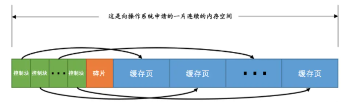
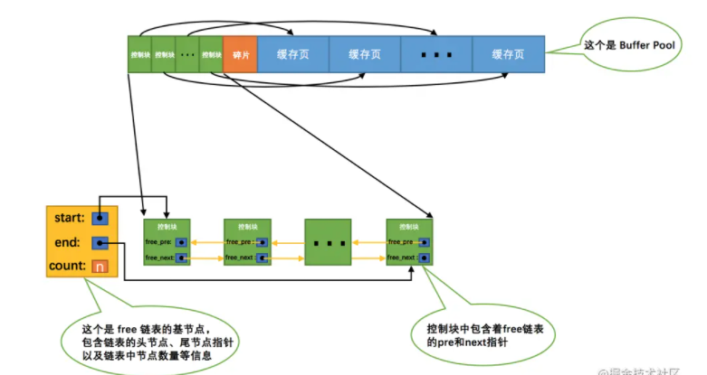
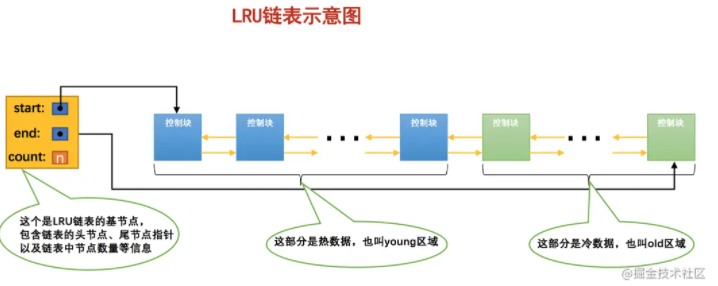

11. mysql

    1. 三大范式？

       > 一范式：所有属性都不可分割
       >
       > 二范式：在一范式的基础上，消除了属性对非住属性的依赖
       >
       > 三范式：在二范式的基础上，消除了传递依赖

    2. 一条select语句的执行过程？

       > 

    3. sql执行顺序

       1. **from->2 join->3 on->4 where->5 group by ->6 having ->7 select->8 order by->9 limit**

    4. 一条update sql执行过程？

       1. 连接器：
       2. 分析器：
       3. 优化器：memory存储引擎
       4. 执行器：
       5. innodb：buffer pool

    5. innodb和myisam的区别？

       1. 事务：
       2. 外键：
       3. 索引：inndob存储数据是聚簇索引，主键和数据放在一起。myisam的索引和数据是分开的
       4. 日志：innodb有redo log和undo log
       5. count：
       6. 锁：innodb支持行锁、表锁，而myisam只支持表锁
       7. 存储文件：innodb有两个文件：frm是表定义文件，idb是数据文件。myisam有三个文件：frm是表定义文件，myd是数据文件，myi是索引文件
       8. 插入顺序：innodb插入的数据会按主键排序（会导致页分裂），myisam数据的存放顺序和插入顺序一致
       9. 二级索引：innodb的二级索引存的是主键，myisam的索引存的是数据页的地址

    6. myisam查询为什么比innodb快？

       > 1. myisam的二级索引存储的是数据的地址，不需要回表
       > 2. myisam不支持事务等特性，不需要记录redo log等日志

    7. innodb的特性？

       1. 插入缓冲

          >   对于索引（该索引是二级索引并且索引不是唯一的）的插入和更新，不是每一次都直接插入到索引页中，而是先插入到内存中。
          >
          >   具体做法：如果该索引页在buffer pool中，直接插入；如果不在就先放到insert buffer中，再以一定的频率和索引页合并。这样就可以把同一个索引页的多个插入合并到一次IO中，大大提高了写性能。有点像LSM树

       2. 二次写

          1. partial page wirte问题

             > innodb的数据页（page size）一般是16KB，将数据写入磁盘也是以page为单位进行操作。但是文件系统对于16kb的操作不是原子性的，会导致16KB的数据有可能只写入了4KB，然后服务器就宕机了，这会造成数据页的损坏。（redo log记录的是数据页的物理修改，例如：偏移量200，写aaa记录。如果数据页已经损坏，redo log是没办法进行恢复的）、

          2. 为什么redo log不会有partial page wirte问题？

             > 因为redolog的写是以4KB为单位写，这个大小的数据页的写入是具有原子性的

          3. 实现原理：

             > 做个冗余，在写数据页之前，先把这个数据页写到一块独立的物理位置，然后再写数据页。这样在宕机重启的时候，如果发生了数据页损坏，那么在使用redolog 重做之前，使用该副本来还原数据页，然后再进行redo重做。二次型保证的是innodb存储引擎数据页的可靠性

       3. 自适应hash

    8. 为什么自增主键不连续？

       > 1. innodb的自增值是保存在内存中的，8.0之后才会持久化。所以当mysql重启之后，第一次打开表都会去找max（id），然后把max（id）+1作为下一次自增的id的值。
       > 2. 插入失败后，id也不会减1
       > 3. 事务回滚后，id不会减1.
       > 4. 为什么这么设计？
       >    1. 为了解决主键冲突，每次申请主键id都需要去加锁，如果加上回滚功能，申请id时需要等到上一个insert事务提交，而且这样锁的粒度太大，系统的插入性能太慢

    9. 自增主键理解？

    10. 为什么innodb必须要有主键？

       > 1. innodb使用的是聚簇索引，数据是挂在主键下面的。所以几乎每次查询都需要利用主键，如果主键是和业务相关的，我们就可以利用到这个主键加快查询速度。

    11. innodb为什么推荐自增id？

        > 1. 如果不是自增，那么数据就有可能从页的中间插入，会频繁导致页分裂，造成性能下降
        >
        > 2. 

    12. 索引

        1. 索引的优缺点

           > 1. 加快数据查找的速度
           > 2. 给用来排序或者分组的字段添加索引，可以加快分组和排序的速度
           > 3. 加快表与表之间的连接
           > 4. 需要占用物理空间
           > 5. 降低新增、删除、修改的速度

        2. 什么情况需要建立索引

           > 1. 经常用于查询的子弹
           > 2. 用于连接的子弹
           > 3. 需要排序的字段

        3. 什么情况不适合建立索引

           > 1. where用不到的字段不适合索引
           > 2. 表的记录较少
           > 3. 经常需要增删改的字段
           > 4. 参与列计算的字段不适合索引
           > 5. 区分度不高的字段不适合建立索引

        4. 为什么用b+树

           1. msyql是一个OLTP数据库，需要在短时间内返回数据，数据又是放在磁盘上，所以为了加快查询速度，必须降低IO次数
           2. b+树扇出性高，可以在比较低的层级存储大量的数据
           3. b+树比较稳定
           4. 底层有双向链表，更符合应用场景（范围查询）

        5. 索引类型？

           1. 聚簇索引和非聚簇索引
           2. 主键索引、唯一索引、普通索引
           3. 全文索引、自适应hash索引、b+树索引

        6. hash索引和b+树索引的区别

           > hash索引不支持范围查找
           >
           > hash索引不支持排序
           >
           > hash不支持模糊查询
           >
           > hash索引存在hash冲突

        7. 索引覆盖？回表？索引下推？联合索引？

           1. 索引覆盖：

              > 1. 使用explain输出结果的Extra字段为using index时，表示能触发索引覆盖
              > 2. 只需要在一颗索引树上就能获取到sql所需的所有列数据

           2. 索引下推

           > mysql5.6的新功能：
           >
           > 

        8. 索引设计原则

           1. 适合索引的列是出现在where子句中的列，或者连接子句中指定的列
           2. 基数较小的类，索引效果较差，没有必要在此列建立索引

           3. 使用短索引，如果对长字符串列进行索引，应该指定一个前缀长度，这样能够节省大量索引空间

           4. 不要过度索引。索引需要额外的磁盘空间，并降低写操作的性能。在修改表内容的时候，索引会进行更新甚至重构，索引列越多，这个时间就会越长。所以只保持需要的索引有利于查询即可。

           5. 更新频繁字段不适合创建索引

12. 尽量的扩展索引，不要新建索引
        7. 区分度较高的列适合创建索引
        

     9. 索引失效场景？

        1. 使用了函数或者算术表达式

    10. 使用了'LIKIE刘' ,>,<,!=
            3. 发生了类型转换
            4. 不同的字段使用了or：name='' or age=123
            5. not int,not exists
            6. 字段可以为null：使用is null或者is not null可能导致索引失效
            7. 联合索引违背最左匹配原则

          10. 最左匹配原则？

              > 如果sql语句用到了组合索引的最左边的字段，那这个sql语句就可以利用这个组合索引去匹配，当遇到范围查询（>,<.between,like）就会停止匹配，后续的字段将无法用到索引

          11. 联合索引建立规则？

              > 1. 经常作为查询条件的字段建立索引（where、order by）

      > 2. 区分度高
      >        > 3. 短索引
      >        > 4. 建立的索引符合最左前缀原则

         12. 前缀索引？
         
             > 对文本或者字符串的前几个字符建立索引
         
         13. 百万级别数据怎么删除？
         
         14. 普通索引和联合索引怎么选择？
         
        15. 记录溢出了怎么办（大小超过了一个页的大小）
         
            > 发生行溢出，把多于的数据放到溢出页中

    13. buffer pool

        1. buffer pool的内存示例图：	

     14. 空闲列表示例图（free链表）：
         3. 怎么判断一个页是否在buffer pool中？
            1. 维护一个hash表，表空间号+页号为key，缓存页为value
         4. 使用LRU来管理已经被使用的页
            1. 预读机制（加载进buffer pool的页可能用不到），全表扫描会导致经常用的缓存页被替换出去，降低了缓存命中率
            2. 优化：
               1. 热数据区域：63%
               2. 冷数据区域：37%
               3. 示例图：
               4. 初次加载到buffer pool的缓存页，放在冷数据区的头部。
               5. 如果第一次和最后一次访问该页面的时间间隔大于1s，会把该缓存页移到热数据的头部
               6. 只有被访问的缓存页处于热数据区的后1/4，才会把它移到缓存页的头部
         5. 预读
            1. 线性预读：innodb提供了一个系统变量`innodb_read_ahead_threshold`，如果顺序访问了某个区（`extent`）的页面超过这个系统变量的值，就会触发一次`异步`读取下一个区中全部的页面到`Buffer Pool`的请求，注意`异步`读取意味着从磁盘中加载这些被预读的页面并不会影响到当前工作线程的正常执行。这个`innodb_read_ahead_threshold`系统变量的值默认是`56`
            2. 随机预读：如果`Buffer Pool`中已经缓存了某个区的13个连续的页面，不论这些页面是不是顺序读取的，都会触发一次`异步`读取本区中所有其的页面到`Buffer Pool`的请求。设计`InnoDB`的大叔同时提供了`innodb_random_read_ahead`系统变量，它的默认值为`OFF`，即默认不开启。
         6. 把脏页刷新到磁盘：被修改过的缓存页会被加入到flush链表中
            1. 从LRU冷数据区刷新一部分页面到磁盘
               1. 后天线程从LRU尾部开始扫描，如果发现了脏页，就会进行刷盘
            2. 从flush链表中刷新一部分到磁盘
         7. 多个buffer pool怎么保证并发安全？
            1. 每个数据页都会根据hash算法，放到固定的buffer pool

13. 锁

          1. 锁的分类
                1. 性能：乐观锁和悲观锁
                2. 操作类型：读锁和写锁
                3. 数据粒度：行锁、表锁、页锁
          2. 共享锁和排他锁
          3. 共享锁： lock in share mode
          2. 排它锁：for update
          4. MDL锁
          1. 当对一个表执行crud时，对表加MDL读锁
          2. 当对表结构做变更操作时，加MDL写锁
         5. 示例图（ix：表级意向写锁）：
         6. 间隙锁是什么？什么情况会加间隙锁？
         7. mysql的语句加上next lock，sql应该怎么写
         8. mysql的语句具体在什么时候加锁？

14. 事务

     1. acid？

       2. atomic（原子性）：一个事务里的sql要么都执行，要么都不执行

    3. c（一致性）：

       3. i（隔离性）
       4. d（持久性）：事务提交了之后

    4. mvcc？

       > rr下的mvcc：

    >rc下的mvcc：每次select都会生成一个readView

    3. 事务id是第一次执行sql的时候就会分配。只不过如果先执行select 再执行update 也就是先执行只读事务 再执行读写事务会分配两次

15. explain？

16. 脏页？怎样刷新脏页？

17. 一条sql很慢怎么定位？

18. sql优化？

19. mysql的三种日志？

    1. binlog	
    2. binlog的三种格式
    3. redo log
    4. undo log

20. redo log和bin log的区别

     > 1. binlog是mysql 自带的，redo log是innodb独有的
     > 2. binlog是逻辑日志，记录的是对数据库数据的修改。redo log是物理日志，记录的是数据页的修改
     > 3. redolog是幂等的点，binlog不是幂等的
     > 4. binlog追加写，redo log循环写

   21. 什么是撞库、脱库、洗库？

   22. 主从复制？

         1. master：binlog dump thread：按照binlog的格式写入主库的binlog
         2. master：log dump 线程通知slave主库的binlog 有更新
         3. slave：IO therad：把主库的binlog复制到relay log
         4. slave：sql线程：读取relay log进行重放

23. 为什么会发送主从同步延迟？

           1. 随机重放: 主库的binlog是顺序写，但是这个sql语句放到从库去执行的时候是随机写盘的，某一时刻relay log的数据来不及重放就会产生延迟
            2. 主库并发高：从库是单线程进行重放
           3. 锁等待：从库重放产生的锁，重放线程需要等待

   24. 怎么解决主从同步延迟？

         1. mysql5.6之后支持多线程重放

                  27. 对于实时性要求高的数据，读主库

   25. 一个6亿的表a，一个3亿的表b，通过外间tid关联，你如何最快的查询出满足条件的第50000到第50200中的这200条数据记录

26. 主从一致性校验？

27. 如何分库分表？

        1. 水平拆分
           
        31. 垂直拆分

          32. 如何实现跨库分页查询？

          33. 分库分表之后怎么平滑上线？

                    1. 从老的db中拉取历史数据
                    2. 再从binlog中拉取增量数据
                    3. 实例图：
                    4. 迁移之后怎么校验数据的一致性？
                       1. 先校验数量
                       2. 每次取一部分数据（比如50条），拼接成字符串，进行md5比较。如果不一致，进行二分查找不一致的数据

          34. limit 1000000很慢怎么解决

                    1. 为什么慢？
                       1. server层向innodb要第一条数据，然后回表。重复直到数量到了limit指定的数量。mysql觉得还不如进行全表扫描
                    2. 解决：利用子查询来索引覆盖优化速度：
                       1. SELECT * FROM t, (SELECT id FROM t ORDER BY key1 LIMIT 5000, 1) AS d    WHERE t.id = d.id;