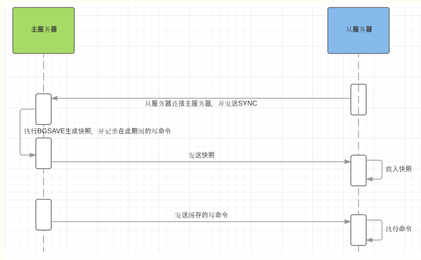
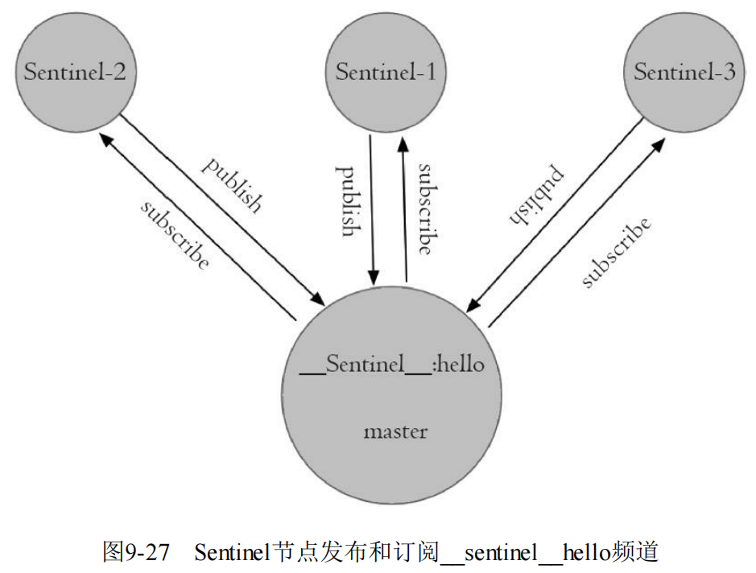

1. redis

2. 为什么选择redis？
   1. 快

3. 5种基本数据结构+bitmap、geo、hyperLoglog+redis module+redis stream

   1. redis module提供了一种插件的方式接入我们自定义的数据结构，比如说bloom filter

   2. redis stream是用来替换sub/pub的

4. redis为什么快？

   1. 基于内存

   2. 单线程，减少了线程切换的消耗

   3. epoll机制

   4. redis存储数据使用hash，读取数据快

   5. redis实现了自己的事件分离器，内部使用了非阻塞的执行方式，吞吐量大

5. redis渐近式hash?

   1. 

   2. 在渐进式hash过程中，字典会同时使用ht[0], ht[1]两个hash表，字典的删除、查找、更新等操作都会在两个hash表里进行。除此之外，新增的键值对都保存到h[1]中

   3. redis怎么解决hash冲突

   3. 扩容条件：

      1. hash表中保存的key数量超过了hash表的大小

      2. 当前没有子进程执行aof重写或者生产rdb文件

      3. 如果保存的节点数与哈希表大小的比例超过了安全阈值（默认值为5），也会进行扩容

6. redis的线程模型？

    1. redis内部使用文件事件处理器（file event handler），这个文件事件处理器是单线程的，所以redis才叫单线程的模型。它采用IO多路复用的机制同时监听多个socket，根据socker的事件来选择对应的事件处理器进行处理
    2. 文件事件处理器的结构包含4部分
       1. 多个socket
       2. IO多路复用程序
       3. 文件事件分派器
       4. 事件处理器（连接应答处理器，命令请求处理器，命令回复处理器）
    3. 多个socket可能会并发产生不同的操作，每个操作对应不同的事件。但是IO多路复用程序会监听多个socket，将socket产生的事件放入队列中排队，事件分派器每次葱队列中取出一个事件，把该事件交给对应的事件处理器进行处理
    4. 流程图：
    5. 流程图2：

7. redis6.0为何使用多线程？

    1. 为什么之前不适用多线程？

       > 一般来说redis的瓶颈不在cpu，而在于内存和网络。如果要使用多核cpu，可以搭建多个redis实例来解决。

    2. redis在4.0的时候就有多线程的概念了。比如redis通过多线程方式在后台删除对象

    3. 为什么6.0之前一直不使用多线程？

       > 多线程的模型虽然在某些方面变现优异（非阻塞），但是带来了并发读写的问题，增加了系统复杂度，同时也可能存在线程切换、加锁、死锁带来的损耗。

    4. 为什么要6.0引入多线程？

       > redis的瓶颈不在cpu，在内存和网络。
       >
       > 内存可以通过加内存的方式解决或者搭建集群
       >
       > 网络IO的读写在redis执行期间占用了大部分cpu的时间，如果能把网络处理这块引入多线程，对redis的性能有很大提升。

    5. 多线程实现机制：

    6. 特点：

       1. IO线程要么同时在读socket，要么同时在写socket，不会同时读写
       2. IO线程只负责读写socket解析命令，不负责命令处理，所以不会带来并发安全问题

    7. 总结：

       1. 可以充分利用多核cpu，但是主线程还是只能利用一个核
       2. 多线程可以分摊Redis同步读写IO的压力

8. 缓存过期策略？

    1. 定时删除：

       1. 概念：设置key的过期时间的同时，为该key创建一个定时器，让定时器在key过期的时候把该key删除
       2. 优点：能保证内存被尽快释放
       3. 缺点：
          1. 如果过期的key很多，删除这些key会耗费cpu时间
          2. 会产生大量的定时器，影响性能

    2. 惰性删除：

       1. 概念：key过期的时候不删除，每次从数据库中获取key的时候去检测是否过期，过期了就删除
       2. 优点：对cpu的占用时间较少
       3. 缺点：如果有大量的key过期但是没被访问，会浪费内存

    3. 定期删除：

       1. 概念：redis默认每隔100ms（hz  10:表示1s执行10次定期删除）就随机抽取一些（maxmemory-samples 5：默认是5个）设置了过期时间的key，检测这些key是否过期，如果过期了就将其删除。如果过期的比例超过1/4，那么继续执行一次定期策略。

       2. 为什么是随机部分，而不是全部

          > 如果redis里面有大量的key都设置了过期时间，全部去检测一遍的话cpu负载很高，会浪费大量的时间在检测上，可能导致redis挂掉。且带来的收益可能很小

       3. 带来的问题？

          > 有可能出现大量的key都已经过期了但是并没有被删除，会导致明明大量的key已经过期了但是内存并没有减少

    4. redis的选择：惰性删除+定期删除

    4. 内存淘汰机制？

        1. 不管是定期删除还是惰性删除都不是完全精准的删除，还是会存在key没被删除的场景，所以需要内存淘汰策略进行补充。当内存不够是，会使用内存淘汰机制
        2. 具体策略：
           1. noeviction：当内存不够时返回错误，不会删除任何键（默认策略）
           2. volatile-lru：对设置了过期时间的key使用LRU算法淘汰
           3. allkeys-lru：对所有的key使用LRU算法淘汰
           4. volatile-lfu：对设置了过期时间的key使用LFU算法淘汰（LFU：根据历史访问频率来淘汰数据）
           5. allkeys-lfu：对所有的key使用LFU算法淘汰
           6. volatile-random：对设置了过期时间的key使用随机算法淘汰
           7. allkeys-random：对所有的key使用随机算法淘汰
           8. volatile-ttl：设置了过期时间的key根据过期时间淘汰，越早过期越早淘汰

9. 主从

    1. 全量同步：

       1. 具体流程

          1. 保存住节点信息
          2. 建立socket连接，如果连不上会无限重试
          3. 发送ping命令：检测socket是否可用、检测主节点当前是否可接受处理命令。如果从节点没有收到pong或者超时，从节点会断开连接，下次定时任务会重试
          4. 权限验证
          5. 从服务器连接主服务器，发送SYNC命令
          6. 主服务器接收到SYNC命名后，开始执行BGSAVE命令生成RDB文件并使用缓冲区记录此后执行的所有写命令
          7. 主服务器BGSAVE执行完后，向所有从服务器发送快照文件，并在发送期间继续记录被执行的写命令
          8. 从服务器收到快照文件后丢弃所有旧数据，载入收到的快照
          9. 主服务器快照发送完毕后开始向从服务器发送缓冲区中的写命令
          10. 从服务器完成对快照的载入，开始接收命令请求，并执行来自主服务器缓冲区的写命令
          11. 流程图1： 
          12. 流程图2：

       2. 部分同步（增量同步），psync：

          > 1. 主从复制各节点的复制偏移量：参与复制的主从节点都会维护自身复制偏移量。master在处理完写入命令之后，会把命令的字节长度做累加，存储在info relication的master_repl_offset中。slave节点也会上报自身的复制偏移量给主节点，主节点也会把从节点的复制偏移量保存起来，存储在info replication的slave_{id}：offset中。slave节点收到master发送的命令之后，也会累加自身偏移量，存储在info replication的slave_repl_offset中
          > 2. 主节点复制积压缓冲区：保存在master节点的一个固定长度的队列，默认大小为1MB。当master有slave时被创建，这时master响应写命令时，不仅把命令发给从节点，还会写入复制积压缓冲区
          > 3. 主节点运行id：当master重启之后id会发生变化，只要slave监听到masterid发生变化，将进行全量复制。使用debug reload‘命令重新加载EDB文件可以保持运行ID不变

       3. 无盘复制：redis2.8.18之后master的子进程直接将RDB通过网络发送给slave，不适用磁盘作为中间存储。

10. 哨兵

       1. sentinel的三个定时任务

     2. 概念：sentinel通过三个定时任务完成对各个节点的发现和监控

     3. 定时任务一：每隔10s，每个sentinel节点会向主节点和从节点发送info命令获取主从结构的最新拓扑

        1. 实例图：
        2. 通过向主节点执行info命令，获取从节点信息
        3. 当有新节点加入可以快速感知
        4. 有节点不可达后，可以及时更新拓扑

     4. 定时任务二：每隔2s，每个sentinel节点会向redis的数据节点的\__sentinel__:hello的频道上发送当前sentinel节点对主节点的判断以及当前sentinel节点信息。同时，每个sentinel也会订阅该频道，来了解其他sentinel节点以及他们对主节点的判断。

        1. 发现新的sentinel节点

        2. sentinel之间交换主节点的状态，作为后面的客观下线以及领导者选举的依据

        3. 实例图：

        4. 定时任务三：每隔1s，每隔sentinel节点会向主节点、从节点、其余sentinel节点发送一条ping命令做心跳检测，来确认这些节点当前是否可达。

           1. 示例图： 

              

       5. 主观下线和客观下线

     6. 主观下线：

        1. 每个sentinel节点每隔1s会向主节点、从节点、其他sentinel节点发送ping命令做心跳检测。当这些节点超过down-after-milliseconds没有恢复，sentinel节点就会认为这些节点已经被下线了，这就是主观下线。

     7. 客观下线：

        1. 当sentinel主观下线的节点是主节点时，该sentinel节点会通过sentinel is-master-down-by-addr （<ip> <port> <current_epoch> <runid>）命令向其他sentinel节点询问对该主节点的判断，当超过{quorum}个sentinel节点认为该主节点确实有问题，那么该sentinel节点会做出客观下线的决定

       8. sentinel领导者选举流程

     9. 如果sentinel节点对于主节点做出了客观下线的决定，需要进行故障转移，故障转移只需要一个sentinel节点来完成即可，所以sentinel节点之间会做i一个领导者选举的工作，选出一个sentinel节点作为领导者进行故障转移的工作。redis使用raft算法实现领导者选举

        > 1. 每个在线的sentinel节点都有资格成为领导者,当他确认主节点主观下线的时候，会向其他sentinel节点发送sentinel is-master-down-by-addr命令，要求将自己设置为领导者
        > 2. 收到命令的sentinel节点，如果没有同意过其他sentinel节点的sentinel is-master-down-by-addr命令，则同意该请求，否则拒绝
        > 3. 如果发起sentinel is-master-down-by-addr命令的sentinel节点发现自己票数大于等于quorum，那么它将成为领导者。
        > 4. 如果所有的sentinel投完票之后，没有sentinel节点成为领导者，那么进行下一次选举
        > 5. 选举的过程非常快，基本上谁先完成客观下线，谁就是领导者

       10. 故障转移：sentinel选出的领导者节点进行故障转移

     11. 在从节点列表中选出一个节点作为新的主节点

         1. 过滤：“不健康”（主观下线、断线）、5秒内没有回复过Sentinel节点ping响应、与主节点失联超过down-after-milliseconds*10秒
         2. 选择slave-priority（从节点的优先级）最高的从节点，如果不存在，继续往下找
         3. 选择复制偏移量最大的从节点，如果不存在，继续往下找
         4. 选择runid最小的从节点

     12. sentinel领导者会对第一步选出来的从节点执行 slaveof no one命令让该节点成为主节点

     13. sentinel领导向剩余从节点发送命令，让他们成为新主节点的从节点，复制规则和parallel-syncs参数有关

     14. sentinel集合会将原来的主节点更新为从节点，并保持关注，待其重新上线后命令其复制新的主节点

    4. 集群：集群的从节点只能复制主节点，只支持db0

              1. 怎么实现数据分片
            2. hash分区
               1. 节点取余：简单，但是容易发生数据倾斜（节点上下线会加重倾斜程度），扩容一般也是双倍扩容
               2. 一致性hash：很好的解决了数据倾斜的问题。但是加减节点会造成部分数据不可用，使用少量节点时，节点变化也会影响
               3. 虚拟槽分区：redis使用虚拟槽分区,计算公式：slot=CRC（16）%16383，简化了节点扩容和缩容的难度
            3. 顺序分区
              4. 怎么做故障转移和发现
              5. redis的hash槽？
            6. hashTag
              7. 集群的最大节点个数？
            8. 主节点个数是16384个。因为redis的slot就是16384
              9. Gossip协议：流言协议，节点之间不断通信交换信息，一段时间后所有的节点都会知道集群的完整信息
            10. 通信过程：
                1. 集群中的每个节点都会单独开辟一个TCP通道，用于通信，端口是基础端口号加10000（例如基础端口是6379，通信端口就是16379）
                2. 每个节点在固定的周期内通过特定的规则选择几个节点发送ping消息
                3. 接受ping消息的节点用pong消息作为回应
                4. 

    5. redis的aof和rdb？

           1. RDB:

         2. 对内存做一个快照

           3. AOF：写完数据再写日志（因为redis不会对命令进行语法检查，这样可以做到只记录成功的命令。但是带来了丢失数据的风险）

         4. 每次修改内存的数据时，都把这条命令写入日志。

         5. 为什么不是预写日志？

            > 1. 为了避免写入无效指令。如果是预写日志，需要做指令检查（单纯的语法检查不够，还要判断指令的有效性，比如删除一个不存在的key）。mysql使用预写日志是因为他本身维护了所有的表信息

         6. 当aof文件过大时，使用bgrewriteaof命令进行重写

            > 开辟一个子进程对内存进行遍历，转换成一系列的redis操作指令，序列化到新的aof文件。然后把遍历期间发生的增量aof日志追加到这个新的aof文件中。然后替换旧的aof文件

           7. redis4.0的混合持久化

         8. 单纯使用RDB容易丢失数据，单纯使用aof会导致aof文件过大而且重放aof文件速度较慢

         9. 混合持久化把rdb文件和增量的aof文件放在一起。重启的时候先加载RDB的内存，然后在重放aof的内容。数据丢失较少而且重启的效率很快

11. redis的事务？

           1. redis使用mult，exec，watch等命令实现事务
         
         2. multi：开启事务
         3. exec：执行事务
         4. discard：取消事务
         5. watch：监视key，如果事务执行之前。key被其他命令改动，事务将被打断
         
           6. 事务失败场景：
         
         7. 语法错误（参数个数错误，不支持的命令）
         8. 命令执行失败（对string执行lpush等操作）
         9. watch
         
           10. 为什么不支持回滚：

      ​	有当被调用的Redis命令有语法错误时，这条命令才会执行失败（在将这个命令放入事务队列期间，Redis能够发现此类问题），或者对某个键执行不符合其数据类型的操作：实际上，这就意味着只有程序错误才会导致Redis命令执行失败，这种错误很有可能在程序开发期间发现，一般很少在生产环境发现。支持事务回滚能力会导致设计复杂，这与Redis的初衷相违背，Redis的设计目标是功能简化及确保更快的运行速度。

12. 缓存击穿、雪崩、穿透怎么解决？

           1. 穿透： 查询一个缓存中不存在、数据库也不存在的key
         2. 缓存过期时间很短的空值：消耗内存、如果数据库中添加了这个key，会导致数据不一致
         3. bloom过滤器：维护困难，如果key是持续不断加入的，过滤器总会被打满
         4. 给这个key设置null值
           5. 击穿：查询缓存不存在，数据库存在的key
         6. 加锁排队：当获取到了锁之后，可以短暂sleep，然后再去查询缓存，如果还是没有则重建缓存，获取不到锁的线程直接返回或者阻塞（等获取锁的线程重建缓存之后唤醒）。
         7. 设置热点数据永远不过时
           8. 雪崩：缓存中的key大量失效
         9. 预防措施：给key设置随机过期时间、永不过期（不设置过期时间、当发现缓存快过期了自动更新缓存）
         10. 已经发生的措施：加锁排队

13. watch和cas乐观锁？

14. redis如何实现分布式锁？

           1. redisson
         2. 实现原理
         3. 流程

15. redis的redlock？

           1. 为什么要redLock：在主从结构中，如果只在主库上加锁成功，还没同步到从库主库就宕机。然后sentinel选举一个slave成为master，然后整个锁就丢失了
           2. 概念：
         3. 前提：	
            1. 不在需要部署从库和哨兵
            2. 主库部署多个，至少5个（5个主库，而不是redis cluster）
         4. 流程：
            1. 客户端获取时间戳T1
            2. 客户端依次向所有的redis实例发起加锁请求（setnx），每个加锁请求设置超时时间（超时时间远小于锁的有效期），如果超时或者加锁失败，就向下一个redis实例加锁
            3. 如果客户端成功加锁的redis实例超过一半，获取时间T2，如果(T2 - T1)<锁的有效期，客户端认为加锁成功，否则加锁失败
            4. 加锁失败向所有节点发起释放锁请求
           5. redlock有什么问题？
         6. 
         7. 时间同步会导致时间跳跃，也有可能有问题：redis作者认为时间同步的误差较小
         8. 网络延迟和gc不止redlock有这个问题，其他组件也会有这个问题

16. 并发竞争？

17. 异步队列？

18. 延时队列？

19. redis优化策略？

           1. 管道:
           2. 减少socket连接

20. redis如何保证双写一致性？先更新缓存还是先更新数据库

        1. 三个经典的缓存模式：

      2. Cache-Aside Pattern（旁路缓存）

         > 1. 读请求：先查询缓存，命中直接返回数据。没有命中就去数据库取出数据放入缓存。
         > 2. 写流程：先更新数据库，然后再删除 缓存

      3. Read-Through/Write through

         > read: 由cache provider来负责缓存和数据库的读写。先查询缓存，命中直接返回数据。没有命中就去数据库取出数据放入缓存
         >
         > write:更新数据库，然后更新缓存

      4. 在2的基础上使用异步来执行

        5. 为什么是删除缓存而不是更新缓存：

      6. 

      7. 如果写入的缓存值是经过复杂计算得到的，就会造成多次更新，浪费性能

      8. 有可能有的数据在缓存中，还没有被读取到就被跟更新了

        9. 为什么是先操作数据库而不是先操作缓存？

      10. 

      11. 123

        12. 缓存延时双删是什么？

      13. 

      14. 123

        15. 先更新数据库再删除缓存，万一删除缓存失败了怎么办？

      16. 引入消息队列：

      17. 使用数据库的binlog来异步淘汰key：

      18. 123

21. redis内存耗尽后怎么办？

           1. 内存淘汰策略

22. redis怎么做大数据量的插入？

       ```cat data.txt | redis-cli --pipe```

23. 如何解决redis的并发竞争key的问题？

           1. 分布式锁
           2. 消息队列

24. 1亿个key，10万个key是已知前缀，怎么把它们全找出来？

           1. keys：会阻塞redis
           2. scan：一次取批，最后汇总。存在重复的概率，需要在客户端进行一次去重

25. mysql有2000w数据，redis只存20w数据，怎么保证redis的数据就是热数据

26. 如何排查redis性能问题？

        1. api或者数据结构使用不合理

      2. slowlog get{n}可以获取慢查询

      3. redis-cli -h{ip} -p{port}bigkeys：获取大对象

        4. cpu饱和

        5. 持久化的阻塞：

      6. fork阻塞：RDB和AOF重写时，需要fork子进程

      7. aof刷盘阻塞：如果主线程发现距离上一次的fsync成功超过2秒，为了 数据安全性它会阻塞直到后台线程执行fsync操作完成

      8. huge page写阻塞

         > 子进程在执行重写期间利用Linux写时复制技术降低内存开销，因此只 
         >
         > 有写操作时Redis才复制要修改的内存页。对于开启Transparent HugePages的 
         >
         > 操作系统，每次写命令引起的复制内存页单位由4K变为2MB，放大了512 
         >
         > 倍，会拖慢写操作的执行时间，导致大量写操作慢查询

      9. 内存交换：操作系统可能把redis使用的内存换出到硬盘

      10. 网络

27. redis的内存划分

           1. 自身内存
           2. 对象内存
           3. 缓冲内存：
         4. 客户端缓冲：所有连接到redis的tcp连接的输入输出缓冲
         5. 复制积压缓冲区：redis2.8提供可重用固定大小缓冲区用于部分复制功能，repl-backlog-size控制默认为1mb。所有从节点共享这个缓冲区。建议设置大点
         6. aof缓冲区
           7. 内存碎片

28. redis子进程消耗内存

       > Transparent Huge Pages（THP）机制:复制内存页的单位从4KB变 
       >
       > 为2MB，如果父进程有大量写命令，会加重内存拷贝量，从而造成过度内存 
       >
       > 消耗

29. redis的hot key？

           1. redis4.0.3自带hot key发现机制。使用redis-cli --hotkey即可

30. redis怎么删除大key（指某个key的value很大）？

       > 1. 如果线上redis出现大key，不可立即执行del，因为del会造成阻塞，导致其他请求超时->redis连接池耗尽->依赖redis的业务出现异常
       > 2. 解决方案：
       >    1. 系统负载低的时候

31. 主库挂怎么办》？

           1. 使用哨兵，把从库提升为主库
              59. 性能优化？
          
              60. master不做任务持久化工作，slave可以开启持久化
              61. master和slave在同一个局域网
              62. 主从复制采用单链表结构，而不是图状结构