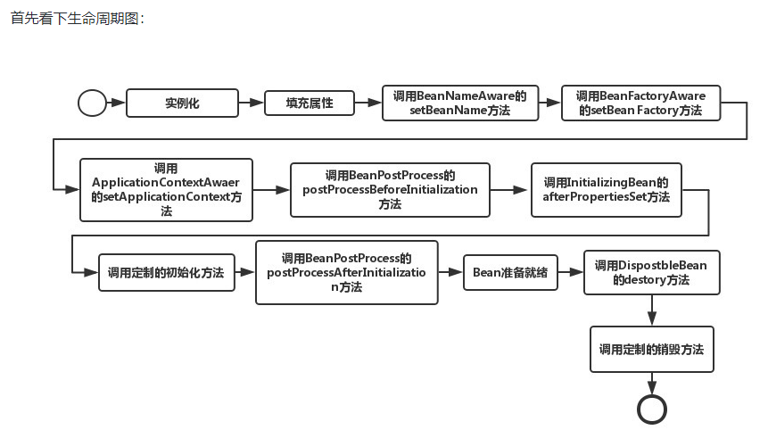
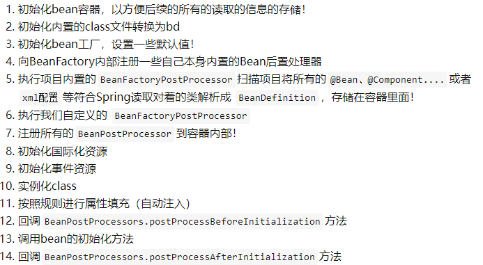
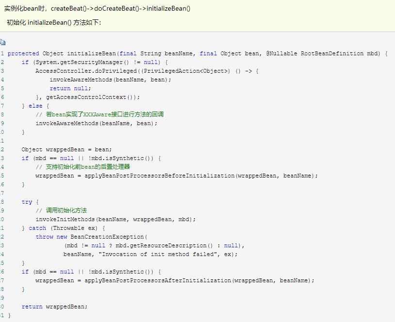
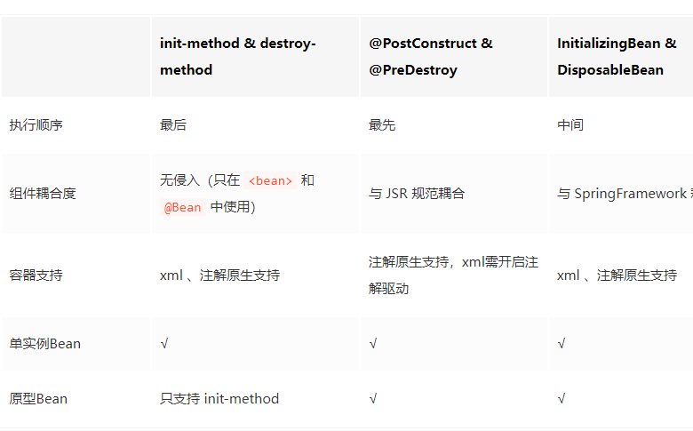
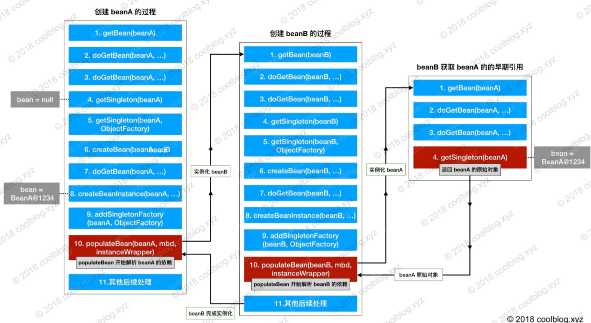
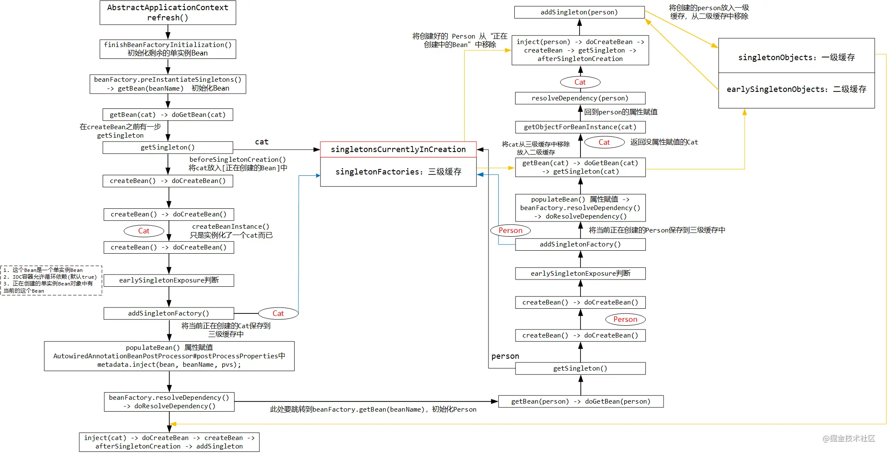
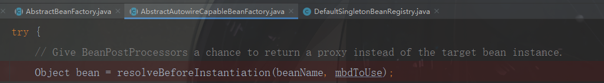

spring

1. 为什么spring不同class来建立bean，而要用beanDefinition？

   > class的信息太少，只描述了类信息
   >
   > 而beanDefinition描述了spring的bean的元信息，包含了类信息、属性、依赖关系等。beanDefinition可以在容器的初始化阶段被BeanDefinitionRegistryPostProcessor构造和注册，被BeanFactoryPostProcessor修改

2. BeanDefinitionRegistry

   1. BeanDefinitionRegistry` 是维护 `BeanDefinition` 的注册中心，它内部存放了 IOC 容器中 bean 的定义信息，同时 `BeanDefinitionRegistry` 也是支撑其它组件和动态注册 Bean 的重要组件。在 SpringFramework 中，`BeanDefinitionRegistry` 的实现是 `DefaultListableBeanFactory

3. beanFactoryPostProcessor

   1. BeanFactoryPostProcessor` 是容器的扩展点，它用于 IOC 容器的生命周期中，所有 `BeanDefinition` 都注册到 `BeanFactory` 后回调触发，用于访问 / 修改已经存在的 `BeanDefinition` 。与 `BeanPostProcessor` 相同，它们都是容器隔离的，不同容器中的 `BeanFactoryPostProcessor不会相互起作用

4. bean的生命周期？

   1. createBean()会调用AbstractAutowireCapableBeanFactory的initialzeBean(),这个方法会先执行BeanNameAware，BeanClassLoaderAware，BeanFactoryAware，然后调用BeanPostProcessor。在ApplicationContextAwareProcessor这个BeanPostprocessor中，会调用其他的Aware方法，比如ApplicationContextAware、EnvironmentAware
   2. 生命周期图：
   3. 示例图2：
   4. 注意：spring只帮助我们管理singleton的bean的生命周期。对于prototype的bean，spring在创建好了bean之后就不会再管理其生命周期了

5. bean的scope？

   > 在spring context中只定义了singleton和prototype两个scope
   >
   > 在spring web中新增了request ,session, global session, websocket等scope

6. 实例化bean的方式

   1. 构造器实例化
   2. 静态工厂实例化
   3. 实例工厂实例化（factory bean）

7. 注册bean的方式

   1. xml
   2. @Component+@ComponentScan
   3. @Bean+@Configuuration+@ComponentScan
   4. @Import
   5. @IMport+ImportSelector实现类
   6. @Import+ImportBeanDefinitionRegistrar实现类
   7. FactoryBean

8. @PropertySource:可以用来加载配置文件

9. @PostConstruct、InitializaingBean.afterPropertiesSet()、init-method执行顺序

   1. @PostConstruct：@PostConstruct注解会被一个专门的BeanPostProcessor来处理（InitDestroyAnnotationBeanPostPorcessor），在它的postProcessBeforeInitialization方法会调用@PostConstruct注解的方法
   2. InitializainBean：在invokeInitMethods方法里，先调用InitializaingBean的afterPropertiesSet，然后调用init-mehtod方法
   3. init-method:
   4. 示例图：
   5. 对比：

10. beanFactory和applicationContext的区别？

    1. beanFactory是spring  bean的顶级接口，提供了一个管理bean的高级抽象（主要是getBean，作用域，生命周期管理）， ApplicationContext是BeanFactory的一个实现类，并且扩展了许多功能， 比如aop，事件发布
    2. 和普通的BeanFactory相比，ApplicationContext能够检测特殊的bean（BeanFactoryPostProcessor，BeanPostProcessor，ApplicationListener）。beanFactory不区分这些bean，但是ApplicationContext需要把它们区分出来并区别对待
    3. 示例图：

11. GenericApplicationContext

    1. 不支持refresh的applicationContext，因为ApplicationContext内部是使用DefaultListableBeanFactory，这个不允许重复创建

12. FactoryBean：

    1. 用来创建bean

13. 创建bean的方式

    1. 注解（@Component 或@Bean+ @ComponentScan）
    2. xml
    3. factoryBean

14. Bean的生命周期有几种控制方式？有什么区别？

    1. beanPostProcessor（@PostConstruct）
    2. InitiaingBean
    3. init-method

15. HierarchicalBeanFactory：可继承的beanFactory

    1. 当从applicationContext获取bean是，applicationContext会先从当前容器寻找如果找不到，尝试从父容器中获取，spring scope的singleton是针对容器而言的。在SSM项目中会有两个容器， web的容器是原始容器的子容器，所以SSM项目中@Controller可以注入@Service，而@Service不能注入@Controller的bean。 而在springboot中只有一个容器

16. ListableBeanFactory：

    1. 获取bean时只从当前容器寻找，不会找父容器。如果寻找时想包含父容器，使用BeanFactoryUtils中的方法
    2. DefaultListableBeanFactory的**getBeanNamesForType**方法只在当前容器寻找，**getBean**会从父容器寻找

17. 单例bean和原型bean有什么区别？

    1. 单例bean只有一个，它的生命周期完全由spring管理
    2. 原型bean每次获取都是新的，spring创建完之后就失去了对它的管理

18. spring的environment？

    1. environment是spring内置的一种环境抽象，主要是用来描述applicationContext的运行时的一些配置信息和构件信息，比如properties以及profiles。通过${}占位符可以获取properties的属性信息，profile可以用来指定构件，构件可以理解为一组配置信息

19. @Async的循环依赖

20. spring aop实现原理

    > 就是把目标对象进行代理，然后暴露出方法的生命周期（执行之前、执行之后、异常、整合起来的环绕），然后对方法的生命周期地方对方法进行增强

21. 静态代理和动态代理的区别？

    1. 静态代理：

       1. 概念：为每个需要被代理的类实现一个代理类

       > 1. 需要硬编码，而且要为每个需要被代理的类生成其实现，扩展性不高 但是性能高
       > 2. 如果被代理的类增加了方法，代理也必须增加响应的方法

    2. 动态代理：

       1. 概念：在运行时，通过字节码技术动态生成代理类（java有成熟的方案给我们用：jdk动态代理和cglib动态代理）

22. jdk动态代理和cglib动态代理的区别？

   23. jdk动态代理：Proxy.newProxyInstance(classLoader,interface[],invocationHandler)

       > 1. 被jdk代理的对象必须实现接口
       >
       > 2. 通过实现InvocationHandlet接口创建自己的调用处理器
       >
       > 3. 通过为Proxy类指定ClassLoader对象和一组interface来创建动态代理
       >
       > 4. 通过反射机制获取动态代理类的构造函数，其唯一参数类型就是调用处理器接口类型
       >
       > 5. 通过构造函数创建动态代理类实例，构造时调用处理器对象作为参数参入
       >
       > JDK动态代理是面向接口的代理模式，如果被代理目标没有接口那么Spring也无能为力。

   24. cglib动态代理

       > 1. Spring在运行期间通过 CGlib继承要被动态代理的类，重写父类的方法被cglib代理的.
       > 2. 对象的方法不能是final，因为cglib是通过继承的方式来增强的

25. jdk的动态代理为什么不能代理类？

    1. 简单点来说就是生成的代理类extends Proxy。而java是单继承的，所以如果被代理类继承了别的类是没办法再去继承Proxy
    2. 源码分析：

26. spring 默认 用什么代理？

    > spring framework默认使用jdk动态代理
    >
    > 但是spring boot默认使用cglib动态代理

27. this调用导致aop失效（即this调用没有走代理类）

    1. 

28. beanFactory和applicationContext那个才是ioc容器？

   > beanFactory: 定义了ioc容器最基础的功能
   >
   > applicationContext：实现了beanFactory接口，不过对于beanFactory的接口方法都是委托给DefaultListableBeanFactory来实现的。除此之外，添加了额外的功能（国际化，事件驱动）。

11. 基本容器

    1. singletonObjects：一级缓存
    2. earlySingletonObjects：二级缓存
    3. singletonFactories：三级缓存：put的时候放初始bean，get的时候会判断是否需要aop，如果需要aop就返回代理对象，如果不需要还是会返回原对象
    4. singletonsCurrentlyInCreation：存放正在创建的bean，创建完bean后会移出去
    5. Set<String> alreadyCreated：至少被创建了一个bean，都会放进来

12. 三级缓存怎么实现？怎么解决循环依赖

    1. 示例图：
    2. 示例图2：

13. spring 和spring boot的关系

    1. spring和spring mvc整合会有父子容器的概念，spring boot只有一个容器

14. spring aop的理解？基本概念？

    1. target：被代理的对象
    2. proxy：代理对象，代理对象=target+advice
    3. Joinpoint：连接点，target中定义的所有方法
    4. pointcut：被增强的连接点
    5. advice：增强的代码
    6. aspect：切面，pointcut+advice=切面
    7. weaving：织入，将advice应用到target然后生成proxy对象的过程
    8. Interceptor
    9. MethodInterceptor
    10. ConstructorInterceptor
    11. Incocation
    12. 
    13. 怎么概述aop
        1. AOP 面向切面编程，全称 Aspect Oriented Programming ，它是 OOP 的补充。OOP 关注的核心是对象，AOP 的核心是切面（Aspect）。AOP 可以在不修改功能代码本身的前提下，使用运行时动态代理的技术对已有代码逻辑增强。AOP 可以实现组件化、可插拔式的功能扩展，通过简单配置即可将功能增强到指定的切入点。

15. 多个切面怎么确定执行顺序？

    1. 默认的切面执行顺序是根据切面类按照字母表的顺序来的
    2. 手动排序：实现Ordered接口的方法，返回值越小越先执行。默认是Intger.MAX_VALUE。
    3. 手动排序：使用@Order注解也可以指定order

16. spring aop实现原理？

    1. 使用优先级最高的beanPostProcessor：AnnotationAwareAspectJAutoProxyCreator
    2. 在creatBean方法之后，doCreateBean方法之前会对bean进行一次增强

17. @Qualifier注解？

18. spring mvc流程？

    > 1. dispatcherServlet:把请求交给handlerMapping
    >
    > 2. handlerMapping：handlerMapping的作用就是根据url去匹配handler（其实是HandlerMathod），找到了handler之后，把这次请求涉及到了的拦截器和handler一起封装起来，组成一个HanlerExecutionChain（链条），然后返回给dispatcherServlet
    >
    > 3. dispatcherServlet拿到HanlerExecutionChain后，交给HandlerAdapter去执行。注意看 `HandlerAdapter` 与 Handler 的交互：执行 Handler 之后，虽然我们写的返回值基本都是返回视图名称，或者借助 `@ResponseBody` 响应 json 数据，但在 WebMvc 的框架内部，最终都是封装了一个 `ModelAndView` 对象，返回给 `HandlerAdapter` 。`HandlerAdapter` 再把这个 `ModelAndView` 对象交给 `DispatcherServlet` ，这部分的活也就干完了
    >
    > 4. dispatcherServlet拿到handlerAdapter返回的ModelAndView后，交给ViewResolver
    >
    > 5. 拦截器
    >
    > 6. controller
    >
    > 7. 视图解析器
    >
    >    > SpringMVC定义了两个接口来操作这两个过程：参数解析器HandlerMethodArgumentResolver和返回值处理器HandlerMethodReturnValueHandler
    >
    > 8. 总结：检查request类型-->获取匹配的Handlemethod-->查找拦截器-->组成HandlerExecutionChain执行链-->获取方法执行链对象的适配器（HandlerAdapter）-->然后反射执行业务方法

19. @RequestMapping实现原理？

    1. 先解析请求的url，拿到path
    2. RequestMappingHandlerMapping有个属性mappingRegistry，mappingRegistry里面有个pathLookup（linkedMultiValueMap），里面存放了path->AbstractHandlerMethodMapping的映射
    3. 根据path找AbstractHandlerMethodMapping，找不到就报404，找到了就返回MethodHandler
    4. 把HandlerMethod和拦截器封装成链条返回

20. @Response原理

    1. 在handlerAdapter交给controller处理完请求后，会对returnValue进行处理（调用handlerReturnValue方法），里面会找到MessageConvert，messageCOnvert对返回值进行处理

21. spring boot自动装配原理？

    1. SpringBootApplication注解：ComponentScan+EnableAutoConfiguration+SpringBootConfiguration（等价于Configuration）
    2. EnableConfiguration import 了AutoConfigurationImportSelector类
    3. AutoConfigurationImportSelector里面会使用SpringFactoriesLoader.loadFactoryNames，加载spring.factories文件的内容，把里面的类放到ioc容器
    4. 之后ioc解析beanDefinition的时候，在spring.factories的配置类就生效了

22. spring boot怎么实现热部署？

    1. devtools：

       > 1. devtools会监听classpath下的文件变动（通过ClassPathChangeEvent事件），发生了变动就会stop引用，gc，清楚对象引用，重新加载新文件

    2. 原理：

       > 1. 使用了两个classLoader，一个classLoader加载那些不会变的类（第三方的jar包），另一个classLoader加载会更改的类称为：restart classLoader。
       > 2. 在代码有更改的时候，原来的reset ClassLoader被丢弃，重新创建一个restart classLoader来重启应用

23. spring 事务实现方式？

    1. 编程式事务
    2. 声明式事务 
       1. 使用@Transactional注解

24. 事务传播级别？？

    1. Requierd
    2. new
    3. nested：savepoint机制

25. spring用了哪些设计模式

    1. 单例：spring的bean默认就是单例的
    2. 工厂模式：使用工厂模式创建bean

26. 

27. 源码？

    1. spring session源码
       1. MapSession.getId(): 产生一个UUID作为session