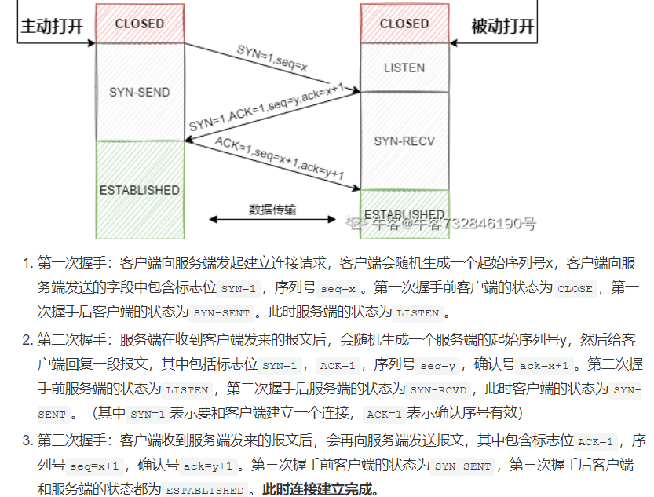
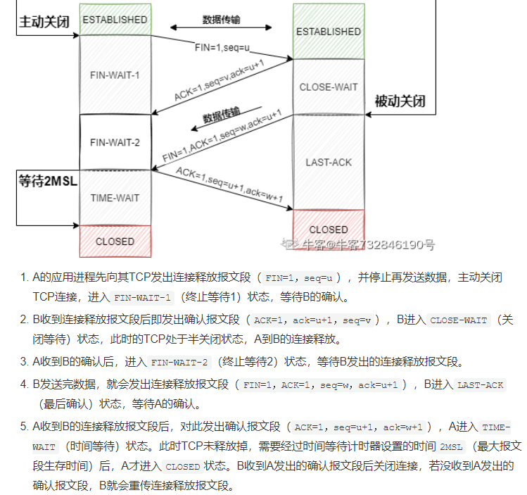
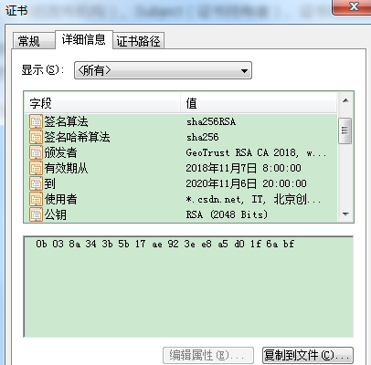
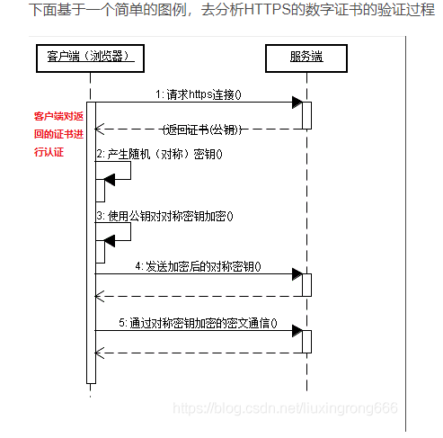
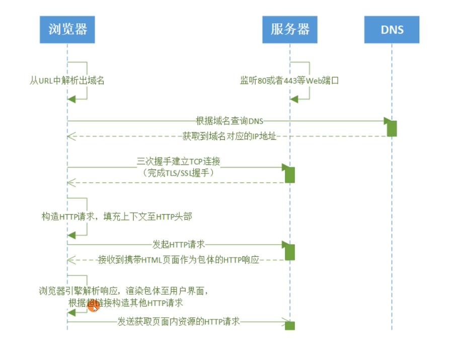

计网

1. http

   1. get和post的区别
      1. get一般通过url传参，post的参数放在请求体中
      2. get请求结果会被浏览器主动缓存
      3. get请求的参数会被保存在浏览器的历史记录里

2. tcp

   1. tcp的特点：	

      1. 面向连接
      2. 可靠
      3. 面向字节流
      4. 全双工

   2. 三次握手：

   3. 两次握手可以吗?

      > 三次握手是为了防止已失效的连接请求报文又传输到了服务端

   4. 四次挥手：

   5. 第四次挥手为什么要等待2MSL（每次发送最后一次ack都会重新把时间更新为2MSL）

      > 1. 保证a发生的ack能够到达b。如果a发生的ack丢失，b会发起超时重传
      > 2. 防止已失效的连接请求出现在本连接中。a在发送完最后一个ack报文后，再经过2MSL，这个连接的所有报文都会从网络中消失，使得下个新的连接不会出现旧的数据。

   6. 为什么是四次挥手？

      > 1. 本来建立连接就需要4次，不过建立的连接的时候可以把syn和ack放到同一个连接。但是在关闭连接的时候，不能一起关闭，因为此时server可能还有数据没有发完       

   7. 拥塞控制

      1. 慢启动：

         > 把滑动窗口cwnd设置成MSS，每收到一个报文的确认就把cwnd加倍，直到cwnd到了ssthresh，然后开始加1而不是翻倍

      2. 拥塞避免：如果没有收到ack，就把ssthrsh减半，把cwnd重新设置成1.

      3. 快速重传：收到3个重复确认号，立即重传从确认号后开始的报文

      4. 快恢复：收到3个重复确认号之后，把ssthresh减半，然后把cwnd设置成ssthresh

   8. 粘包和拆包

      1. 本质：tcp是基于流的
      2. 拆包的原因：
         1. 超过了MSS
         2. 内核缓冲区放不下了
      3. 粘包的原因：
         1. 发送的数据太小，tcp会合并数据包
      4. 解决方案：
         1. 定长
         2. 使用固定分隔符
         3. 将消息分为消息头和消息体，在消息头中设置消息的长度

3. udp

4. tcp和udp的区别

   1. tcp面向连接
   2. tcp可靠
   3. tcp面向字节流，udp面向报文
   4. tcp有拥塞控制
   5. tcp是一对一的，udp支持单播，多播

5. tcp的keepalive

   1. 用来判断通信双方网络的可用性

6. 为什么有了tcp的keepalive还需要应用层的心跳

   1. tcp的keepalive只能判断双方网络是可用的，无法判断双方应用都能正常发送/接受请求

7. http和https的区别？

8. 对称加密和非对称加密？

9. http请求和响应报文格式？

10. http常见状态码和请求头?

   11. 200/206/301/302/404/502

   12. Content-Type：

   13. host

   14. User-agent

15. XSS和csrf

    1. csrf：从别的网站跳转到已登陆的网站
       1. 使用token
       2. 使用http的refer
       3. csrf示例图：
    2. XSS：向网站内注入js脚本
       1. 禁止js读取cookie

16. 长连接和短连接？

    1. http的keepalive

17. redis session共享？

18. http only？

19. http1.1新特性？

    1. 长连接
    2. host
    3. range头：允许只请求某个资源的一部分，返回206

20. http2.0新 特性？dubbo使用http2

    1. 新的二进制格式。http使用二进制传输数据
    2. 多路复用。同一个连接允许同时发生多个请求
    3. 头部压缩
    4. 服务器推送

21. restful？幂等？

22. post和get区别？

23. https连接过程

    1. 数字证书：

       > 1. 数字证书由权威CA机构颁发，主要内容有：公钥，证书颁发机构、证书持有者、证书有效期、签名算法、指纹、指纹算法。实例图：
       > 2. 指纹：证书在发布之前，CA机构对证书的内容用指纹算法计算一个hash值，这个hash值就是指纹（hash具有不可逆性，唯一性）
       > 3. 签名：CA机构将指纹和指纹算法通过私钥加密就是证书的签名
       > 4. 怎么验证证书：通过CA机构（世界上权威CA机构的根证书都是预先嵌入到浏览器中的）的公钥去解密证书的签名，得到指纹和指纹算法，通过指纹算法计算证书内容得到新的hash值，如果hash值和指纹相同，说明证书没有被篡改

    2. https的连接过程：

       1. 示例图xxxxxxxxxxxxxxxxxxxxx：

       2. 具体连接过程

          > 1. 发送客户端支持的加密协议以及版本
          > 2. 服务器刷选合适的加密协议，返回证书（证书有服务器端的公钥）
          > 3. 使用CA机构的公钥验证证书合法性
          > 4. 客户端生成对称秘钥，使用服务端的公钥加密，发送到服务端
          > 5. 服务端使用自己的私钥解密，获取对称秘钥，使用对称秘钥加密数据

24. 大量time_wait怎么处理

    1. 原因：频繁创建断开连接
    2. 解决方案：使用长连接

25. 大量close_time怎么处理

    1. 原因：被动关闭的一方没有主动发送fin包
    2. 解决：程序忘记调用close方法

26. 浏览器输入一个域名发生了什么？

    1. 解析域名
    2. tcp连接
    3. ssl连接
    4. 发送请求
    5. nginx->web
    6. 解析请求
    7. 示例图：